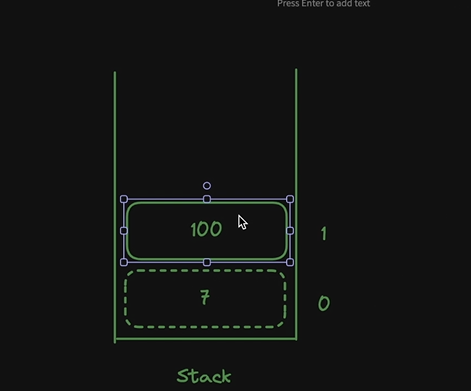
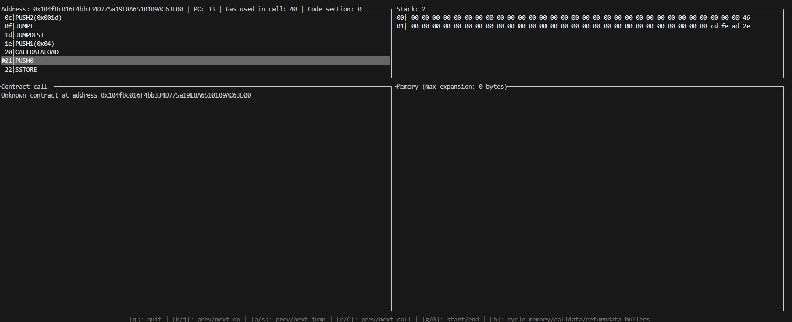

# ASSEMBLY AND FORMAL VERIFICATION COURSE

In this course, we are going to be going even deeper into the EVM to really get a grip of whats going on under the hood. At this point, you have already seen some assembly written before but without really knowing much about it but this course will clear up all confusion on assembly language and we will be learning a lot.

# SETUP

As usual, we will be learning my making projects and this is the first project we will be working on and it is called HorseStore. I created this directory with the usual commands and ran forge init, deleted all irrelevant files and copied the HorseStore.sol contract from the github associated with this section at https://github.com/Cyfrin/1-horse-store-s23/blob/main/src/horseStoreV1/HorseStore.sol . I then compiled it with forge build and went into the generated out folder which you can see. In the HorseStore.sol directory, there is a HorseStore.json as you know which contains the compiler results. You already know about the fact that this file will contain the abi which we know a lot about. What we dont know enough about is all the other information contained in this file like the deployedByteCode, bytecode and rawMetadata. We are going to look at what all of these are as understanding this is extremely crucial to knowing the way the EVM works.

# WHAT ARE OPCODES AND WHAT IS THEIR RELEVANCE TO THE EVM ? EVM CODES, INTRO TO READING BYTECODE

Opcodes are short for operational codes or machine instruction. These codes are very common in computer science but with relation to the EVM, these are the codes that govern what a smart contract does. As you know, the EVM is a virtual machine which means there isnt actually a physical machine there for ethereum but it is an implementation. This is similar to when we learnt about dex adapters and price adapters in the zaros audit so go look at those notes to get what I mean. So for this implementation to work, the EVM has these opcodes which tell it what exactly it should be doing in a particular contract. This is what the bytecode is. It is just a combination of these opcodes. Human beings are very bad at reading these opcodes or machine language which is why we have high level languages like solidity which compile down to bytecode that the EVM understands and this bytecode is simply a combination of opcodes that tell the EVM what the contract should be doing.

Lets see an example. So in the HorseStore.jsone, this is the bytecode attached:

```json
"bytecode": {
    "object": "0x608060405234801561000f575f80fd5b506101438061001d5f395ff3fe608060405234801561000f575f80fd5b5060043610610034575f3560e01c8063cdfead2e14610038578063e026c01714610054575b5f80fd5b610052600480360381019061004d91906100ba565b610072565b005b61005c61007b565b60405161006991906100f4565b60405180910390f35b805f8190555050565b5f8054905090565b5f80fd5b5f819050919050565b61009981610087565b81146100a3575f80fd5b50565b5f813590506100b481610090565b92915050565b5f602082840312156100cf576100ce610083565b5b5f6100dc848285016100a6565b91505092915050565b6100ee81610087565b82525050565b5f6020820190506101075f8301846100e5565b9291505056fea26469706673582212206647c0641c72fe752d7b11ec4b7112cf778846472076e40974f4f03482b6aab064736f6c63430008140033",
    "sourceMap": "66:277:0:-:0;;;;;;;;;;;;;;;;;;;",
    "linkReferences": {}
  },
```

As I said above, the bytecode is simply a combination of opcodes. Bytecode is written in hexadecimal format though which is why it is a bunch of numbers but we can see what these numbers mean in terms of opcodes. The rule of thumb is that every byte which is every 2 characters represents an opcode but there are some caveats and we will explore them.

We ignore the '0x' as we know that means pretty much nothing in hexadecimal terms by now so lets look at 60. So this byte of data translates to an opcode. To see what this means, go to evm.codes which is a website that contains all the ethereum opcodes and their hex representations. Search for 60 and you will see that its name is PUSH1 and the description is that it places 1 byte item on the stack. You arent familiar with the stack right now but we will go into what that is soon.

Now lets look at the next 2 characters which are 80. This is where the caveats come in. 80 isnt an opcode because we already read that 60 is PUSH1 which places a byte item on the stack. The hex representation of that byte item is 80 (0x80). As i said before, every 2 characters represents a byte so the next byte is the 80 which is the byte placed on the stack.

The next 2 characters (byte) is 60 again which means the next thing our contract does is push another byte item on the stack with PUSH1 and the byte pushed is 0x40 (0x40). The next byte is 52 which is an opcode which we can see on evm codes in MSTORE which saves a word to memory. You are already familiar with how memory works by now and this is the opcode related to it. You can keep on reading this bytecode all the way to the end and converting the hex to its name with evm codes and you will be able to see everything that the HorseStore contract does. This is an introduction into how you read bytecode.

# INTRODUCTION TO HUFF, LOW LEVEL VS HIGH LEVEL LANGUAGES, DIFFERENTIAL TESTING

Huff is a low level language when compared to solidity. You might be asking what a low level language is?

A low level language provides minimal abstraction from a computers hardware. What this means is that with a low level language, you are communicating almost directly with the hardware operations of the computer. In EVM, as we learnt there is no hardware so you are communicating almost directly with the EVM and as we know, the EVM uses these opcodes to understand what to do. We are going to use huff to code pretty much using opcodes.

The difference between using huff and solidity for example is the fact that solidity comes built in with some settings that help us communicate better with the EVM without having to worry about every aspect. We will see what I mean by every aspect shortly. When coding with a low level language, since these pre determined settings that come with a high level language are not used, it is usually faster than working with a high level language like solidity but the downside that comes with this is that you have to handle those pre determined settings yourself and customise them the way you want and if you dont specify something, it isnt done which makes writing in a low level language like huff more complex that writing in plain solidity. For this same reason, writing in low level languages is more complicated and error prone as we will see.

To install huff, we need to follow the docs at https://docs.huff.sh/get-started/installing/ where you can also read more on huff and any issues you run into, you should always look to the documentation as a source of truth as it is regularly updated so follow the docs to install huffup which is pretty straightforward. As usual, to make sure it works, run "huffc --version" and if the version shows up, then you know you have installed it.

Once installed, create a new file called HorseStore.huff which is where we will replicate the HorseStore.sol but in huff. The 2 contracts will do the exact same thing but as explained above, the huff contract will run faster due to the minimal abstraction from the EVM. The cool thing about this is that we can have the same test suite to test these 2 contracts as they will do the same thing. This type of testing is known as differential testing. This testing is mostly used for people who want to optimize their code. What they do is to write the code in a high level language like solidity where it is easier to read and work with and then rewrite the contract in something like huff in order to optimize gas and performance of the code. We will see how all this works.

# FUNCTION DISPATCHING, CALLDATA

The concept of function dispatching is something we are all too familiar with. Say we deploy our HorseStore.sol and call the readNumberOfHorses, we know that what happens is that there is input sent to the evm which then returns the output from the relevant storage slot in bytes32.

Whenever you are creating a smart contract in just opcodes, the first thing you want to define is the function dispatcher as that is the main component of the smart contract.
We also know that the input sent is known as calldata. For example, with readnumberofhorses, the input data is "0xe026c017". We already know that this is the function selector of readNumberOfHorses(). the function selector is gotten from hashing the function signature and taking the first 4 bytes. This is all stuff we have learnt in previous hardhat and foundry courses so you can recap from those notes.

From what we have learnt already above, we know that a byte is represented by every 2 characters and the 0x is always ignored so when you ignore the 0x, you can see there are only 4 bytes in the above input data which suggests that this is a read only function and doesnt change any state because if it did, the input data would pack the value we were going to set in storage into the calldata. For example, if we would be setting updateHorseNumber to 1, this is what the input data would be "0xcdfead2e0000000000000000000000000000000000000000000000000000000000000001". This is the function selector and it is abi encoded with the bytes32 version of 1 which is just a bunch of 0's and 1.

When we call a function and this input data is sent to the HorseStore smart contract, the contract finds the function that matches the selector sent in the calldata and executes that function. This process is known as function dispatching and this is done natively in solidity. this is one of the abstractions I was describing earlier that makes solidity a high level language. it adds extra features on top that allow us interact smoothly with the EVM opcodes and native function dispatching is one of those.

In Huff, there is no native function dispatching so there is no code that tells the contract that if the first 4 bytes of the calldata matches the selector of a function in the contract, execute that function. When rewriting HorseStore in huff, you will see that we will have to write the code to send the calldata and dispatch the function by ourselves.

# WRITING HORSESTORE IN HUFF, MACROS, COMPILING IN HUFF

Lets see how we can rewrite our HorseStore.sol in huff which is pretty much in opcodes. To do this, we first need to define a macro called main. To run our calldata, we do it in a similar way to how we run scripts in javascript or python in the sense that we define a main function that will contain what we want to do and then run the main function. In Huff, these are known as macros. A macro is similar to a function but we will go through the slight nuances later. For now, just think of a macro as a function.

We need to define the macro where our calldata is going to be processed in. This macro is called MAIN(). Think of it a main function we use to write scripts in javascript. To do this, we had:

```h
#define macro MAIN() = takes(0) returns(0){}
```

This is all the code used to define the MAIN() macro. takes(0) just defines what the macro is going to take off the stack and returns defines what will be returned to the stack. We havent covered what the stack is yet but we will shortly.

This is a minimalistic smart contract you have already lol. It doesn't do anything but this is a start. To compile this, run :

```bash
huffc ./src/HorseStore.huff
```

The output will just say compiling and then return which means it compiled successfully weirdly enough but if you want something more verbose:

```bash
huffc ./src/HorseStore.huff -b
```

This will return the bytecode of the smart contract you just compiled and with our minimal smart contract, the compiler returned "60008060093d393df3". This is the bytecode of this minimal smart contract.

# SMART CONTRACT BYTECODE, INTRODUCTION TO CODECOPY OPCODE

You might be wondering that how come the huff contract we just deployed has literally nothing in it but when we compiled it, it returned some bytecode. What does this bytecode mean?


Bytecode is usually broken down into 3 main sections.

- Contract Creation Bytecode : This is the section of the bytecode that tells the EVM that we are deploying a contract and to store the contents of that contract. so with our huff contract so far, the bytecode we got back is simply the contract creation bytecode. That bytecode is simply identifying the code as a contract and telling the EVM to store whatever contents of that contract onchain. These 'contents' I am talking about is everything that the smart contract would usually contain like the functions, variables, etc and all of these are defined in the bytecode immediately after the contract creation bytecode which is the runtime bytecode. Typically, you would know you are looking at the contract creation section of the bytecode if you see a 39 or CODECOPY opcode in the bytecode. This is the opcode that tells the evm to stick the contract data (runtime data) onchain. If you look at the bytecode returned to us by huff, you will see that there is a 39 opcode in there which is an example of that I am talking about.

- Runtime Bytecode: This is the next section of any contract bytecode you see and it contains like I said, all functions and variables that are defined in the contract. In the referenced image above, we see how solidity splits the opcodes that these bytecodes match to. The idea is that at the end of the contract creation bytecode, an invalid opcode is set to signify the end of the contract creation bytecode and the start of the runtime bytecode. ALso signifies the end of the runtime bytecode and the start of the metadata bytecode.

-Metadata Bytecode: This is the final section of any contract's bytecode and is typically only used for high level languages like solidity or vyper. Low level languages like huff dont come with any metadata attached so there is no metadata bytecode. The metadata is not crucial to the deployment of the contract. It typically contains extra information like compiler details, names and versions of linked libraries and some other additional information.

# EVM: THE STACK, MEMORY AND STORAGE

There are 3 main places where we can do things in the EVM whih are the stack, memory and storage. So if you look at Horse.sol, we can see that numberOfHorses is kept in storage as it is defined at the top of the contract. We also know that when we have other places in the EVM where we can do things like memory or calldata which are things we are all too familiar with. We also know about how gas intensive working with storage can be and also that whatever is done in memory only lasts the duration of the function. This is all common knowledge. So the idea that when we define variables at the start of the contract, they are kept in storage is something that solidity does natively. This is another one of those added things that solidity does to make life easier for us. In huff, we dont automatically get given places to do things by default. We need to define where we want to do things like computations or pretty much anything in the EVM. We need to decide whether we want to do it in memory, storage or the stack.

This is where the idea of the stack comes in. The EVM is known as a stack machine. What this means is that the cheapest place to do anything with the EVM is on the stack . We can see this by looking at evm codes and looking at the gas cost of each opcode . For example, ADD with an opcode of 01 has a minimum gas of 3 and if you expand it, you will see that it talks about stack input and stack output. Think of the stack like a stack of plates or a stack of anything really. To make a stack , all you do is put one thing on top of the other and you do that enough times and it is a large stack. This is what the EVM stack does. To access any variable on the stack , the EVM has to remove all the other variables on top of it, to get to that variable. To add something to the stack ,it simply adds it on top of all existing items on the stack . It is as simple as that. See image below:



# PUSH AND ADD OPCODES

To further illustrate how the stack works, lets look at 2 opcodes that manipulate the stack like PUSH and ADD. You can see both of these in evmcodes. If you search for push, you will see it has many variations like PUSH0, PUSH1, etc which specifies how many bytes we want to place on the stack . So PUSH is used whenever we want to place things on the stack . Say we wanted to place 3 and 1 on the stack, it would look like the image below:


So we would call push opcode twice to add 2 things to the stack. Remember that everything is stored in hexadecimals hence the 0x prefix in the image above. If we wanted to add those 2 values, we would call the ADD opcode and what will happen is that 3 and 1 will be taken off the stack, added together to make 4 and then 4 will replace 3 and 1 in the stack so there will now only be one element in the stack. You can read about the ADD opcode in evmcodes. Also see image below:


Note that say we had 3 items on the stack for example, and we sent the add opcode, only the top 2 items on the stack will be taken off the stack and used with the top item being the first and the one after being the second. We will also soon see how memory opcodes take stuff off the stack and add them to memory. This is what I mean when i say the EVM is a stack machine. Everything that is done is first done on the stack and then moved to any other location. The stack is the most important part of the EVM. In fact the stack IS the EVM.

With this knowledge on the stack and how the EVM is a stack machine, lets continue learning about coding in huff. Like I eluded to earlier, coding in huff is literally coding in opcodes. The first thing we want to do in the Huff contract is to add 0. Don't worry about why we do this for now, I will explain this shortly. So if we have something in HorseStore.huff like:

```h
#define macro MAIN() = takes(0) returns(0){
    0x00
}
```

Huff is powerful enough to realize that if we define one byte by itself like 0x00, it will know that we want to call the PUSH0 opcode which simply pushes 0 on the stack. If we have 0x04, huff knows we are calling the PUSH1 opcode which places 1 byte on the stack an that byte is 0x04 which we know is 4.

If you compile this now with:

```bash
huffc ./src/HorseStore.huff -b
```

Notice how the bytecode is now "60018060093d393df35f". 5f has been appended onto the bytecode and if we search on evmcodes for 5f, you will see that it is the PUSH0 opcode. So any calldata we pass to this huff contract will simply just add 0 to the stack. That is all it will do with this definition.

# CALLDATALOAD , VISUALIZING THE STACK IN COMMENTS

The next thing we want to do is be able to do is set up the function dispatcher which tell the contract that whenever calldata is sent, take the first 4 bytes and use it to identify a function in the contract. To do this, since the EVM is a stack machine, we need to load the calldata sent onto the stack. As I said earlier, the EVM is a stack machine so literally everything we are going to do will be done on the stack first.

to load sent calldata to the stack , the relevant opcode is calldataload. If you look at evmcodes on the description of this opcode, it will become obvious why we added the zero onto the stack first. See below:

```
Index 1 is top of the stack. See PUSH.

Stack input
i: byte offset in the calldata.
Stack output
data[i]: 32-byte value starting from the given offset of the calldata. All bytes after the end of the calldata are set to 0.
Examples
Calldata
0xFFFFFFFFFFFFFFFFFFFFFFFFFFFFFFFFFFFFFFFFFFFFFFFFFFFFFFFFFFFFFFFF
Input	 Output
	0	   0xFFFFFFFFFFFFFFFFFFFFFFFFFFFFFFFFFFFFFFFFFFFFFFFFFFFFFFFFFFFFFFFF
Input	 Output
 31	   0xFF00000000000000000000000000000000000000000000000000000000000000

```

So as you can see, calldataload takes the top element off the stack and uses it as a byte offset for the calldata and then adds the calldata on the stack. So this is why we first added 0 to the stack. It is because calldataload takes whatever value has been pushed to the stack and uses it as a byte offset for the calldata to be added to the stack. Byte offset is simply how many bytes we want to remove from the calldata before adding it to the stack. You can see this from the above example. With the stack input being 0, i.e. 0 already being on the stack, when calldataload is called , if 0xFFFFFFFFFFFFFFFFFFFFFFFFFFFFFFFFFFFFFFFFFFFFFFFFFFFFFFFFFFFFFFFF is the calldata and the byte offset is 0, then it means there should be nothing taken off the bytes array in the calldata. If 31 was in the stack before calldataload is called, the right 31 bytes of the calldata are offset and by offset, i mean these values are changed to 0.

This is another very important point we will talk more about. When bytes are offset, they are offset from the rightmost bytes. So it goes from right to left which is why in the above example, the rightmost 31 bytes are changed to 0.

So this is how we have our HorseStore.huff now:

```h
#define macro MAIN() = takes(0) returns(0){
  0x00     // [0]
  calldataload  //[calldata]
}
```

To use an opcode in huff, all we have to do is write the name of it in the macro. A great practice to have in huff is to visualize what is on the stack using comments. so as you see above, with every command, we have commented out an array to show what is in the stack with the leftmost element being the top of the stack and each subsequent element being the next element on the stack. For example, if we had //[3,5,2], the top element on the stack would be 3 followed by 5 and then 2.

# SHR (RIGHT SHIFT) , CAST --TO-BASE BIN, HEX, DEC, TWOS COMPLEMENT SYSTEM, MOST VS LEAST SIGNIFICANT BITS

This is where my point about right shifting where in bytes, things move from right to left. Remember our aim is to get the calldata and extract the function and to do this, we need to extract the function selector from the calldata. To extract the function selector from the calldata, we need to delete some bytes from the calldata until only the first 4 bytes are left which is the function selector.

To do this, we use the SHR opcode which is known as the logical right shift operator. What it does is to delete a specified number of rightmost bits for us. See evm codes for the description:

```
Index 1 is top of the stack. See PUSH.

Notes
Shift the bits towards the least significant one. The bits moved before the first one are discarded, the new bits are set to 0.

Stack input
shift: number of bits to shift to the right.
value: 32 bytes to shift.
Stack output
value >> shift: the shifted value. If shift is bigger than 255, returns 0.
Examples
Input |	Output			Input	|Output
	2		|		            4	|0xF
0x0102|	            0xFF|

```

I will explain the first example in more detail. we want to remove the rightmost 2 bits from 0x01022. We know that there are 2 bytes in this hex. We also know that one byte = 8 bits. We can easily use cast to convert bytes to bits by saying:

```bash
cast --to-base 0x0102 bin
```

This will return '0b 1 00000010'. The 0b just tells us that this is a binary. Now you might be wondering why there are 9 bits left here instead of the expected 16. We are about to go down a rabbit hole here so strap in as you are about to learn a lot of stuff.

To understand this, you first need to grasp what a two complement system is:

Two’s complement is a binary numbering system used to represent both positive and negative integers. It’s the most common method for encoding signed numbers in digital systems and computers. Here’s an overview of how it works:

### Fixed Bit Width

In a two’s complement system, numbers are represented using a fixed number of bits (for example, 8-bit, 16-bit, 32-bit, etc.). The total number of distinct bit patterns is 2^n for an n-bit number. So for 0x0102, we know that the fixed number of bits is 16 so the total number of distinct bit patterns is 2^16 which is 65536. This means that the binary representation "wraps around" after reaching 2^16. Does this ring a bell? Remember how when we had a uint8 value, if the value goes over type(uint8), it goes back to 0, this is the reason why.

### Sign Bit (MSB)

The most significant bit (MSB), or the leftmost bit, is used as the sign indicator:

- **0 in the MSB:** Indicates a non-negative (zero or positive) number.
- **1 in the MSB:** Indicates a negative number.

This is the major reason why we see only 9 bits in 0x0102. 01 represents 1 byte and in bits, this is simply 0000 0001 . so the ful 16 bits would be '0b 0000 0001 0000 0010'. So the MSB for these 16 bits is 0 which indicates that it is a positive number. The settings in cast must be to set all bits to their minimal form. So what this means is that it aims to remove any unnecessary information from the bits.

So when we have something like '0b 0000 0001 0000 0010', since the MSB is 0, all the leading 0's can be removed as they don't change what the number is. For example, if you have '0b 1 00000010', this is a 9 bit number and if we run:

```bash
cast --to-base 0b100000010 dec
```

and:

```bash
cast --to-base 0b0000000100000010 dec
```

which is the 16 bit representation of the same number. These 2 should return the same number in decimal format. Only leading zeros are seen as irrelevant. If you try to remove any zeros that come after a 1, those 0's determine the value of the number so if you omit even a single zero, the number will change.

So when we change 0x0102 to hex, it removes all irrelevant leading 0's which is why we have 9 bits instead of the 16 but we can left pad 0's to make it into our 16 bit format.

If our hex was something like 0xF102, F is a nibble of 1111. A nibble is simply 4 bits. In this case, the MSB will be 1 which means it is a negative number. If we run:

```bash
cast --to-base 0xF102 bin
```

we will get the full 16 bit representation because there will be no leading zeros as the MSB is 1 so the first bit is 1 which means there are no leading zeros to remove. As a result, we will be returned the full 16 bits which is "0b 1111 0001 0000 0001" .

### Range of Values

For an n-bit number:

- **Positive range:** 0 to (2^{n-1} - 1)
- **Negative range:** (-2^{n-1}) to (-1)

For example, in a 16-bit two’s complement system:

- **Positive numbers:** 0 to 32767
- **Negative numbers:** -32768 to -1

So if we run:

```bash
cast --to-base 0xF102 dec
```

This will give us a uint version of 0xF102 which is 61697. We know that the MSB is 1 so this will be a negative number so to change this to a negative number, we run 61697 - 65535. So an int version of 0xF102 is -3838 which is within the range of negative numbers as you see above. Knowing this is going to level you up a lot.

Lets go back to SHR now. With the knowledge we just gained, it will be much easier to understand SHR. As explained above, SHR, just deletes a number of bits for us by 'moving it to the right'. Lets continue with our 0b100000010 example. Note that the 0b just signifies that this is a binary.

So if we called SHR opcode on 0b100000010 which we know is 0x0102 hex with a shift value of 2 which means we want to shift 2 bits, the new binary would be 0b1000000. To know what this looks like in hex, we can run:

```bash
cast --to-base 0b1000000 hex
```

which will give us 0x40. This is how the SHR opcode works. It deletes bits from the hex for us. In decimal form, this will be:

```bash
cast --to-base 0x40 dec
```

which will give us an unsigned decimal value of 64.

# evm.codes PLAYGROUND

We can check that our math here is sound by practicing it on evm.codes playground. Omn their site, they have a playground you can use to test whatever you wan to do and run through what happens in the stack and learn from what you are doing. So go into the playground and type the following:

```h
PUSH2 0x0102
PUSH1 0x02
SHR
```

I am sure you understand what we have just done. We simply pushed the hex we want to shift right onto the stack first, then the amount of bits we want to remove and then called SHR opcode which takes the values off the stack and returns our 0x40 hex we expect. Try this out in the playground and make sure you understand what is going on. Once you run it, you have to step through the code and the site shows what happens in the stack after you run each command. Make sure in the options of which data you entering, make sure you choose mnemonic as that is what accepts pure opcodes.

Now you've seen how this works, lets get back on track. Remember our aim is to get the function selector from the calldata we loaded onto the stack using calldataload opcode. The calldataload opcode only loads the first 32 bytes of the call data to the stack. Lets look at our call data again:
"0xcdfead2e0000000000000000000000000000000000000000000000000000000000000001"

Since only first 32 bytes is stored on the stack , we will currently have:

"0xcdfead2e00000000000000000000000000000000000000000000000000000000"
on the stack as these are the first 32 bytes. So to get just the function selector from this, we need to SHR about 28 bytes of this which is about 224 bits(28\*8). Converting 224 to hex, you already know how to do this and itr will give 0xe0.
We have just learnt how to use shr so our huff contract will now look like this:

```h
#define macro MAIN() = takes(0) returns(0){
  0x00     // [0]
  calldataload  //[calldatafirst32bytes]
  0xe0          //[224,calldatafirst32bytes]
  shr           //[function selector(0xcdfead2e)]
}
```

Now we have this, we can compile this using huffc, take the bytecode and go into evm.playground again , choose the bytecode option and paste the given bytecode and you can then step through the code and even pass the calldata in the relevant field and see how it will end up with your desired function selector in the stack .Using this playground is something you must get used to doing.

# F3 OPCODE

When you compile, you will see the following bytecode "60058060093d393df35f3560e01c". As we have already covered, half of this is the contract creation code and when you paste this into the playground, you will see all the opocdes used in the contract creation section of the bytecode including the 39 opcode we already spoke about and you will also see all of the bytecode converted to opcodes. See image below.


Note that the contract creation code ends with the RETURN opcode in position 8 so we can trace that to where it is in the bytecode which is f3. So now we know that F3 is another opcode that means return and you can also look at this in the list of evm opcodes. So if we really wanted to just focus on the runtime bytecode, we could delete all the bytecode from f3, back to the start and end up with "5f3560e01c". This will be the runtime bytecode that will contain all the opcodes that you see from the HorseStore.huff contract.

# EQ OPCODE, FUNCTION DISPATCHER

Now we have the function selector in the stack , we need to setup the dispatcher which is going to find out if the function selector of the calldata matches one of the function selectors in the contract, we want to run the matching function.

To do this, we need the function selectors from HorseStore contract which we know how to do by running:

```bash
cast sig "updateHorseNumber(uint256)"
```

starting with the updateHorseNumber function. This returns 0xcdfead2e. We now want to compare this selector to the function selector from the calldata and there is an opcode that allows us to do this which is called EQ and is described as follows:

```
Stack input
a: left side integer.
b: right side integer.

Stack output
a == b: 1 if the left side is equal to the right side, 0 otherwise.

Examples
Input	Output			Input 	Output
	10	|1		         10 |	0
	10	|			          5

```

By now you should be familiar with what is going on. So we can adapt HorseStore.huff as follows:

```h
#define macro MAIN() = takes(0) returns(0){
  0x00     // [0]
  calldataload  //[calldatafirst32bytes]
  0xe0          //[224,calldatafirst32bytes]
  shr           //[function selector(0xcdfead2e)]

  //c function dispatcher setup
  //Idea is that if the function selector from the calldata matches one of the function selectors from the HorseStore contract, then we want to go to that location in the contract and execute that function.

  0xcdfead2e   //[0xcdfead2e, function selector(0xcdfead2e)]
  eq           //[1]
}
```

We pushed the selector for updateHorseNumber on the stack so now we have 2 function selectors and then we called the eq opcode to compare the top 2 items on the stack as we normally do and this returns 1 as these 2 selectors are equal. This is what the EQ opcode does.

# JUMP AND JUMPI OPCODE, PROGRAM COUNTER

Now we have compared the function selector, we want to dispatch the function so we want to check if the function selectors are the same, we want to jump to the bit in the contract where the function lies and there are 2 ways we can do this. We can either use JUMP or JUMPI which stands for jump if and in this case, we are going to use jump if because jump only jumps to the function selector if the second input in the stack is !=0 . Our EQ opcode already did that for us so we are in a good position to use JUMPI. see the instructions for JUMPI from evm codes below:

```
The program counter (PC) is a byte offset in the deployed code. It indicates which instruction will be executed next. When an ADD is executed, for example, the PC is incremented by 1, since the instruction is 1 byte. The PUSH instructions are bigger than one byte, and so will increment the counter accordingly.

The JUMPI instruction may alter the program counter, thus breaking the linear path of the execution to another point in the deployed code. It is used to implement functionalities like loops and conditions.

Not allowed in EOFv1 code, code containing this instruction will fail validation.

Stack input
counter: byte offset in the deployed code where execution will continue from. Must be a JUMPDEST instruction.
b: the program counter will be altered with the new value only if this value is different from 0. Otherwise, the program counter is simply incremented and the next instruction will be executed.
```

You can see it talks about a program counter that has to be on top of the stack for JUMPI to work. So what is a program counter?

# **What is a Program Counter (PC) in the Ethereum Virtual Machine (EVM)?**

The **Program Counter (PC)** in the Ethereum Virtual Machine (EVM) is a **register** that keeps track of the **current execution position** in the bytecode of a smart contract. It is an **integer value** that indicates **which instruction** in the bytecode is currently being executed.

---

## **How Does the Program Counter Work?**

1. **Execution Begins**

   - When a smart contract transaction is executed, the EVM starts executing the contract's **bytecode** from **PC = 0**.

2. **Instruction Fetch & Execution**

   - The EVM **reads** the instruction at the current **PC**.
   - It **executes** the instruction.
   - The **PC is then incremented** to point to the next instruction.

3. **Jumping in Execution**

   - Some instructions, like **JUMP** and **JUMPI** (conditional jump), modify the **PC value** to move execution to a different position in the bytecode.
   - If a **jump** is invalid (e.g., jumping to an invalid location), the EVM throws an **exception** and reverts execution.

4. **Execution Stops**
   - When a **STOP**, **RETURN**, or **REVERT** instruction is encountered, execution **halts**, and the PC stops incrementing.

---

## **Example of PC in Action**

Let's say we have the following EVM **bytecode**:

0x6001600201600055

This translates to the following **EVM opcodes**:

| PC  | Opcode  | Instruction | Description                          |
| --- | ------- | ----------- | ------------------------------------ |
| 0   | `60 01` | PUSH1 0x01  | Push `1` to the stack                |
| 2   | `60 02` | PUSH1 0x02  | Push `2` to the stack                |
| 4   | `01`    | ADD         | Add `1 + 2`                          |
| 5   | `60 00` | PUSH1 0x00  | Push `0` to the stack (storage slot) |
| 7   | `55`    | SSTORE      | Store the result (`3`) at slot `0`   |

- The **PC starts at `0`** and moves to `2`, `4`, `5`, `7`, and then stops.
- Each step **increments the PC** based on the size of the opcode in bytes. So with the first opcode, the program counter was incremented by 2 because the PUSH1 opcode is 1 byte and then the byte that is pushed to the stack is another byte hence why it is incremented by 2.

## Notice how at 7, even though SSTORE is run and it is one byte long, the PC is not incremented by 1. SSTORE is a one-byte opcode, and since it is the last instruction, the EVM halts execution after completing it so the PC never increases after the last opcode is run.

## **Why is the Program Counter Important?**

1. **Controls Execution Flow**

   - The PC ensures that the EVM executes bytecode **sequentially**, except when jumps occur.

2. **Manages Jumps & Conditionals**

   - JUMP and JUMPI modify the PC to change execution order.
   - Invalid jumps can cause **execution failures**.

3. **Used in Debugging & Gas Calculations**
   - The **PC is tracked in execution traces** for debugging transactions.
   - EVM **gas costs** are calculated based on how many instructions are executed.

# LABELS IN HUFF

Now we know what the program counter is, lets see how we can use our JUMPI opcode in HorseStore.huff.

```h
#define macro MAIN() = takes(0) returns(0){
  0x00     // [0]
  calldataload  //[calldatafirst32bytes]
  0xe0          //[224,calldatafirst32bytes]
  shr           //[function selector(0xcdfead2e)]

  //c function dispatcher setup
  //Idea is that if the function selector from the calldata matches one of the function selectors from the HorseStore contract, then we want to go to that location in the contract and execute that function.

  0xcdfead2e   //[0xcdfead2e, function selector(0xcdfead2e)]
  eq           //[1]

  updateJump   //[getsprogramcounterfromdefinedmacro, 1]
  jumpi        //[]

  updateJump:
  SET_NUMBER_OF_HORSES()
}

#define macro SET_NUMBER_OF_HORSES() = takes(0) returns(0){}
```

So what we did in the code above was to use a label in huff. A label is like a variable where we can set it to anything. Think of it like memory variables in solidity. This one we named it updateJump but in reality we could have called it anything. This label will fetch what the program counter is for any macro we define and assign to it. So we dont have to manually type it in hex, using lables gets what the current program counter is for whatever macro we want.

By doing this, we now have both the inputs we need in the stack so we can call JUMPI opcode to jump to the relevant function which we did. After this, we point the updateJump label to the macro we want it to fetch the program counter for. Notice how after we call JUMPI, there is nothing left on the stack. This is important to note. Any inputs that an opcode takes are ALWAYS taken off the stack and never put back.

We then defined the SET_NUMBER_OF_HORSES() macro we wanted to get the program counter for but for now, it does nothing. You might be wondering why do we define updateJump label and then set updatejump to the macro after already calling jumpi ? Isnt that counter intuitive? If updateJump gets the program counter, how does it know what program counter it is getting when it hasnt been set yet?

# FORWARD REFERENCING AND HUFF ASSEMBLERS

At first glance, it seems like we're calling updateJump before it's even defined. However, this is not counterintuitive in Huff because of how macro resolution and program counter (PC) calculation work.

Huff’s Preprocessing & Label Resolution
In Huff, labels (such as updateJump) are resolved at compile-time, not at runtime. When the assembler reads the first occurrence of updateJump, it does not execute anything immediately—instead, it marks a placeholder for where updateJump should resolve to once the full code is processed.

At compile time, Huff knows that updateJump refers to a program location, but it hasn’t yet resolved where that location is.

When the assembler reaches:

```h
updateJump
```

It treats updateJump as a label reference. It will be resolved later when the actual updateJump definition is found.

When the assembler reaches:

```h
updateJump:
SET_NUMBER_OF_HORSES()
```

It assigns updateJump to the program counter (PC) at this point in the code.

Then, when we backtrack to the first mention of updateJump, the assembler substitutes the correct PC address in the jumpi instruction.

What Actually Happens at Compile Time
The assembler sees updateJump and reserves a placeholder.
Later, when updateJump: is defined, the assembler fills in the correct PC address.
When jumpi executes at runtime, the EVM jumps to the correct location.

Why Define updateJump: After Calling It?
This is a common pattern in assembly-style languages, including Huff. The reason we "call" updateJump before defining it is because we already know that the assembler will resolve it later.

If Huff required labels to be declared before they are used, we’d have to write our macros in an unnatural order. Instead, Huff allows forward references, meaning we can use updateJump before we explicitly define it.

# JUMPDEST OPCODE, GETTING JUST RUNTIME BYTECODE WITH CAST

So if we wanted to run with this in the evm.codes playground, lets get just the runtime bytecode by using:

```bash
huffc ./src/HorseStore.huff --bin-runtime
```

This will give us just the runtime bytecode which we can take directly to the playground and not have to worry about seeing all the contract creation opocdes like we did before.

When you run this bytecode in the playground, you will see the following:


All the opcodes we expect will be there but you will also see a JUMPDEST opcode included. This opcode must be called after a JUMP or JUMPI opcode and it is used to confirm that the macro at the current pc we have jumped to is valid and acts like a pointer to it. So for every JUMPI, there is going to be an equivalent JUMPDEST that points to the location of the function.

For it to be valid, it needs to be set up as a jump destination and this is what JUMPDEST does. Lables like updateJump as well as getting the program counter for us from our defined macro, will also set the macro as a valid destination by calling JUMPDEST for us. This is why you see the JUMPDEST opcode in the playground when running the bytecode. So in reality, we could've also written the huff code as:

```h
#define macro MAIN() = takes(0) returns(0){
  0x00     // [0]
  calldataload  //[calldatafirst32bytes]
  0xe0          //[224,calldatafirst32bytes]
  shr           //[function selector(0xcdfead2e)]

  //c function dispatcher setup
  //Idea is that if the function selector from the calldata matches one of the function selectors from the HorseStore contract, then we want to go to that location in the contract and execute that function.

  0xcdfead2e   //[0xcdfead2e, function selector(0xcdfead2e)]
  eq           //[1]

  0x000f  //[programcounterforsetnumberofhorses, 1]
  jumpi        //[]

  jumpdest
}

#define macro SET_NUMBER_OF_HORSES() = takes(0) returns(0){}
```

So in the playground, if you enter some calldata like the calldata we had earlier and step through the opcodes, you will see that if the selector of the calldata matches the selector of the function we want, the eq gives 1 and JUMPI runs which will changes the program counter to the function we want IF we have called JUMPDEST to show that it is a valid destination.

The reason we use labels instead of using jumpdest directly is not evident here but it will be shortly.

However, if EQ returns 0, then the program counter will not be updated to the PC of the function we specified so the PC will just be incremented by 1 since JUMPI is one byte and then JUMPDEST is called and JUMPDEST has no effect on execution if there is no jump. What I mean is that if JUMPI is false, the PC will increment by 1 as usual and then JUMPDEST runs next and the EVM will see that there has been no jump in the PC so it will ignore the JUMPDEST opcode in this case. JUMPDEST serves as a valid marker for jump destinations so if there is no jump in the program counter, there is no jump destination to validate so the JUMPDEST is skipped.

# DUP1 OPCODE

Like we were saying above, say for example, we passed calldata with the readNumberOfHorses function selector to the stack, since we only have the updateHorseNumber function defined in the stack, eq will return 0 and jumpi will do nothing. Since JUMPI empties the stack, we now have nothing on the stack so the function selector we just extracted using calldataload, push, shr and all those other other opcodes is now gone, we could just run all those commands again if we wanted to do it again so we could have something like:

```h
#define macro MAIN() = takes(0) returns(0){
  0x00     // [0]
  calldataload  //[calldatafirst32bytes]
  0xe0          //[224,calldatafirst32bytes]
  shr           //[function selector(0xcdfead2e)]

  //c function dispatcher setup
  //Idea is that if the function selector from the calldata matches one of the function selectors from the HorseStore contract, then we want to go to that location in the contract and execute that function.

  0xcdfead2e   //[0xcdfead2e, function selector(0xcdfead2e)]
  eq           //[1]

  updateJump   //[getsprogramcounterfromdefinedmacro, 1]
  jumpi        //[]


   0x00     // [0]
  calldataload  //[calldatafirst32bytes]
  0xe0          //[224,calldatafirst32bytes]
  shr           //[function selector(0xcdfead2e)]

  //c function dispatcher setup
  //Idea is that if the function selector from the calldata matches one of the function selectors from the HorseStore contract, then we want to go to that location in the contract and execute that function.

  0xcdfe000   //[0xcdfe000, function selector(0xcdfead2e)]
  eq           //[0]

  updateJump   //[getsprogramcounterfromdefinedmacro, 0]
  jumpi        //[]


  updateJump:
  SET_NUMBER_OF_HORSES()
}


#define macro SET_NUMBER_OF_HORSES() = takes(0) returns(0){}
```

This would very much still work fine but the problem is that this is too gas inefficient. There is a better way to do this where we can keep the function selector we extracted from the calldata on the stack for our next operation. The opcode we use to do that is DUP1. This is an opcode that duplicates the last item on the stack. See below:

```
Stack input
value: value to duplicate.

Stack output
value: duplicated value.
value: original value.

Example
Input|	Output
1	  |1
	  |1


```

With this, we can duplicate the function selector we extracted from the calldata so we don't have to do everything we did again to re-extract the function selector. With this, our huff contract will now look like this:

```h
#define macro MAIN() = takes(0) returns(0){
  0x00     // [0]
  calldataload  //[calldatafirst32bytes]
  0xe0          //[224,calldatafirst32bytes]
  shr           //[function selector(0xcdfead2e)]

  //c function dispatcher setup
  //Idea is that if the function selector from the calldata matches one of the function selectors from the HorseStore contract, then we want to go to that location in the contract and execute that function.
  dup1          //[function selector(0xcdfead2e), function selector(0xcdfead2e)]
  0xcdfead2e   //[0xcdfead2e, function selector(0xcdfead2e), function selector(0xcdfead2e)]
  eq           //[1, function selector(0xcdfead2e)]

  updateJump   //[getsprogramcounterfromdefinedmacro, 1, function selector(0xcdfead2e)]
  jumpi        //[function selector(0xcdfead2e)]

  updateJump:
  SET_NUMBER_OF_HORSES()
}

#define macro SET_NUMBER_OF_HORSES() = takes(0) returns(0){}
```

With this, you can see that we didn't have to reuse all the opcodes, we simply duplicated the function selector in the stack using DUP1 and then went about our operations. This is where huff/yul have advantages over solidity in the sense that since all these processes are abstracted away in solidity, you cannot control whether solidity uses DUP1 or whether it just runs all the opcodes again. These are predetermined but in huff, you get to customise how everything works which can lead to gas savings and other things we will see as we go along.

# readNumberOfHorses Function dispatch

So now we know how to run a function dispatcher, lets write the function dispatcher for the readnumberofhorses function. See what the code looked like after doing this below:

```h
#define macro MAIN() = takes(0) returns(0){
  0x00     // [0]
  calldataload  //[calldatafirst32bytes]
  0xe0          //[224,calldatafirst32bytes]
  shr           //[function selector(0xcdfead2e)]

  //c function dispatcher setup
  //Idea is that if the function selector from the calldata matches one of the function selectors from the HorseStore contract, then we want to go to that location in the contract and execute that function.
  dup1          //[function selector(0xcdfead2e), function selector(0xcdfead2e)]
  0xcdfead2e   //[0xcdfead2e, function selector(0xcdfead2e), function selector(0xcdfead2e)]
  eq           //[1, function selector(0xcdfead2e)]

  updateJump   //[getsprogramcounterfromdefinedmacro, 1, function selector(0xcdfead2e)]
  jumpi        //[function selector(0xcdfead2e)]

  0xe026c017  //[function selector(0x26c017), function selector(0xcdfead2e)]
  eq          //[0]
  readJump    //[getsprogramcounterfromdefinedmacro, 0]
  jumpi       //[]

  updateJump:
  SET_NUMBER_OF_HORSES()
  readJump:
  GET_NUMBER_OF_HORSES()
}

#define macro SET_NUMBER_OF_HORSES() = takes(0) returns(0){}
#define macro GET_NUMBER_OF_HORSES() = takes(0) returns(0){}
```

With the knowledge so far, you should be able to understand what we have done here but there are bits that need explaining that I will cover. We first pushed the function selector of readNumberOfHorses to the stack and then compared that selector to the first selector we had in the stack. We then used a new label called readjump to get the program counter and to mark the function selector as a valid destination as we did before.They arent the same so jumpi does nothing as eq returned 0 as you can see from the stack.

Rememeber I spoke about how we use labels instead of calling jumpdest directly? This will show you why. Compile the huff file as usual, get the runtime bytecode and go to the playground in evm codes and paste it as usual. You will then see the following opcodes:


In the above image, you will see that both of teh JUMPDEST opcodes are at the end and if you enter calldata that matches the first function selector for example, like the one we had above: 0xcdfead2e0000000000000000000000000000000000000000000000000000000000000001

You will see that once the firstg jumpi hits, it jumps to the relevant jumpdest which is what we expect to happen but when writing this code out, it can be confusing to know where to put the jumpdest which is why we use labels as it is easier and solves 2 problems in one but giving us the program counter and also placing the jumpdest opcode correctly for us.

# REVERT OPCODE. INTRODUCTION TO RETURN DATA AND MEMORY

now we have our function dispatchers, at the moment, when we run this bytecode, you will see that if you do this in the playground like i suggested above, we hit the JUMPDEST opcodes at the end of the code whether or not the calldata we entered matched the function selector or not. Ideally we only want to hit the relevant jumpdest if JUMPI in the function dispatcher is true. If it isnt, we don't want the jumpdest opocde to get hit. To do this, we are going to use the revert opcode. This is the description of it in evm.codes:

```
Notes
Stop the current context execution, revert the state changes (see STATICCALL for a list of state changing opcodes) and return the unused gas to the caller. It also reverts the gas refund to its value before the current context. If the execution is stopped with REVERT, the value 0 is put on the stack of the calling context, which continues to execute normally. The return data of the calling context is set as the given chunk of memory of this context.

Stack input
offset: byte offset in the memory in bytes. The return data of the calling context.

size: byte size to copy (size of the return data).

Example
	Memory
	0xFF01
Input
0
2

Calling context return data
0xFF01
```

So essentially, the revert opcode takes 2 inputs which are the offset which is how many bits we want to remove from the bytes we send to memory. You might be wondering why we send bytes to memory. This is where custom errors come in. In solidity, as you know, when we define a custom error, what actually happens is that the error is pushed into memory in its full bytes size which is 32 bytes I believe. Then the arguments required for a revert are passed. The first being the byte offset which is how many bytes we want to take off the custom error byte encoding we put in memory. We have seen this offset idea earlier when we were deriving function selector from calldata.

So we want to offset the bytes in memory to return the first 4 bytes which is the selector of our custom error. This will be at the top of the stack. Before this, we need to specify how many bytes we want to copy from the custom error we put in memory. Lets see an example to drill this home. See the following opcodes:

```
// Set the state
PUSH32 0xFF01000000000000000000000000000000000000000000000000000000000000
PUSH1 0
MSTORE

// Example
PUSH1 2
PUSH1 0
REVERT
```

So we push the bytes32 version of the custom error on the stack , we then push 0 on the stack. This is because the MSTORE opcode takes 2 inputs but worry too much about that for now as we havent looked at MSTORE yet. Once MSTORE is called, the bytes are then taken off the stack and put in memory. There is nothing on the stack now. You can see all of this by running these opcodes in the playground of evm codes.

Say we then pushed 2 to represent that we want only the first 2 bytes in memory to be copied as return data. Then pushed 0 to the stack to say that we dont want any offset on these 2 bytes to be passed to the return data. From here, we can call the REVERT opcode and by doing this, the stack will now be empty, no more code will be executed due to the revert but if you look in the return data section of the playground, you will see the first 2 bytes of the bytes we sent to memory with MSTORE there. This is how custom errors work in solidity.

So lets apply this to our huff code. see below:

```h
#define macro MAIN() = takes(0) returns(0){
  0x00     // [0]
  calldataload  //[calldatafirst32bytes]
  0xe0          //[224,calldatafirst32bytes]
  shr           //[function selector(0xcdfead2e)]

  //c function dispatcher setup
  //Idea is that if the function selector from the calldata matches one of the function selectors from the HorseStore contract, then we want to go to that location in the contract and execute that function.
  dup1          //[function selector(0xcdfead2e), function selector(0xcdfead2e)]
  0xcdfead2e   //[0xcdfead2e, function selector(0xcdfead2e), function selector(0xcdfead2e)]
  eq           //[1, function selector(0xcdfead2e)]

  updateJump   //[getsprogramcounterfromdefinedmacro, 1, function selector(0xcdfead2e)]
  jumpi        //[function selector(0xcdfead2e)]

  0xe026c017  //[function selector(0x26c017), function selector(0xcdfead2e)]
  eq          //[0]
  readJump    //[getsprogramcounterfromdefinedmacro, 0]
  jumpi       //[]
  0x00        //[0]
  0x00        //[0,0]
  revert      //[]

  updateJump:
  SET_NUMBER_OF_HORSES()
  readJump:
  GET_NUMBER_OF_HORSES()
}

#define macro SET_NUMBER_OF_HORSES() = takes(0) returns(0){}
#define macro GET_NUMBER_OF_HORSES() = takes(0) returns(0){}
```

Now, if none of the JUMPI opcodes hit, then the revert will hit and stop execution BEFORE the jumpdest opcodes are ever run but since we passed nothing to memory and stated the byte size as 0, it means we dont want to return anything and there will no return data in the return data section when we run this in evm.codes playground.

# HUFF INTERFACES, \_\_FUNC_SIG

Remember how we had to use cast sig to get the function selectors of the functions we wanted to load into our function dispatcher ? Well Huff has a way to get these function selectors for us and this is by using interfaces with \_\_FUNC_SIG. See our updated code below:

```h
/* Interfaces */
#define function updateHorseNumber(uint256) nonpayable returns()
#define function readNumberOfHorses() view returns (uint256)

#define macro MAIN() = takes(0) returns(0){
  0x00     // [0]
  calldataload  //[calldatafirst32bytes]
  0xe0          //[224,calldatafirst32bytes]
  shr           //[function selector(0xcdfead2e)]

  //c function dispatcher setup
  //Idea is that if the function selector from the calldata matches one of the function selectors from the HorseStore contract, then we want to go to that location in the contract and execute that function.
  dup1          //[function selector(0xcdfead2e), function selector(0xcdfead2e)]
 __FUNC_SIG(updateHorseNumber)   //[0xcdfead2e, function selector(0xcdfead2e), function selector(0xcdfead2e)]
  eq           //[1, function selector(0xcdfead2e)]

  updateJump   //[getsprogramcounterfromdefinedmacro, 1, function selector(0xcdfead2e)]
  jumpi        //[function selector(0xcdfead2e)]

 __FUNC_SIG(readNumberOfHorses)   //[function selector(0x26c017), function selector(0xcdfead2e)]
  eq          //[0]
  readJump    //[getsprogramcounterfromdefinedmacro, 0]
  jumpi       //[]
  0x00        //[0]
  0x00        //[0,0]
  revert      //[]

  updateJump:
  SET_NUMBER_OF_HORSES()
  readJump:
  GET_NUMBER_OF_HORSES()
}

#define macro SET_NUMBER_OF_HORSES() = takes(0) returns(0){}
#define macro GET_NUMBER_OF_HORSES() = takes(0) returns(0){}
```

So what we did was simple. To get the function selectors from the functions directly in huff, we need to write out the function definitions which you can see in the above code. You will see how these functions look similar to solidity in a way. Also notice how updateHorseNumber is marked as nonpayable. This is something we have to do in Huff for functions that are not payable and also not view functions, For view functions, we dont have to mark as non payable.

Once the functions are defined as above, we can use \_\_FUNC_SIG instead of passing the function selector directly to the function dispatcher as you see above and this makes our lives a whole lot easier.

# SSTORE, FREE_STORAGE_POINTER, STOP OPCODES

Moving on, we now need to update our macros we defined for our huff labels which are updateJump and readJump. At the moment, both of these labels point to macros that do nothing. We want to make those macros do something so lets start with the SET_NUMBER_OF_HORSES macro that is linked to the updateJump label. In our solidity implementation, all the updateHorseNumber function does is to set a value we pass as an argument to the storage slot where numberOfHorses is assigned to. We know that storage slot 0 is where that variable is stored.

So in our huff implementation, this is all we want the macro to do. We want it to go to storage slot 0 and store a value that we pass to the macro there. This is where the SSTORE opcode comes in.

To do this, we will be using the SSTORE opcode which is as follows from evm.codes:

```
Stack input
key: 32-byte key in storage.
value: 32-byte value to store.

```

So the SSTORE opcode has no output but takes 2 inputs off the stack and these inputs are teh key which is the bytes encoding of the storage slot where we want to store the variable and the actual bytes encoding of the variabe we want to store at that storage slot. See our new huff code below:

```h

/* Interfaces */
#define function updateHorseNumber(uint256) nonpayable returns()
#define function readNumberOfHorses() view returns (uint256)

#define constant NUMBER_OF_HORSES_STORAGE_SLOT = FREE_STORAGE_POINTER()

#define macro MAIN() = takes(0) returns(0){
  0x00     // [0]
  calldataload  //[calldatafirst32bytes]
  0xe0          //[224,calldatafirst32bytes]
  shr           //[function selector(0xcdfead2e)]

  //c function dispatcher setup
  //Idea is that if the function selector from the calldata matches one of the function selectors from the HorseStore contract, then we want to go to that location in the contract and execute that function.
  dup1          //[function selector(0xcdfead2e), function selector(0xcdfead2e)]
 __FUNC_SIG(updateHorseNumber)   //[0xcdfead2e, function selector(0xcdfead2e), function selector(0xcdfead2e)]
  eq           //[1, function selector(0xcdfead2e)]

  updateJump   //[getsprogramcounterfromdefinedmacro, 1, function selector(0xcdfead2e)]
  jumpi        //[function selector(0xcdfead2e)]

 __FUNC_SIG(readNumberOfHorses)   //[function selector(0x26c017), function selector(0xcdfead2e)]
  eq          //[0]
  readJump    //[getsprogramcounterfromdefinedmacro, 0]
  jumpi       //[]
  0x00        //[0]
  0x00        //[0,0]
  revert      //[]

  updateJump:
  SET_NUMBER_OF_HORSES()
  readJump:
  GET_NUMBER_OF_HORSES()
}

#define macro SET_NUMBER_OF_HORSES() = takes(0) returns(0){
  //get value to store in storage from calldata using calldataload
  0x04 //[4]
  calldataload //[calldataexcludingselector]


  //call sstore with relevant inputs
  [NUMBER_OF_HORSES_STORAGE_SLOT] //[numberofhorses_storage_slot, calldataexcludingselector]
  sstore //[]
  stop
}
#define macro GET_NUMBER_OF_HORSES() = takes(0) returns(0){}
```

Few things to note here. One of the few abstractions huff has is a FREE_STORAGE_POINTER function which we can call and this simply gets us the next free storage slot. So when passing the key to the stack ,we could easily hardcode it by saying 0x00 for example which signifies we want to store the vartiable at slot 0 but by using FREE_STORAGE_POINTER, huff finds the next available storage slot and pushes the hex on the stack for us which is very useful. So as you see in the code above, to use it, we set FREE_STORAGE_POINTER as a constant and that constant represents the next free storage slot so with NUMBER_OF_HORSES_STORAGE_SLOT, this will point to slot 0 as that is the first available storage slot.

Note that now we have assigned that storage slot, it isnt empty anymore so if we wanted to get the next free storage slot, we would have to declare a new constant and then use the FREE_STORAGE_POINTER function again. More on this is in the huff documentation at https://docs.huff.sh/tutorial/simple-storage/#storage-in-huff . Rememeber that the storage slots are all 32 bytes slots where data can be stored.

the next thing to note is about calldataload which we already know about. the value of the number of horses we want to store in slot 0 is going to be in the calldata as you know. Lets look at our sample calldata again:
"0xcdfead2e0000000000000000000000000000000000000000000000000000000000000001"

As we know, the first 4 bytes are the function selector and the rest are the values we want to put into storage. We have already learnt that teh calldata is simply the selector concatenated with all the arguments we wabt to pass to the function. In this case, it is just one value which is 0000000000000000000000000000000000000000000000000000000000000001 which is simply the hex representation of 1 so this is the value we want to put in storage slot 0 which is what the huff code above does with the SSTORE opocdde.

Notice how after the SSTORE opcode is called in the macro, there is also a STOP opcode called right after. The STOP opcode is very important as it tells the EVM to stop execution after that SSTORE opcode. If we dont enter the stop opcode, the code will keep executing so whatever comes after our SET_NUMBER_OF_HORSES macro will run which is something we don't really want to happen as it can lead to weird results. The STOP opcode costs 0 gas and it is different to a REVERT opcode as we know a revert opcode is used when the tx fails but STOP is used when the transaction is over and has succeeded.

As usual, compile the huff code, take the runtime bytecode and go into the playground with the above calldata and see the process flow end to end. We will leaen how to do all this stuff we are doing in the playgeound in foundry soon.

Once you have done this, we have pretty much rewritten the updateHorseNumber in HorseStore.sol in pure opcodes. This is similar to how solidity does it but in solidity, they have a few more opcodes they use which we will look at but the function we have in HorseStore.huff does exactly the same thing.

# SLOAD, MSTORE, RETURN OPCODES

Finally, we need to define the macro for GET_NUMBER_OF_HORSES which does to the storage slot where the number of horses was set and returns the value to us. To do this, we need to use a few more opcodes. Lets look at some of the new ones starting with SLOAD. See description below:

```
Stack input
key: 32-byte key in storage.
Stack output
value: 32-byte value corresponding to that key. 0 if that key was never written before.

Examples
Storage key |	Storage value
0	          | 46

```

This is an opcode you should already know a lot about even though you haven't come across it till now. This is what the getter functions you use do and this is the opcode associated.

The next opcode is the RETURN opcode which is the same as STOP but the difference is, before stopping execution, it returns a value back to the user from memory which is why we will need to take the output from sload, use mstore to put it in memory and then call the return opcode.

From reading the instructions above, this opcode should be easy to use. See below:

```h

/* Interfaces */
#define function updateHorseNumber(uint256) nonpayable returns()
#define function readNumberOfHorses() view returns (uint256)

#define constant NUMBER_OF_HORSES_STORAGE_SLOT = FREE_STORAGE_POINTER()

#define macro MAIN() = takes(0) returns(0){
  0x00     // [0]
  calldataload  //[calldatafirst32bytes]
  0xe0          //[224,calldatafirst32bytes]
  shr           //[function selector(0xcdfead2e)]

  //c function dispatcher setup
  //Idea is that if the function selector from the calldata matches one of the function selectors from the HorseStore contract, then we want to go to that location in the contract and execute that function.
  dup1          //[function selector(0xcdfead2e), function selector(0xcdfead2e)]
 __FUNC_SIG(updateHorseNumber)   //[0xcdfead2e, function selector(0xcdfead2e), function selector(0xcdfead2e)]
  eq           //[1, function selector(0xcdfead2e)]

  updateJump   //[getsprogramcounterfromdefinedmacro, 1, function selector(0xcdfead2e)]
  jumpi        //[function selector(0xcdfead2e)]

 __FUNC_SIG(readNumberOfHorses)   //[function selector(0x26c017), function selector(0xcdfead2e)]
  eq          //[0]
  readJump    //[getsprogramcounterfromdefinedmacro, 0]
  jumpi       //[]
  0x00        //[0]
  0x00        //[0,0]
  revert      //[]

  updateJump:
  SET_NUMBER_OF_HORSES()
  readJump:
  GET_NUMBER_OF_HORSES()
}

#define macro SET_NUMBER_OF_HORSES() = takes(0) returns(0){
  //get value to store in storage from calldata using calldataload
  0x04 //[4]
  calldataload //[calldataexcludingselector]


  //call sstore with relevant inputs
  [NUMBER_OF_HORSES_STORAGE_SLOT] //[numberofhorses_storage_slot, calldataexcludingselector]
  sstore //[]
  stop
}
#define macro GET_NUMBER_OF_HORSES() = takes(0) returns(0){
   [NUMBER_OF_HORSES_STORAGE_SLOT] //[numberofhorses_storage_slot]
   sload //[valuefromslot0]
   0x00 //[0,valuefromslot0]
   mstore //[]
  0x20 //[32]
  0x00 //[0,32]
  return
}
```

Notice how to pass 32 in the stack after mstore, the hex is 0x20 and i got this from running cast --to-base 32 hex in foundry. This is very important that you get these conversions right When you compile this and take the runtime bytecode to the playground, you will see that when you pass the signature of readNumberOfHorses as calldata, you will be able to read AND return whatever value is in storage slot 0.

With this, we now have our first smart contract written fully with opcodes. Lets see how we can test our HorseStore.huff contract using differential testing.

# DIFFERENTIAL TESTING/FUZZING, VIRTUAL KEYWORD, INHERITANCE

Diffeerential testing is simply where we are comparing 2 contracts. One written in a higher level language like solidity and the other in low level language like huff but the contracts are supposed to do the same thing. Differential testing runs the same test on both contracts to make sure thsat their results are the same.

To run a differential test for both our horse store contracts, this is how we wil approach . Create a v1 folder in the test folder and we will start with a Base_TestV1.t.sol file which contains our usual test setup which we are very accustomed to by now. in this file, you will see it is an abstract contract which as you know, means we cannot deploy it. To be honest, the contract being abstract doesnt really change much. The main idea is that the setUp function is virtual and this is because the setup in BaseTestV1 does the usual deployment of the HorseStore contract in solidity.

In huff, we are going to deploy the contract a different way. The readnumberofhorses test in Base Test V1 is going to stay the same for both contracts. The only thing we want to change is the setup which is why in BaseTestV1, the setUp function has a virtual keyword.

The virtual keyword in solidity signifies that the function can be overriden in any contract that inherits from BaseTestV1. Note that I said CAN be overriden. It doesnt mean it has to be and this will be evident in the next file we created which was the HorseStoreSolc.t.sol. In that contract, all we did was inherit from BaseTestV1 and that was literally it and if you run the test for HorseStoreSolc.t.sol with forge test, you will see that it passes even though there are no explicit tests defined in that contract. This is the beauty of inheritance.

```solidity
//SDPX-License-Identifier: MIT

pragma solidity 0.8.20;

import {Test, console} from "lib/forge-std/src/Test.sol";
import {HorseStore} from "../../src/HorseStore.sol";

abstract contract Base_TestV1 is Test {
    HorseStore horseStore;

    function setUp() public virtual {
        horseStore = new HorseStore();
    }

    function test_readNumberOfHorses() public view {
        uint256 num = horseStore.readNumberOfHorses();
        assertEq(num, 0);
    }

    function test_updateNumberOfHorses() public {
        horseStore.updateHorseNumber(70);
        uint256 num = horseStore.readNumberOfHorses();
        assertEq(num, 70);
    }
}
```

```solidity
//SDPX-License-Identifier: MIT

pragma solidity 0.8.20;

import {Base_TestV1} from "./Base_TestV1.t.sol";

contract HorseStoreSolc is Base_TestV1 {}

```

# DEPLOYING WITH HUFF, EVM_VERSION

As I said earlier, deploying with Huff is not the same as solidity. To deploy with huff, we need a foundry-huff extension which is downloadable at https://github.com/huff-language/foundry-huff . The docs of this are very easy to follow so you can easily follow whats going on.

We didnt follow the docs exclusively but for the most part, we did. Our plan was to override the setUp function to deploy our contract in Huff. What happens behind the scenes of foundry-huff is that it runs huffc on our HorseStore.huff, takes the bytecode and stores it on a binary file and uses the bytecode to deploy the contract.

For foundry to be able to do this, we need to set ffi to true in the foundry.toml. Ths gives foundry the required permissions to do what it needs to. We also have to add some key remappings that are needed to use the HuffDeployer. Note that in the Huff location variable we declared, we didnt need to specify the .huff or the src folder. These are auto-assumed by foundry-huff and also partially due to the remappings we set up. We just specify the name of the huff contract we want to deploy and that is pretty much it. If you read the docs, you will be able to understand a lot of what is going on. Its not that difficult.

With this in place, we can run the same test_readNumberOfHorses from BaseTestV1 on both the solidity HorseStore and the huff one and they will both pass. If you run into a not activated revert, it usually means that foundry might be running the test in an outdated evm version so you can go into foundry.toml and type:

evm_version = 'shanghai' or whatever the latest evm version is.

# FOUNDRY OPCODE DEBUGGER, OPCODE MATCHING

So instead of using the playground in enmv codes, we also have the option of debugging in foundry directly. Lets see how we can do this.

To make looking at the foundry debugger easier, I added an extra test to Base_TestV1 which updates the number of horses to 70 which you can view in the file. Then in the terminal, I ran:

```bash
 forge test --match-contract HorseStoreHuff --mt test_updateNumberOfHorses --debug
```

The debug flag is what opens up the foundry opcode debugger. This will look similar to the playground in evm codes but the key thing you need to note is that the foundry opcode debugger will obviously contain ALL the opcodes which include the ccontract creation opcode for your contraact, opcodes for creating the test contracts. opcodes for everything. So it can be really hard to know which opcode is responsible for what. This is where you have to make use of opcode matching to find what you are looking for. For you to find what you are looking for, you need to know what you are looking for. So lets say we want to see where number of horses is being updarted to 70. The first thing we need to know is what 70 is in hex and as you know, we can run:

```bash
cast --to-base 70 hex
```

which gives us 0x46 which is 46. So after we run the debugger, All you have to do is keep pressing j on the keyboard which will keep going to the next opcode. A list of instructions on how to use the debugger are on the bottom of the screen as you see in the below image. What you are looking for is where the number of horses storage slot is updated so we know that our SET_NUMBER_OF_HORSES macro is going to be called so we are looking in the debugger for where we can find opocdes called that match the way the opcodes are called in the macro of HorseStore.huff. If you keep on pressing j, you will eventually find it as you will see in the image below. What you will see is the same opcode format as our macro i.e. PUSH01 0x04 , calldataload, etc. Once you find it, you can step through it and see that when calldataload is called, the hex of 46 is pushed on the stack like we expect before sstore is called to store 70 in slot 0.



The foundry opcode debugger can be hard to read due to all the opcodes being bundled together but using opcode matching should make the process a lot easier.

# UPDATING TESTS TO FUZZ TESTS

It is usually advised to run fuzz tests as well just to make extra sure that the huff code is working as we expect it to. So we can refactor the test_UpdateNumberOfHorses test in Base_TestV1 as follows:

```solidity
function test_updateNumberOfHorses(uint256 number) public {
        horseStore.updateHorseNumber(number);
        uint256 num = horseStore.readNumberOfHorses();
        assertEq(num, number);
    }
```

This is standard fuzzing stuff we are used to doing. It is advised because of how easy it is to mess up huff code so we need to use all testing methods to make it beyond doubt that there isnt a mistake. We can also employ formal verification methods which we will learn as we go on.

# INTRODUCTION TO DECONSTRUCTING A SOLIDITY SMART CONTRACT

With the knowledge we have, we are now going to look at how solidity uses these opcodes for our HorseStore.sol contract. We will be breaking down the bytecode to see the exact opcodes that soldiity uses when deploying our contract. You will be surpised to see that solidity uses a lot more opcodes than we did in our HorseStore.huff and we are going to see why.

To do this, I created a new breakdowns folder and in that, i created a solc-breakdowns.c++ file. Note that there isnt going to be c++ in there but we want to use the c++ formatting as it is good for our breakdown.

In that file, I took the bytecode for HorseStore.sol from the out folder in the HorseStore.sol folder which contains the json file that contains the compilation details which you already know about and pasted it in solc-breakdowns.c++. Then i just copied the bytecode and pasted it in evm codes and then switched the mode to mmemonic which gave me all the opcodes which I pasted in there.

As you will see, there are WAY more opcodes that solidity uses and we will see why

# SOLIDITY FREE MEMORY POINTER, HOW MEMORY AND MSTORE WORK

Now we are getting into the interesting stuff. In the bytecode, we already know that it splits into contract creation code, runtime code and metadata (optional but solidity has it). In every solidity compiled bytecode you read, the first few bytes of the contract creation code you will see will be 0x6080604052.

This will be standard across every solidity code you find and what this is the free memory pointer. Every solidity code starts with the free memory pointer. Lets explore what this is. we already know how to read trhe bytecode so lets start with 60, we know this is PUSH1 as we can search for 60 in the opcodes section of evm codes. So we push 0x80 to the stack , then push 0x40 to the stack and then call MSTORE which is 52.

So the question now is, why tf do we do this? This is the most frequent question you will ask when trying to understand bytecode so you need to get used to it. To understand this, we need to understand memory so lets do a quick recap.

Think of memory like a dynamic array of bytes where each space in the array fits 32 bytes. so in a normal array, we have index 0, 1,2,etc but in memory, we have index 0, 32,64,96,etc. It goes up in 32 bytes as each position takes up 32 bytes. The image below makes this extremely clear.


Another thing that the image sheds light on is what the free memory pointer does. So we first push 0x80 to the stack which is the value we want to store in memory. 0x80 in decimals is 128. We then push the offset we want to store with MSTORE to the stack. Lets look at how MSTORE is defined in EVM codes:

```

Stack input
offset: offset in the memory in bytes.
value: 32-byte value to write in the memory.
```

You can see it takes 2 inputs which are the offset and the value. We have spoken about offsetting bytes which is deleting bytes from a bytes array. That is completely different to the offset being spoken about here which can be confusing but get used to it. In memory, offset refers to the index in the memory array where you want to store the value.

So going back to 0x6080604052, we push 80 which is 128 in decimals as the value and we push this value to index 2 in memory or 0x40 in hex or 64 in decimals. You might be asking why dont we push it to index 0 or index 32. The reason is that in the EVM, both of those memory slots are usually reserved to do hashing functions so you cant store anything there. The next available slot is 0x40 which is where we store 128.

In solidity, this 0x40 index is reserved in memory as the free memory pointer. The idea is that it points to exactly where in memory that a free slot exists. So when we were writing our huff contract, we werent dealing much with memory as it was mainky to show how the stack works but in solidity, as you know, we deal with memory a lot. Memory is where most variables are stored when running functions and is where our return values and custom errors are stored as we learnt so it is used for a lot of things. When an index in memory is used, we want to make sure that the next time we write to memory, we are writing to an offset that is free. If not, we will overrwrite what wwe had in previous indexes. To solve this problem, solidity reserves the 0x40 index as the free memory pointer. This is why at the start of the bytecode, this is the first thing they do. They assign 0x80 as the free memory index in 0x40. As a result, wheenever anything is written to memory as we will see, solidity will run an MLOAD opcode first on 0x40 to get the index of the memory that is free and then write whatever value there and then update the free memory pointer at 0x40. We will see how this works as we keep deconstructing the bytecode.

So far, we now know what 0x6080604052:

```
PUSH1 0x80      //[0x80]
PUSH1 0x40      //[0x40, 0x80]
MSTORE          //[]
```

means in solidity.

# MSG.VALUE CHECK IN OPCODES

So now we know what the free memory pointer is,lets keep looking at these opcodes.
The next batch we are going to look at is the msg.value in constructor check. I will explain what all of this means. The block of opcodes that perform the msg.value check come right after the free memory pointer definition. See below:

```
CALLVALUE       //[msg.value]
DUP1            //[msg.value, msg.value]
ISZERO          //[0x01, msg.value]
PUSH2 0x000f    //[0x000f, 0x01, msg.value]
JUMPI           //[msg.value]
PUSH0           //[0x00, msg.value]
DUP1            //[0x00, 0x00, msg.value]
REVERT          //[msg.value]
JUMPDEST
```

As usual, we define all the values on the stack in comments so we can visualise what is happening and this is super important when trying to understand opcodes. The first call is to CALLVALUE which is an opcode that gets the msg.value from the function in question. Since we are still in the contract creation part of the bytecode, we know that the msg.value here will be whatever value is sent in our constructor.

The value is the duplicated with DUP1 which we know about. Then an ISZERO opcode is called and as seen from evm.codes, this opcodes takes the item on top of the stack and replaces it with 1 if the value it took off the stack is 0 and it returns 0 if the value it took isn't 0.

The reason for this is that there is no constructor in our HorseStore.sol contract and even if there was one, if the constructor is not set to payable, you know that no values can be sent to it. So solidity has seen that there is no constructor which invokes a check on msg.value to make sure this is 0. This is the aim of these blocks of opcodes. So ISZERO adds 1 to the stack. Then PUSH2 pushes the program counter onto the stack. This is the destination we want the execution to jump to if msg.value is 0. Solidity then performs JUMPI which you already know about. If the second input is non zero which it is in this case, solidity jumps to the program counter entered at the top of the stack. That program counter is located at the JUMPDEST just after the revert. If you want to see this, you can take the bytecode to evm.codes as that displays the program counter on each opcode.

So if we had a constructor in our HorseStore.sol contract that was payable, the msg.value check would not be there because there is now a payable constructor and solidity spots this and removes the msg.value check in the compiler. So now we know that if we want more gas optimized code, we can just have a payable constructor as it removes the msg.value check opcodes from the contract creation code. Try this out for yourself and take the bytecode to the playground and see that the msg.value check is no longer there


If JUMPI had a zero value as its second input, as we know, nothing would happen so the execution will continue sequentially. Since msg.value would be non zero, we want to revert as a non payable constructor cannot have a msg.value attached. So we simply PUSH0, DUP1 and revert which is just a standard revert as we have seen earlier.

# CODECOPY, STORING RUNTIME CODE IN MEMORY, RETURN, INTRODUCTION TO CREATE AND CREATE2, VALUES PERSISTING IN MEMORY IF NOT OVERWRITTEN

Now lets look at our next chunk of opcodes and these opcodes are responsible for taking the runtime code and storing it on chain. See below:

```
POP             //[]
PUSH2 0x0143    //[0x0143]
DUP1            //[0x0143, 0x0143]
PUSH2 0x001d    //[0x001d, 0x0143, 0x0143]
PUSH0           //[0x00, 0x001d, 0x0143, 0x0143]
CODECOPY        //[0x0143]
PUSH0           //[0x00, 0x0143]
RETURN          //[]
INVALID         //[]
```

Before we dive into this, you need to become familiar with the CODECOPY opcode. See the description in evm.codes:

```
- **`CODECOPY(destOffset, offset, size)`**
  - `destOffset` → Byte offset in memory where the result will be copied.
  - `offset` → Byte offset in the code to copy from.
  - `size` → Number of bytes to copy.


 **Example Execution**

ByteCode: 0x7DFFFFFFFFFFFFFFFFFFFFFFFFFFFFFFFFFFFFFFFFFFFFFFFFFFFFFFFFFFFF7F


 **Stack Inputs**
| Step | `destOffset` | `offset` | `size` |
|------|------------|--------|------|
| **Input 1** | `0` | `0` | `32` |
| **Input 2** | `0` | `31` | `8` |


---

 **Memory Changes**

 **Before Execution**
0x0000000000000000000000000000000000000000000000000000000000000000


**Memory After Input 1**

0x7DFFFFFFFFFFFFFFFFFFFFFFFFFFFFFFFFFFFFFFFFFFFFFFFFFFFFFFFFFFFF7F


### **Memory After Input 1 Then 2**
0x7F00000000000000FFFFFFFFFFFFFFFFFFFFFFFFFFFFFFFFFFFFFFFFFFFFFF7F


```

Theres a few things to cover here. CODECOPY takes 3 inputs as you can see. The first is the memory offset which we discussed earlier is just the index in memory where the bytecode will be stored. This has to be on top of the stack followed by the byte offset of the bytecode we want to copy which is how much of the bytecode we want to take to memory and finally, we define how many bytes we want to copy. Simple enough but there are some nuances you should be aware of which the example makes clear.

Say we had inputs in the stack [0,0,32] and the bytecode we want to copy is 0x7DFFFFFFFFFFFFFFFFFFFFFFFFFFFFFFFFFFFFFFFFFFFFFFFFFFFFFFFFFFFF7F which is 32 bytes. So we are saying to go to index 0 in memory, remove 0 bytes from the bytecode and copy the first 32 bytes in the bytecode which in this case is all of it so in memory, we will have 0x7DFFFFFFFFFFFFFFFFFFFFFFFFFFFFFFFFFFFFFFFFFFFFFFFFFFFFFFFFFFFF7F.

So now the stack will be emtpy. Say we then added the following to the stack [0,31,8] and then ran CODECOPY again, we would be saying that we want to go to index 0 in memory again which we know has 0x7DFFFFFFFFFFFFFFFFFFFFFFFFFFFFFFFFFFFFFFFFFFFFFFFFFFFFFFFFFFFF7F already, we want to remove 31 bytes from the bytecode which leaves us with 7F and we want to copy 8 bytes. Since the offset leaves us with only 2 bytes, the EVM will supllement the remaining bytes with 0's so we will have 7F000000.

Heres the kicker. Since we already have 0x7DFFFFFFFFFFFFFFFFFFFFFFFFFFFFFFFFFFFFFFFFFFFFFFFFFFFFFFFFFFFF7F in memory at index 0 and we want to only add 8 bytes to index 0, what happens is that from the 9th byte to the 32nd byte at index 0 in memory will stay the same. Only the first 8 bytes in memory will change to what we specified. The reason for this is because as we know, each index in memory is 32 bytes long so if we are only putting 8 bytes in a memory slot that already has 32 bytes in it, the EVM will just replace the first 8 bytes and leave everytthing else as is. So this means that if you want to replace everything that was in index 0 in memory, you will need to send 32 bytes to fill up the slot. so the stack would need to have had [0,31,32] and what would be in memory would be:

0x7f00000000000000000000000000000000000000000000000000000000000000

which replaces the whole of the contents at index 0 in memory.

Now we know a bit more about memory and how CODECOPY works, lets see how it is used in solidity.
So first, we removed the msg.value from the stack with POP, we then pushed 0x0143 to the stack and duplicated it. 0x0143 in decimals is 323. we already know how to do these conversions with cast.

We then pushed 0x001d to the stack which in decimals is 29 and then did PUSH0. So before CODECOPY was called, we had [0x00, 0x001d, 0x0143, 0x0143] on the stack which we know from what we have learnt, is saying that we want to go to index 0 in memory, remove the first 29 bytes and store the next 323 bytes in memory. The idea of this is to take the runtime code out of the bytecode and storte it in memory. This makes sense because the contract creation code and the metadata dont need to be stored on chain. Only the runtime code does and this is why that is stored in memory.

If you were wondering how solidity knows that the runtime code starts from 29th byte or 0x001d, that would be a good question. This is where the INVALID opcode comes in. As we discussed earlier, this INVALID opocde does nothing. It is used by solidity to break up the bytecode into sections. So it knows that after the first INVALID opocde, the next byte is the beggining of the runtime bytecode which is how it knows to specify the byte offset as 0x001d.

Your next question is probably that since each index is 32 bytes long, if we are copying 323 bytes to memory, dont we overwrite the free memory pointer at 0x40 and the answer would be yes. The reason is because once we store the runtime bytecode in memory, we then store the runtime code on chain using the RETURN opcode which achieves what we are trying to do. We will talk about why CREATE or CREATE2 isnt used here shortly. With memory, we know that it is temporary storage and it is emptied once the current context or execution is over. The RETURN opcode as we know, ends the current execution. So once RETURN is called, if a new execution is started, memory will be empty and the free storage pointer eill have to be redefined. You can even see this at the start of the runtime code, the same opcodes that defined the free memory pointer are called again and this is the reason why. So you can even argue why is the memory pointer even defined in the solidity contract creation opcodes if it will mostly likely be overwrriten and then discarded? That is a great question and would be correct because in the contract creation code, the free memory pointer serves no prupose and is essentially a waste of gas.

If you are really curious, you might be wondering how tf does RETURN deploy our runtime code on chain? On evm.codes, it says nothing about return doing antything of the sort.

https://ethereum.stackexchange.com/questions/141154/why-do-i-not-see-create-or-create2-opcodes-in-traces-of-contract-creating-transa

If you look at the return opcode, you will see that it is in no way related to deploying a contract. However, if you look at CREATE or CREATE2 opcodes, you will see that they are used specifically for deploying contracts so how is our contract deployed here without using CREATE or CREATE2?

The answer is in the above link. What it says is that when a contract is deployed using an EOA(externally owned account), what happens is that 0 is sent as the to address for the contract creation transaction and once the EVM sees this as well as the contract creation code in the data field, it knows it is a contract deployment transaction which is analogous to what solidity does. the RETURN opcode is similar to sending 0 when sending a raw transaction to the blockchain. This is a concept we are already familiar with when learning solidity and deploying contracts using python and javascript, we saw how this worked.

However, when a contract sends the transaction to deploy another contract, this is where you will see CREATE and CREATE2 opcodes used so this is something to keep in mind.

# RUNTIME CODE INTRODUCTION

So now, we have covered all the contract creation opcodes that solidity uses so lets move on to the runtime code. As we know the runtime code is what we sent onchain so all the execution whenever this contract is called will start where the runtime code starts. so lets look at the runtime bytecode in solc-breakdowns.c++:

```
//2 RUNTIME CODE
//c Entry Point for all calls
//c free memory pointer
PUSH1 0x80
PUSH1 0x40
MSTORE

//c msg.value check
CALLVALUE      //[msg.value]
DUP1           //[msg.value, msg.value]
ISZERO         //[0x01, msg.value]
PUSH2 0x000f   //[0x000f, 0x01, msg.value]
JUMPI          //[msg.value]
PUSH0          //[0x00, msg.value]
DUP1           //[0x00, 0x00, msg.value]
REVERT         //[msg.value]

//c this jumpdest below has the 0x000f program counter and you can see this in evm.codes by pasting the bytecode in the playground as usual
JUMPDEST      //[msg.value]
```

I have split it into sections and this is how we will be assessing the runtime bytecode. Above are the first 2 sections we are looking at and instantly, you should see something you recognise which are the first 3 opcodes which deifne the free memory pointer as we know.

In fact, you should also recognise the second part also which is a msg.value check just like we had in the contract creation section of the bytecode. As we discussed earlier, we know that on compilation, solidity will look through all the functions in the contract and see if any of them are payable, this msg.value check is not made but if none of the functions are payable like our HorseStore.sol, there will be a msg.value check to make sure whenever anyone calls this contract, they cannot send any value along with a function or it will revert.

# FUNCTION SELECTOR SIZE CHECK

Let move on to the next part of the runtime bytecode we want to explore.

```
//c function selector size check
JUMPDEST     //[msg.value]
POP          //[]
PUSH1 0x04   //[0x04]
CALLDATASIZE  //[bytesizeofcalldata, 0x04]
LT            //[1 if bytesizeofcalldata < 4 else 0]
PUSH2 0x0034  //[0x0034, 1 if bytesizeofcalldata < 4 else 0]
JUMPI         //[]

```

This isnt too difficult to understand what is going on here. we know that a function selector is 4 bytes so when someone sends calldata to the contract, solidity first pushes 0x04 which is 4 to represent 4 bytes and then checks the call data size with CALLDATASIZE opcode which we can see in evm.codes takes no inputs but places the calldatasize in bytes on the stack.

The LT opcode is then called which means less than and you can see in evm.codes that it returns 1 if the top item on the stack is less than the second one and 0 otherwise. Then a new program counter is pushed to the stack and as usual, if 1 is the second value on the stack , we jump to the pushed program counter. If 0, JUMPI doesnt do anything. We can see the JUMPDEST that relates to the 0x0034 program counter by taking the bytecode and pasting it in evm.codes. When I did this, the following opcodes were after the JUMPDEST at 0x0034 (52 in dec format):

```
JUMPDEST
PUSH0
DUP1
REVERT
```


# SOLIDITY FUNCTION DISPATCHERS

Okay lets move on to the next sections of the solidity opcodes.

```h
//c solidity function dispatcher for updateHorseNumber
PUSH0         //[0x00]
CALLDATALOAD  //[calldata]
PUSH1 0xe0    //[224, calldata]
SHR           //[calldatafunction_selector]
DUP1          //[calldatafunction_selector, calldatafunction_selector]
PUSH4 0xcdfead2e //[0xcdfead2e, calldatafunction_selector, calldatafunction_selector]
EQ             //[1 if calldatafunction_selector == 0xcdfead2e else 0, calldatafunction_selector]
PUSH2 0x0038   //[0x0038, 1 if calldatafunction_selector == 0xcdfead2e else 0, calldatafunction_selector]
JUMPI           //[calldatafunction_selector]


//c solidity function dispatcher for readNumberOfHorses
DUP1            //[calldatafunction_selector, calldatafunction_selector]
PUSH4 0xe026c017  //[0xe026c017, calldatafunction_selector, calldatafunction_selector]
EQ          //[1 if calldatafunction_selector == 0xe026c017 else 0, calldatafunction_selector]
PUSH2 0x0054   //[0x0054, 1 if calldatafunction_selector == 0xe026c017 else 0, calldatafunction_selector]
JUMPI        //[calldatafunction_selector]

//c revert jumpdest
JUMPDEST
PUSH0
DUP1
REVERT

```

If this looks quite familiar to you, it is because it is. This is pretty much how we defined our function dispatchers in HorseStore.huff. The only difference if that after the updateHorseNumber dispatcher, solidity duplicates the calldata when it technically doesnt need to. Here is what I mean by that.

So as you can see above, after the updateHorseNumber function dispatcher. the calldata function selector is duplicated and the reason solidity does this is that it assumes that after readNumberOfHorses dispatcher, if the calldata doesnt match the function selector of the function, there might be more functions to check the calldata function selector against but since our HorseStore.sol only has 2 functions, there are no more functions to compare it to which means the DUP1 opcode isnt needed but solidity doesnt know that. So by us not have this extra DUP1, although not by much but we are saving a small amount of gas. This is how huff is useful for writign more optimised code.

So lets just whizz through the updateHorseNumber dispatcher. So as usual, we push 0 and then load the calldata that the address sent to the contract. Solidity then sends 0xe0 to the stack which is 224 in dec and the calls SHR. Again, we know why this happens as we saw this in huff so look earlier in these notes to see how all these opcodes work. As we know, the SHR opcode gets us the function selector of the calldata which is what we will be comparing against the function selectors in the contract. This is duplicated with DUP1 for reason i explained above and then compared to the updateHorseNumber selector which is 0xcdfead2e. As we also know, 0x0038 which is pushed to the stack before calling JUMPI is obviously going to be the program counter where the execution code of the updateHorseNumber function will begin. We saw all of this in our Huff implementation so none of it should really be new to you at this point.

Finally, we have the revert JUMPDEST. So now that the 2 functions in our contract have their dispatchers, if the calldata function selector doesnt match any ofr the 2 contract function selectors then the code just carries on into this revert jumpdest part of the code where it simply reverts. This revert JUMPDEST is the one located at 0x0034 that i was referencing after which is where the function selector size check jumps to if the selector size is incorrect. We also know that we have evm.codes playground which can show us exactly where the program counters are as I explained earlier.

# SETTING UP JUMPDEST , UPDATEHORSENUMBER JUMPDEST1

So there's more to look at, lets see what happens after the revert JUMPDEST.

```h
//c solidity function JUMPDEST 1 for updateHorseNumber
JUMPDEST    //[calldatafunction_selector]
PUSH2 0x0052  //[0x0052, calldatafunction_selector]
PUSH1 0x04    //[0x04, 0x0052, calldatafunction_selector]
DUP1           //[0x04, 0x04, 0x0052, calldatafunction_selector]
CALLDATASIZE   //[bytesizeofcalldata, 0x04, 0x04, 0x0052, calldatafunction_selector]
SUB            //[bytesizeofcalldata - 4, 0x04, 0x0052, calldatafunction_selector]
DUP2           //[0x04, bytesizeofcalldata - 4, 0x04, 0x0052, calldatafunction_selector]
ADD           //[bytesizeofcalldata, 0x04, 0x0052, calldatafunction_selector]
SWAP1         //[0x04, bytesizeofcalldata, 0x0052, calldatafunction_selector]
PUSH2 0x004d  //[0x004d, 0x04, bytesizeofcalldata, 0x0052, calldatafunction_selector]
SWAP2         //[bytesizeofcalldata, 0x04, 0x004d, 0x0052, calldatafunction_selector]
SWAP1         //[0x04, bytesizeofcalldata, 0x004d, 0x0052, calldatafunction_selector]
PUSH2 0x00ba  //[0x00ba, 0x04, bytesizeofcalldata, 0x004d, 0x0052, calldatafunction_selector]
JUMP          //[0x04, bytesizeofcalldata, 0x004d, 0x0052, calldatafunction_selector]

```

As you can see, immediately after the revert JUMPDEST and all its relevant opcodes, we have the JUMPDEST that the JUMPI in the updateHorseNumber dispatcher jumps to if the value in the stack was non zero.

How do i know that this is the relevant JUMPDEST for that dispatcher, all i did was simply take the bytecode into the playground as usual, delete the contract creation part of the bytecode by deleting all the code before the first FE including the FE because FE is what represents the INVALID opcode and we know that the first INVALID opcode signifies the end of the contract creation code in solidity. Once you do this, you know that you have the runtime code and metadata left.

In the playground, add the selector for the updateHorseNumber function as calldata and then run the code and keep stepping into the code until you reach the JUMPI for the updateHorseNumber dispatcher and you will see that because it is successful, it jumps to 0x0038 which is this JUMPDEST right after the REVERT opcode. This is how you need to maneover decyphering bytecode. The playground is currently your best bet and you need to get used to it.

So, what do these opcodes do? Well it is pretty straightforward in terms of how they are manipulating the stack as i have shown what happens in the stack when each opcode is called. There are a few opcodes there which we havent seen before but they dont do anything craxy. You can search them up in evm.codes and you will easily see what they do like SUB which subtracts the first 2 items on the stack , DUP2 which duplicates the second item on the stack , SWAP1 which swaps the first and second items on the stack , SWAP2 which swaps the first and third items on the stack and JUMP which jumps to the program counter on top of the stack which was 0x00ba which was pushed on top of the stack as you can see above.

All of these are easy to see but the question is, how is this relevant to running the updateHorseNumber function ? In the solidity code, all we do is SSTORE in slot 0, whatever number is passed to the updateHorseNumber function so why are we moving all of this stuff around. To answer this question, we need to follow the updateHorseNumber opcodes all the way through which is what we are going to do.

# UPDATEHORSENUMBER JUMPDEST 2

So we have seen that our JUMPI opcode jumps to 00ba so as usual, in evm.codes, i followed the flow through to find 00ba and these were the opcodes associated:

```h
//c solidity function JUMPDEST 2 for updateHorseNumber. this is the 0x00ba jumpdest
JUMPDEST    //[0x04, bytesizeofcalldata, 0x004d, 0x0052, calldatafunction_selector]
PUSH0       //[0x00, 0x04, bytesizeofcalldata, 0x004d, 0x0052, calldatafunction_selector]
PUSH1 0x20  //[0x20, 0x00, 0x04, bytesizeofcalldata, 0x004d, 0x0052, calldatafunction_selector]
DUP3       //[0x04, 0x20, 0x00, 0x04, bytesizeofcalldata, 0x004d, 0x0052, calldatafunction_selector]
DUP5       //[bytesizeofcalldata, 0x04, 0x20, 0x00, 0x04, bytesizeofcalldata, 0x004d, 0x0052, calldatafunction_selector]
SUB        //[bytesizeofcalldata - 4, 0x20, 0x00, 0x04, bytesizeofcalldata, 0x004d, 0x0052, calldatafunction_selector]
SLT       //[1 if bytesizeofcalldata - 4 < 32 else 0, 0x00, 0x04, bytesizeofcalldata, 0x004d, 0x0052, calldatafunction_selector]
ISZERO    //[1 if SLT opcode result is 0 else 0, 0x00, 0x04, bytesizeofcalldata, 0x004d, 0x0052, calldatafunction_selector]
PUSH2 0x00cf   //[0x00cf, 1 if SLT opcode result is 0 else 0, 0x00, 0x04, bytesizeofcalldata, 0x004d, 0x0052, calldatafunction_selector]
JUMPI  //[0x00, 0x04, bytesizeofcalldata, 0x004d, 0x0052, calldatafunction_selector]

//c if the JUMPI does nothing, it means that in the calldata, after the function selector, there isnt up to 32 bytes which is the size of a uint256. so the function will revert with the following 3 opcodes. this jumps to 0x0083 which i have identified as a jumpdest that has a revert in its flow
PUSH2 0x00ce  //[0x00ce, 0x00, 0x04, bytesizeofcalldata, 0x004d, 0x0052, calldatafunction_selector]
PUSH2 0x0083  //[0x0083, 0x00ce, 0x00, 0x04, bytesizeofcalldata, 0x004d, 0x0052, calldatafunction_selector]
JUMP         //[0x00ce, 0x00, 0x04, bytesizeofcalldata, 0x004d, 0x0052, calldatafunction_selector]

```

This is the 0x00ba JUMPDEST so lets look at what is going on here, again it just looks like a lot of random stuff is getting added to the stack just like when we saw the opcodes below JUMPDEST 1 but we can actually see somwthing start to happen in this set of opcodes starting from the SUB opcode. Before that, it is just opcodes moving things around the stack but the interesting part starts from the SUB opcode.

As we know from evm.codes, the SUB opcode subtracts the first item on the stack from the second one. At that point in the stack , the first item was the call data size which we go using the CALLDATASIZE opcode and the second item was 0x04 which is just 4. So the question now is, why are we subtracting 4 from the calldata size ?

Well what is the significance of 4 bytes in the EVM, we know that the function selector of any function is 4 bytes long. We also know that the function selecotr is included in the calldata. So we can deduce that the SUB opcode is trying to see how many bytes are left in the calldata after the function selector.

You might be asking why this is? Remember we are still in the updateHoseNumber opcode flow and we know that the function is supposed to take in a uint256. The size of a uint256 is 32 bytes and these 32 bytes are added to the calldata that is sent to be executed in the contract which is something we already know. So we know that the calldata for updateHorseNumber has to have at least 36 bytes for it work (function selector + uint256). This is what these opcodes are trying to check for us.

The SLT opcode that follows SUB stands for signed less than and returns 1 to the stack if the remaining calldata is less than 32 bytes and 0 otherwise. So as you see, in the stack, at that point, the top of the stack is the remaining calldata size after the function selector and the seocnd item os 0x20 which as you know, is 32 in decimals. Then the ISZERO opcode is called which we are familiar with and know that it checks the first item on the stack and if it is zero so if the remaining calldata is more than 32 bytes, then SLT returns 0 which means ISZERO returns 1 and vice versa.

Then we have the usual PUSH2 and JUMPI combination which pushes us to another program counter JUMPDEST if the second value on the stack is non zero which means that if the remaining calldata after the function selector is more than 32 bytes, solidity is saying that it is ok to carry on execution and takes us to the next JUMPDEST (0x00cf) which we will see in a little while.

If not, the execution carries on which means that in the calldata, after the function selector, there isnt up to 32 bytes which is the size of a uint256. so the function will revert with the following 3 opcodes. Those opcodes jump to 0x0083 which i have identified as a jumpdest that has a revert in its flow. So the exectution will revert if the remaining calldata is not at least, the size of a uint256. As usual , i used evm.codes and entered relevant calldata to be able to find the 0083 program counteer and these are the opcodes of the JUMPDEST and the relevant following opcodes that show the revert.

```h
//c this is the revert jumpdest for the calldata size check. this is the 0083 jumpdest. when the calldata size after function selector is less than 32 bytes, this is the jumpdest that hits
JUMPDEST
PUSH0
DUP1
REVERT
```

# UPDATEHORSENUMBER JUMPDESTS 3-12

Yes if you read the title correctly, we are going to jump AT LEAST 9 more times before this function is complete which sounds ridiculous but lets keep reviewing

```h
//c solidity function JUMPDEST 3 for updateHorseNumber. this is the 0x00cf jumpdest
JUMPDEST     //[0x00, 0x04, bytesizeofcalldata, 0x004d, 0x0052, calldatafunction_selector]

PUSH0       //[0x00, 0x00, 0x04, bytesizeofcalldata, 0x004d, 0x0052, calldatafunction_selector]
PUSH2 0x00dc   //[0x00dc, 0x00, 0x00, 0x04, bytesizeofcalldata, 0x004d, 0x0052, calldatafunction_selector]
DUP5      //[bytesizeofcalldata, 0x00dc, 0x00, 0x00, 0x04, bytesizeofcalldata, 0x004d, 0x0052, calldatafunction_selector]
DUP3      //[0x00, bytesizeofcalldata, 0x00dc, 0x00, 0x00, 0x04, bytesizeofcalldata, 0x004d, 0x0052, calldatafunction_selector]
DUP6      //[0x04, 0x00, bytesizeofcalldata, 0x00dc, 0x00, 0x00, 0x04, bytesizeofcalldata, 0x004d, 0x0052, calldatafunction_selector]
ADD       //[0x04, bytesizeofcalldata, 0x00dc, 0x00, 0x00, 0x04, bytesizeofcalldata, 0x004d, 0x0052, calldatafunction_selector]
PUSH2 0x00a6 //[0x00a6, 0x04, bytesizeofcalldata, 0x00dc, 0x00,0x00, 0x04, bytesizeofcalldata, 0x004d, 0x0052, calldatafunction_selector]
JUMP //[0x04, bytesizeofcalldata, 0x00dc, 0x00, 0x00, 0x04, bytesizeofcalldata, 0x004d, 0x0052, calldatafunction_selector]
```

The above is JUMPDEST 3 which is the 0x00cf program counter. You should already know how i knew where it was. As you can see, the stack is getting pretty full at this point and this is where it gets very easy to make a mistake whentrying to follow what values are being stored in the stack.

The key is to not assume you know what each opcode does. As you know from auditing, assumptions can be deadly. The key is to always check what each opcode takes off the stack and what it puts on just so you can be sure. Also you MUST make use of evm.codes playground. Take your bytecode, put it in, add the calldata for the path you want (for us, we want to call updateHorseNumber so we pass the calldata that we know will go through the whole flow for that function successfully which we had earlier which was 0xcdfead2e0000000000000000000000000000000000000000000000000000000000000001) the opcode to follow and follow it through and see what items are in the stack at a certain point and make sure it matches your comments as it is really easy to make mistakes.

Anyway, this JUMPDEST and its related opcodes arent really doing much we can directly decypher now in terms of how it affects out updateHorseNumber function but maybe we will get it as we go along. Lets move to jumpdest 4. See below:

```h
//c solidity function JUMPDEST 4 for updateHorseNumber. this is the 0x00a6 jumpdest
JUMPDEST //[0x04, bytesizeofcalldata, 0x00dc, 0x00, 0x00, 0x04, bytesizeofcalldata, 0x004d, 0x0052, calldatafunction_selector]
PUSH0   //[0x00, 0x04, bytesizeofcalldata, 0x00dc, 0x00, 0x00, 0x04, bytesizeofcalldata, 0x004d, 0x0052, calldatafunction_selector]
DUP2  //[0x04,0x00, 0x04, bytesizeofcalldata, 0x00dc, 0x00, 0x00, 0x04, bytesizeofcalldata, 0x004d, 0x0052, calldatafunction_selector]
CALLDATALOAD  //[calldatawithoutselector,0x00, 0x04, bytesizeofcalldata, 0x00dc, 0x00, 0x00, 0x04, bytesizeofcalldata, 0x004d, 0x0052, calldatafunction_selector]
SWAP1  //[0x00,calldatawithoutselector, 0x04, bytesizeofcalldata, 0x00dc, 0x00, 0x00, 0x04, bytesizeofcalldata, 0x004d, 0x0052, calldatafunction_selector]
POP    //[calldatawithoutselector, 0x04, bytesizeofcalldata, 0x00dc, 0x00, 0x00, 0x04, bytesizeofcalldata, 0x004d, 0x0052, calldatafunction_selector]
PUSH2 0x00b4 //[0x00b4, calldatawithoutselector, 0x04, bytesizeofcalldata, 0x00dc, 0x00, 0x00, 0x04, bytesizeofcalldata, 0x004d, 0x0052, calldatafunction_selector]
DUP2    //[calldatawithoutselector, 0x00b4, calldatawithoutselector, 0x04, bytesizeofcalldata, 0x00dc, 0x00, 0x00, 0x04, bytesizeofcalldata, 0x004d, 0x0052, calldatafunction_selector]
PUSH2 0x0090  //[0x0090, calldatawithoutselector, 0x00b4, calldatawithoutselector, 0x04, bytesizeofcalldata, 0x00dc, 0x00, 0x00, 0x04, bytesizeofcalldata, 0x004d, 0x0052, calldatafunction_selector]
JUMP    //[calldatawithoutselector, 0x00b4, calldatawithoutselector, 0x04, bytesizeofcalldata, 0x00dc, 0x00, 0x00, 0x04, bytesizeofcalldata, 0x004d, 0x0052, calldatafunction_selector]
```

The only thing of note going on here is the CALLDATALOAD opcode, you can see that we call DUP2 before CALLDATALOAD and DUP2 brings 4 to the top of the stack and CALLDATALOAD takes the 4 off the stack and uses it as the byte offset for the calldata. As we know, the first 4 bytes of the calldata is the function selector so we are essentially taking the function selector off the calldata and getting just the data we want to store at storage slot 0 with CALLDATALOAD and putting it on the stack. This is all we can decypher that is happening now, the rest of the opcodes are just dups or pushes and jumps so lets keep going. At least we have seen something now that is remotely related to what the function is meant to be doing.

From JUMPDESTS 5-11, nothing of note really happens and you can go into solc-breakdowns.c++ file to see what gets added and removed from the stack in each jumpdest and its relevant opcodes. What you will see is a whole load of stuff being added and removed from the stack and some of the idea of why that is happening is storing the different program counter jumpdests that the executuion is going to go to in order to carry out our updateHorseNumber function but when comparing this to our HosrStore.huff file, it just seems like a lot of overkill. Maybe when I am more knowledgeable, I will understand why there are so many more opcodes in solidity because for the actual execution off updateHorseNumber, the main thing we want to happen is SSTORE and it takes all the way until JUMPDEST12 for that to happen and as you know, the more opcodes used, the more gas we are paying so being able to ask why all these opcodes are used is very much a relevant question. Any way, lets review JUMPDEST12 and see the opcodes used.

```h
//c solidity function JUMPDEST 12 for updateHorseNumber. this is the 0x0072 jumpdest
JUMPDEST //[calldatawithoutselector, 0x0052, calldatafunction_selector]
DUP1  //[calldatawithoutselector, calldatawithoutselector, 0x0052, calldatafunction_selector]
PUSH0  //[0x00, calldatawithoutselector, calldatawithoutselector, 0x0052, calldatafunction_selector]
DUP2  //[calldatawithoutselector, 0x00, calldatawithoutselector, calldatawithoutselector, 0x0052, calldatafunction_selector]
SWAP1  //[0x00, calldatawithoutselector, calldatawithoutselector, calldatawithoutselector, 0x0052, calldatafunction_selector]
SSTORE  //[calldatawithoutselector,calldatawithoutselector, 0x0052, calldatafunction_selector]
POP  //[calldatawithoutselector, 0x0052, calldatafunction_selector]
POP  //[0x0052, calldatafunction_selector]
JUMP //[calldatafunction_selector]
```

So the relevant parts of this are the SWAP1 and SSTORE opcodes. we already know what SWAP1 does but SSTORE takes the top 2 items off the stack and the first item will be the location in storage where we want to store a value and the second item is the 32 byte value we want to store at that location. So based on our calldata, we want to store 1 at storage slot 0 and the calldatawithoutselector is going to be 1 in 32 bytes which is just a bunch of 0's followed by 1 and 0x00 is 0 which signifies storage slot 0. After we call this, we store the value we want in storage slot 0 which was our original intention.

After this, you will see that there are a few more opcodes which just remove things from the stack and then we jump to 0x0052 and i can already tell you that the JUMPDEST related to that program counter has a STOP opcode that follows it which simply ends the execution. As usual, if you dont believe me, take the runtime bytecode, take the calldata to evmcodes as usual and verify this yourself.

# READNUMBEROFHORSES JUMPDESTS 1-9

Lets do a similar thing for the readnumberofhorses function. JUMPDEST 1 at program counter 0x004d was pretty uneventful as all it did was push and jump. JUMPDEST 2 was a bit more interesting so lets look at that

```h
//c solidity function JUMPDEST 2 for readNumberOfHorses. this is the 0x007b jumpdest
JUMPDEST //[0x005c, calldatafunction_selector]
PUSH0   //[0x00, 0x005c, calldatafunction_selector]
DUP1    //[0x00, 0x00, 0x005c, calldatafunction_selector]
SLOAD   //[valueinslot0, 0x00, 0x005c, calldatafunction_selector]
SWAP1   //[0x00, valueinslot0, 0x005c, calldatafunction_selector]
POP     //[valueinslot0, 0x005c, calldatafunction_selector]
SWAP1   //[0x005c, valueinslot0, calldatafunction_selector]
JUMP    //[valueinslot0, calldatafunction_selector]
```

As you see, after dup1, we called SLOAD which takes the key off the stack which is simply the slot number we want to retrieve a value from and it returns the value in that slot. In this case, we want the value at slot 0 so this is what the SLOAD is doing. The remaining opcodes here are not so interesting as we cant read much into them so lets go to JUMPDEST 3

```h
//c solidity function JUMPDEST 3 for readNumberOfHorses. this is the 0x005c jumpdest
JUMPDEST //[valueinslot0, calldatafunction_selector]
PUSH1 0x40 //[0x40, valueinslot0, calldatafunction_selector]
MLOAD  //[0x80,valueinslot0, calldatafunction_selector]
PUSH2 0x0069  //[0x0069, 0x80, valueinslot0, calldatafunction_selector]
SWAP2   //[valueinslot0, 0x80, 0x0069, calldatafunction_selector]
SWAP1   //[0x80, valueinslot0, 0x0069, calldatafunction_selector]
PUSH2 0x00f4 //[0x00f4, 0x80, valueinslot0, 0x0069, calldatafunction_selector]
JUMP //[0x80, valueinslot0, 0x0069, calldatafunction_selector]

```

In this jumpdest, we can see some more interesting stuff going on. See how 0x40 was pushed on the stack and then MLOAD is called, do you remember what is at offset 0x40 in memory, if you remember at the start of the runtime code, we stored the free memory pointer which is 0x80 right now, at 0x40. So MLOAD goes to 0x40 in memory and returns 0x80 which we stored in there as the free memory pointer. This is a built in feature from solidity which then tells us that the place we can store anything in memory is at 0x80. After this , the remaining opcodes here are again not so relevant as we cant really read more in them so lets move to jumpdest 4.

```h
//c solidity function JUMPDEST 4 for readNumberOfHorses. this is the 0x00f4 jumpdest
JUMPDEST //[0x80, valueinslot0, 0x0069, calldatafunction_selector]
PUSH0    //[0x00, 0x80, valueinslot0, 0x0069, calldatafunction_selector]
PUSH1 0x20 //[0x20, 0x00, 0x80, valueinslot0, 0x0069, calldatafunction_selector]
DUP3  //[0x80, 0x20, 0x00, 0x80, valueinslot0, 0x0069, calldatafunction_selector]
ADD   //[0xa0, 0x00, 0x80, valueinslot0, 0x0069, calldatafunction_selector]
SWAP1  //[0x00, 0xa0, 0x80, valueinslot0, 0x0069, calldatafunction_selector]
POP  //[0xa0, 0x80, valueinslot0, 0x0069, calldatafunction_selector]
PUSH2 0x0107  //[0x0107, 0xa0, 0x80, valueinslot0, 0x0069, calldatafunction_selector]
PUSH0 //[0x00, 0x0107, 0xa0, 0x80, valueinslot0, 0x0069, calldatafunction_selector]
DUP4 //[0x80,0x00, 0x0107, 0xa0, 0x80, valueinslot0, 0x0069, calldatafunction_selector]
ADD  //[0x80, 0x0107, 0xa0, 0x80, valueinslot0, 0x0069, calldatafunction_selector]
DUP5  //[valueinslot0, 0x80, 0x0107, 0xa0, 0x80, valueinslot0, 0x0069, calldatafunction_selector]
PUSH2 0x00e5 //[0x00e5, valueinslot0, 0x80, 0x0107, 0xa0, 0x80, valueinslot0, 0x0069, calldatafunction_selector]
JUMP //[valueinslot0, 0x80, 0x0107, 0xa0, 0x80, valueinslot0, 0x0069, calldatafunction_selector]
```

There is mainly one thing to note from these opcodes which is where 0x80 is added to 0x20 and we know 0x20 in decimals is 32 to get 0xa0. You might be thinking well the reason we add this is to store it in 0x40 in memory as the next free storage slot. This would be sound reasoning but not necessarily correct in this case as we will see going forward.

Nothing happens at JUMPDESTS 5and 6 but there is something i have to point out about JUMPDEST 6. See below:

```h
//c solidity function JUMPDEST 6 for readNumberOfHorses. this is the 0x0087 jumpdest
JUMPDEST //[valueinslot0, 0x00ee, valueinslot0, 0x80, 0x0107, 0xa0, 0x80, valueinslot0, 0x0069, calldatafunction_selector]
PUSH0 //[0x00,valueinslot0, 0x00ee, valueinslot0, 0x80, 0x0107, 0xa0, 0x80, valueinslot0, 0x0069, calldatafunction_selector]
DUP2 //[valueinslot0, 0x00,valueinslot0, 0x00ee, valueinslot0, 0x80, 0x0107, 0xa0, 0x80, valueinslot0, 0x0069, calldatafunction_selector]
SWAP1 //[0x00, valueinslot0, valueinslot0, 0x00ee, valueinslot0, 0x80, 0x0107, 0xa0, 0x80, valueinslot0, 0x0069, calldatafunction_selector]
POP //[valueinslot0, valueinslot0, 0x00ee, valueinslot0, 0x80, 0x0107, 0xa0, 0x80, valueinslot0, 0x0069, calldatafunction_selector]
SWAP2  //[0x00ee, valueinslot0, valueinslot0, valueinslot0, 0x80, 0x0107, 0xa0, 0x80, valueinslot0, 0x0069, calldatafunction_selector]
SWAP1 //[valueinslot0, 0x00ee, valueinslot0, valueinslot0, 0x80, 0x0107, 0xa0, 0x80, valueinslot0, 0x0069, calldatafunction_selector]
POP  //[0x00ee, valueinslot0, valueinslot0, 0x80, 0x0107, 0xa0, 0x80, valueinslot0, 0x0069, calldatafunction_selector]
JUMP   //[valueinslot0, valueinslot0, 0x80, 0x0107, 0xa0, 0x80, valueinslot0, 0x0069, calldatafunction_selector]
```

You will see that this jumpdest hs a program counter of 0x0087. This is the exact same program counter at jumpdest 6 of the updatehorsenumber function dispatcher. So both functions go through this 0x0087 program counter but looking at the related opcodes, all it is doing is some swaps and pops so why do both functions have to go through this program counter, what is so special about it? This is a question you can anseer later but in terms of how it directly affects the readnumberofhorses function, the answer is simply that it doesnt but maybe there something i dont know.

Lets move to JUMPDEST 7 which is more interesting:

```h
//c solidity function JUMPDEST 7 for readNumberOfHorses. this is the 0x00ee jumpdest
JUMPDEST //[valueinslot0, valueinslot0, 0x80, 0x0107, 0xa0, 0x80, valueinslot0, 0x0069, calldatafunction_selector]
DUP3 //[0x80,valueinslot0, valueinslot0, 0x80, 0x0107, 0xa0, 0x80, valueinslot0, 0x0069, calldatafunction_selector]
MSTORE  //[valueinslot0, 0x80, 0x0107, 0xa0, 0x80, valueinslot0, 0x0069, calldatafunction_selector]
POP //[0x80, 0x0107, 0xa0, 0x80, valueinslot0, 0x0069, calldatafunction_selector]
POP  //[0x0107, 0xa0, 0x80, valueinslot0, 0x0069, calldatafunction_selector]
JUMP  //[0xa0, 0x80, valueinslot0, 0x0069, calldatafunction_selector]

```

So as you can see, we call MSTORE which takes the offset in memory where we want to store our value and the value we want to store there. The reason why we do an MSTORE is because for us to return any value, the RETURN opcode reads from memory so the value we want to return has to be in memory. JUMPDEST 8 was rather uneventful but if you are keen you can look at it in the solc-breakdowns.c++ file but literally all that happens is some setup with some swaps, pops and jump. JUMDEST 9 is where the final opcodes of our readnumberofhorses function lies so lets have a look shall we?

```h
//c solidity function JUMPDEST 9 for readNumberOfHorses. this is the 0x0069 jumpdest
JUMPDEST //[0xa0, calldatafunction_selector]
PUSH1 0x40  //[0x40, 0xa0, calldatafunction_selector]
MLOAD    //[0x80, 0xa0, calldatafunction_selector]
DUP1  //[0x80, 0x80, 0xa0, calldatafunction_selector]
SWAP2 //[0xa0, 0x80, 0x80, calldatafunction_selector]
SUB   //[0x20, 0x80, calldatafunction_selector]
SWAP1  //[0x80, 0x20, calldatafunction_selector]
RETURN  //[calldatafunction_selector]
```

All that happens here is that we setup the values we need for the return opcode we want. So we want to return what is in storage slot 0 and we have stored the value in 0x80 in memory so what happens here is that we load up the free memory pointer with PUSH1 and MLOAD as usual. That pointer obviously isnt free anymore as we stored the value in storage slot 0 there in JUMPDEST 7. Then something interesting happens, we duplicate 0x80, do a swap to get 0xa0 to the top of the stack and as we know, 0x80 + 0x20(32) is 0xa0. We did the addition to form 0xa0 in JUMPDEST 4. Now we call SUB to subtract 0x80 from 0xa0 which we know will give 0x20(32). The reason why we want this 32 is to pass it to the RETURN opcode which takes 2 inputs. The offset which is where in memory to get the value to return from and the size which is how many bytes to return. By subtracting 0x80 from 0xa0 to get 0x20 and passing iit to RETURN, we are saying we want to get the value in 0x80 in memory and return 32 bytes which is pretty much eveytthing in that memory offet as we know, each index in memory is 32 bytes long

# RATTLE BINARY ANALYSIS TOOL, HOW TO READ BYTECODE

I already spoke about this tool in the audit notes of velvet v4 when i was reveiwing abi.decode but it is definitely worth mentioning here. This is by far the best tool to use to analyse runtime bytecode as it gets rid of all the unnecessary opcodes and shows us the main logic as well as the paths that the opcodes are taking. Evm.codes playground is really good and will be more than likely have to be used in conjuction with rattle to be able to understand what rattle is doing and I will explain what all this means. The installation guide can be found at https://github.com/crytic/rattle.

To use this, you need to clone the repo and then follow the commands in the readMe. We do need to understand what the the rattle output looks like and how to decode it because the output is not normal. See \_dispatch.png . This is the output of rattle when i ran python3 rattle-cli.py --input ../horse-store/contract.bin -O in the rattle directory which is in the assemblyandfvcourse directory.

Inside contract.bin is the runtime bytecode of Testabidecode.sol which is a simple contract that tests abi.decode. I got this by running solc --bin-runtime src/Testabidecode.sol 2>/dev/null | tail -n1 > contract.bin. To do this, i had to install solc and set the correct version.

Just looking at that diagram, there are a lot of things that dont make sense and we are going to deep dive into all of them to make things clear.

Before going into evm.codes or doing anything, we need to understand what we expect to see in the bytecode. This is the most important point out of everything. If you dont know what you expect to see, when you see it, you will have no idea what is happening. It will all just look like random stuff to you.

So in Testabidecode::testDecode, there are 2 main things happening happening so lets look at what these are:

```solidity
 function testDecode() external {
        bytes memory result = abi.encode("aaaa");
        abi.decode(result, (string));
    }
```

The first is abi.encode so we are converting 'aaaa' to bytes and if you go into the velvetv4 audit notes where i covered how abi.decode works, you will see that when using bytes memory, the first 32 bytes are going to be the length of the data followed by the offset to the start of the length of the string, then the length of the string, then the actual encoded string. This is all stuff we know about but you can go and read my notes on it or any article to become familiar again with how this works. One such article is https://medium.com/@scourgedev/deep-dive-into-abi-encode-types-padding-and-disassembly-84472f1b4543#:~:text=of%20Static%20Types-,abi.,types%20which%20are%20being%20encoded.

To make this super clear, we want to see what we expect to be happening in the bytecode when we run the testDecode function. To do this, I used chisel and typed:

```solidity
bytes memory result = abi.encode("aaaa");
result
```

and this was the result:

```
Type: dynamic bytes
├ Hex (Memory):
├─ Length ([0x00:0x20]): 0x0000000000000000000000000000000000000000000000000000000000000060
├─ Contents ([0x20:..]): 0x000000000000000000000000000000000000000000000000000000000000002000000000000000000000000000000000000000000000000000000000000000046161616100000000000000000000000000000000000000000000000000000000

```

Chisel helps us split the result we expect to see from abi.encode as you see above. So as we expect, we get the length of the data stored in thr first 32 bytes and the length is 0x60 which is 96 bytes in decimals. In the contents section, we have the offset which is 0x20 which is 32 bytes, the length of the string 'aaaa' which is 4 followed by the actual encoded 'aaaa' which is the 461461 stuff we are seeing in the last 32 bytes.

So with this, we have an idea of what is getting encoded. With this, we can get an expectation of what we want to see in the bytecode we are going to be assessing. We know what the encoded data is and we will now read the bytecode to see how abi.decode works. By knowing what we expect to see in the bytecode, it will give us a guide to what we are looking at. This is something you must do before looking at any bytecode.

The first thing I did was to take the runtime bytecode I generated from contract.bin to my trusty evm.codes playground to see all the relevant opcodes. The main idea is to step through each opcode and see what is happening and why it is happening. This is something we have already been doing so far so its not extremely difficult to do. Remember that we want to run our testDecode function so we need to enter the selector of this in the plyground as well to be able to see the floe of what we want.

Lets see how this works. In the first box in the rattle output, we have the MSTORE command and if you look in the playground, you will see that what is happening is the setting up of the free memory pointer which we are already aware of.

# 0x4 BOX RATTLE

In fact, lets look at the first box from rattle to get us used to the rattle syntax:

```
0x4: MSTORE(#40, #80)
0x5: %2 = CALLVALUE()
0x7: %3 = ISZERO(%2)
0xb: JUMPI(#f, %3)
```

So 0x04 is simply the program counter where the MSTORE opcode is. You can see this in the playground. The runtime code doesnt start at 0x04 though. It starts at 0x00 as you know but rattle takes out all unnecessary opcodes and only brings the ones that matter to us. The 2 opcodes before MSTORE are 2 PUSH1's which we really dont care to see so rattle removes those for us and only shows the MSTORE.

The next important thing is the CALLVALUE() opcode and we know what that does already. So with rattle, it takes whatever value that CALLVALUE puts on the stack and assigns that to a variabe %2. So in any other box, if you see %2, know that they are referring to the value returned by CALLVALUE().

The next program counter returned by rattle is 0x7. so 0x6 is skipped because it contains a DUP1 which as I said earlier, is not an opcode that helps us decypher anything. So 0x7 checks if %2 which is the CALLVALUE is 0. If it is, it returns 1 and it returns 0 otherwise. This is what the ISZERO opcode does which we already know.

At 0xb, we jump to pc 0x000f is %3 = 1 and if %3 = 0 , in the rattle diagram, you can see that we go to an INVALID opcode and evm.codes tells us that this invalid opcode is similar to a revert so it stops the current execution and does nothing. I want to quickly explain what is happening here. We know that these opcodes are checking the msg.value sent to the contract as the minimal contract we sent does not have a payable constructor so solidity makes sure that no msg.value is sent with the contract. If there isnt, then the execution continues. If there is, which normally would not happen when yiu are writing solidity because if you tried to deploy using foundry for example, and tried to send a value to the contract, the compiler would warn you that this is not possible by highlighting the line in red which we already know about.

Now we know the reason the compiler does that. The reason is, if msg.value is sent with a contract with a non payable constructor, it will hit this INVALID opcode and the reason the invalid opcode is hit is because solidity has no jump destinations and no related opcodes to deal with a situation when msg.value is populated but the constructor is non payable. As a result, whenever there are no opcodes to deal with a particular path, the INVALID opcode gets triggered naturally by the EVM. This is a very key point you need to note. As a result, solidity prevents this situation from happening entirely by not even allowing you compile if you have a situation like this as solidity has no way to handle it.

So the main idea here is to use rattle and evm.codes playground to decypher what is going on in the bytecode box by box and this will lead you to some interesting stuff.

# 0x13 BOX RATTLE

Lets keep going. The true path leads us to the 0x13 box and again, we are only looking at the relevant opcodes and we see CALLDATASIZE being called and also with LT, we already know what is going on here. We looked at this earlier and this simply checks if the calldata size is greater than 4 bytes to make sure that it contains at least a selector and if that isnt the case, we jump to 0x29 which is a JUMPDEST that simply reverts at 0x2c and in \_dispatch.png, you can see the box containing the REVERT at 0x2c. It can be confusing considering where this revert is but this is why the playground is there to help us figure this out. It was via the playground I knew that 0x29 was the jumpdest that had 0x2c which was the related revert. With rattle not including all the jumpdests, it can be hard to spot sometimes.

Also keep in mind that the rattle output may not always be accurate in terms of where stuff is pointing to which is why we are using the evm.codes playground to confirm whatever rattle tells us. Lets see an example of this. In the true path, where the calldata size is checked, if the calldata has 4 bytes or more, as we know, the execution continues but according to rattle, there is an ICALL(\_fallthrough) and all this means is that if the JUMPI is false, the execution just continues.

The problem is that the execution continuing should point to the box right next to it but it points to an INVALID opcode instead and I know this is wrong because i took the selector of the test_decode function and entered it with the runtime code in the playground and saw that after ICALL(\_fallthrough) happens which just means that execution continues sequentially to 0x19 which is PUSH0 and the next relevant opcode is CALLDATALOAD at 0x1a and as you can see from the diagram from rattle, that output actually points to the 0x1a box to the right of the 0x13 box but instead, rattle points the arrow to an invalid block which is not what is supposed to happen.

Thi is why we use the playground to confirm what rattle is telling us. We use rattle because it shortens all the opcodes we have to look at but for us to know the full flow of what is happening, we MUST have the playground open with the runtime code and call data ready to test all the paths.

You might be thinking well why do we need rattle if its not accurate ?? All the boxes are defintely accurate but the arrows are what we need to be wary of and as I keep reviewing this abi.decode, you will understand why rattle is so useful to us.

# 0x1a BOX RATTLE

Now we are at 0x1a box, we already know what all of these opcodes are doing. Using rattle makes it extremely clear what each box is supposed to be doing. We dont have to look at PUSH and DUP opcodes and start wondering what is happening. Like with ox1a box, we can see that CALLDATALOAD is called, followed by SHR and even from just seeing these 2 opcodes back to back we know that we are taking the rightmost bits off to leave only the function selector and comparing that selector to the one that the function dispatcher has saved for us. This is something we have already covered. With this, we dont have to assess each line. This is the real power of rattle. It lies inside these boxes.

The end of 0x1a box jumps to 0x2d which we see in the playground and it contains a bunch of PUSH opcodes which we know rattle isnt going to have. So we need to go to the next relevant opcode in the playground after 0x2d and find which box that is in. To do this, i just kept stepping into each opcode in the playground till i saw one that i knew rattle would log.

Quick point to bear in mind is that in the playground, I saw an MLOAD at 0x3b and there was no box with 0x3b program counter in it so i was wondering why the 0x3b MLOAD opocde wasnt logged by rattle so i decided to look at what the opcodes were doing and it showed me why it wasnt logged by rattle. As I eluded earlier, rattle only logs opcodes relevant to the function we are running. It doesnt care about any random opcodes and these opcodes were the ones around the first MLOAD:

```
PUSH1 40
MLOAD  (this was the one at 0x3b)
PUSH1 20
ADD
```

Just by looking at these 4 alone, you should know why rattle ignored these opcodes. As you can see, all these are doing is loading the free memory pointer and incrementing it by 0x20 which we know is 32 so it is pointing to the next free memory point which we know solidity does but it isnt relevant for us hence why rattle ignored it.

# 0xd7 BOX RATTLE

Stepping through each opcode in the playground from the 0x2d program counter, the next relevant opcode that rattle logs is in the 0xd7 box and all that box is doing is storing 0x20(32) at offset 160 and we can see this in the playground in the memory section. So offset 160 will contain 32 bytes version 0x20 which is just a bunch of 0's and then 20 at the end. Now if you think about the relevance of this, as we saw earlier, when we abi.encode, the first thing we store is the offset which is 32 bytes so we know that this is what is happening here.

# 0x74 BOX RATTLE

As we keep going, the next recognized opcode by rattle is the 0x74 box and assessing this in the playground shows that all it does is store 0x04 in 32 bytes form at offset 192 which is the offset immediately after 160. As we know, each index in memory is 32 bytes long so after 160 is 192. Again, this is something we expect to happen from our inital assessment.

# 0xa4 BOX RATTLE

As we keep stepping through the opcodes in the playground, I saw that 0xa4 was the next relevant opcode shown by rattle and in the playground , that is an add opcode that adds 0xe0(224) to 0 and then 0xa5 MSTORE's 616161.... at offset 224 (all of this is seen in the playground). This again is what we expect as this completes our data that we encoded with abi.encode as that 616162 stuff is what 'aaaa' is in hexadecimals. Since it is stored at offset 224, then we know that from offset 160 to offset 224, we have all our encoded data. This is how we understand how opcodes work. Lets keep going.

Now you might be asking, how do we know which opcodes in the playground that will be in rattle because the rattle output just has boxes in random places so how do you know which box comes after which ? The answer is wwe dont but what we do know is that rattle ignores all PUSH,POP,SWAP,DUP opcodes. All opcodes that just move things around in the stack arent caught by rattle so the idea is when stepping through in the playground, spot any opcode that is actually doing something like ADD or MSTORE, MLOAD, etc and then compare its program counter to what you see in rattle and it will show you which box comes next. If you dont see the program counter, then it porbably means that it is not directly relevant to anything our function is doing. You can confirm this by looking at the opcodes following it and try to analyse what is happening and comapre it to anything we expect our function to be doing. If it doesnt match up, it means rattle is right and it is not important so we can safely skip it.

# 0x4a BOX RATTLE

So the next relevant box is the 0x4a box which contains a bunch of opcodes so lets break them down. 0x4a, loads the free memory pointer which as we know, contains 0x80.
The 0x4f pc does 0x100 - 0x80 which is 256-128 = 128.

0x50 pc does 0x80 - 0x20 (128 - 32) = 0x60(96). So if you think about what is happening here, we know that our data is from offset 160 to offset 224 and each index is 32 bytes long so the amount of bytes from 160 to 224 is 96 bytes. 160 is 32, 192 is 32 and 224 is 32 so altogether the length is 96 bytes. So we know that rattle is correct here and this 0x4a box actually does something.

Then 0x52 stores the length (0x60) 96 at offset 80. So now we know that whenever bytes memory in solidity is used, the data is stored from offset 160 but the length is stored at offset 80. Just like that you already know a bit more about solidity. This is why looking through bytecode is so important.

0x56 updates the free memory pointer (offset 0x40) to 0x100 (256) which makes sense because the next free memort pointer is at 256 as 224 is full with our data so the next free index is at 256.

0x6b jumps to 0x024f so lets moveeee

# 0x255 BOX RATTLE

This is the next box that is executes do lets see what is happening here.

0x255 pc does 0x100 - 0xa0 (256 - 160) which is 0x60 (96). So where have we seen 96 before? We know that is the length of the data we encoded with abi.encode. So we know that our abi.encode is now complete so this box must have to do with the abi.decode part of the contract so we know where in our contract execution we currently are which is the abi.decode part.

0x256 checks if 0x60 is less than 0x20 so it checks if 96 < 32 using SLT opcode which we already know about.

0x257 and 0x25b program counters use ISZERO and JUMPI which goes to 0x264 if ISZERO returned 1. So lets think about what this box is doing and how it relates to our abi.decode command. So it checks if the length of our encoded data is less than 32 bytes and the execution only proceeds if the encoded data is more than 32 bytes. If we want to see what happens if the length of the data is not 32 bytes , if you type the following code into any contract:

```solidity
pragma solidity 0.8.24;

contract test {
    function testDecode() external {
        bytes16 result = "0x16277340";
        abi.decode(result, (string));
    }
}

```

You will end up with an error saying that abi.decode can only take bytes memory or bytes calldata and the reason is becuase of what we just saw. Bytes memory and bytes calldata will both pad whatever data we enter to have 32 bytes so that this 32 byte check passes. So if you try to pass anything that isnt bytes memory, then 2 things wlll happen. The first is that we will not know the length of the data as we already know that bytes memory always stores the length of the data in memory which means the opcodes will not know what length to check against 32 bytes. Also if we pass anything less than 32 bytes, there are no opocdes to handle that flow so the execution will hit an invalid opcode and revert as we see in rattle. As a result of this, the compiler will fail and not even let you run code without passing bytes memory or bytes calldata to abi.decode.

So we know now that solidity automatically checks the encoded data we pass to make sure it is more than 32 bytes and if it isnt, the message reverts. This is something you wouldnt have known without going through the bytecode. This is how important this process is. Anyway, lets move on to 0x264.

# 0x267 BOX RATTLE

So this is the next box in the flow of our contract so lets see what it does

0x268 MLOAD's offset 160 which as we discussed earlier is where our encoded data starts. We know that we stored the offset at 160 so for us, the offset is 32 bytes as we know.

0x273 then checks if the offset is greater that ffffffffffffffff which is 18446744073709551615 in decimals and you might be wondering why is this check done? Well as we know, our offset points to how many bytes from the offset index (160 in this case), the length of the data to decode is. For us, we stored the offset,length of data to decode and then the data to decode. So 32 bytes after the offset is where the length of the data is.

So solidity checks if the length of the data is greater than 18446744073709551615 because 18446744073709551615 is the enforced maximum memory space. If the offset we set to tell solidity where the length of the data we passed to get decoded is too large, it would cost too much gas and expanding memory past 0xffffffffffffffff is where solidity assumes will be too computationally expensive to do. Technically 0xffffffffffffffff is not the max memory size. Memory offsets are uint256 so the largest offset is technically the max uint256 number but for gas reasons, solidity doesnt let you expand memory past 0xffffffffffffffff. so if offset is saying to go anything greater than 18446744073709551615 to get the data, then this index in memory will cost too much gas to get to and we should revert. I decided to test this out and make sure it reverted so i wrote the following contract:

```solidity
//SDPX-License-Identifier: MIT

pragma solidity 0.8.24;

contract test {
    function testDecode() external {
        bytes memory encode;
        assembly {
            encode := 160
            mstore(
                encode,
                0x0000000000000000000000000000000000000000000000000000000000000060
            )
            mstore(
                add(encode, 32),
                0x0000000000000000000000000000000000000000000000010000000000000004
            )
            mstore(add(encode, 64), 12)
            mstore(add(encode, 96), "Unauthorized")
        }

        abi.decode(encode, (string));
    }
}

```

What i did herre was to mimic the behaviour of abi.encode using assembly. So I defined a variable called encode, pointed it to offset 160 in memory and stored the length of the data as 0x60(96) bytes which we know is standard for bytes memory, then stored the offset as 0x10000000000000004 which is 18446744073709551620 in decimals which is bigger than 0xffffffffff that solidity checks for just to make sure it reverts. Then i stored the length of the data and then the data. If you take the runtime bytecode of this contract with solc --bin-runtime src/NameOfContract. Take the bytecode to the playground and you will see that when solidity goes to check, it will see that the offset we passed is greater than the max memory and it will jump to a revert which proves this.

Going back to our assessment, the rest of the 0x267 box completes the check and jumps to 0x281 if the offset is not greater than the max memory expansion and will revert if not as the above contract proves. In our Testabidecode.sol, the check passes and we jump to 0x281 so lets see what happens next.

# 0x228 BOX RATTLE

0x281 leads us to this box so lets see what it does. This one did take a while to figure out so lets get into it. If you want a quick summary, this box checks if the data to be decoded was actually passed in the payload. So for Testabidecode contract, it is checking that the 'aaaa' string in bytes was actually passed. To understand how, I used the following contract so to follow on with the program counters I am going to be referring to, just compile the contract and take the runtime bytecode to the playground and follow on.

```solidity
 function testDecode() external {
        bytes memory encode;
        assembly {
            encode := 160
            mstore(
                encode,
                0x0000000000000000000000000000000000000000000000000000000000000060
            )
            mstore(
                add(encode, 32),
                0x0000000000000000000000000000000000000000000000000000000000000020
            )
            mstore(add(encode, 64), 12)
            mstore(add(encode, 96), "Unauthorized")
        }

        abi.decode(encode, (string));
    }
```

So for our original code, the 0x228 box compares 256 to 223 and then jumps if 223 is less than 256. So i was wondering where tf did these numbers come from and what do they even mean.

So i used this contract above to see if the numbers were different at the same point and they were. In the above contract, 255 is compared to 288 and jumps if 255 is less than 288 at the same point so i had to figure out what was happening.

My first mission was to figure out where 288 came from and at 0x79 program counter, i found that 160 was added to 32 which gave 192. So i thought why would that be happening? The reason is to get where our actual payload we are sending to abi.decode starts. So we know with bytes memory, the length of the payload is what is logged first which is what i did in the contract above as you can see, i passed 0x60 first which is the length of the payload (96 bytes) at offset 160 in memory. So solidity skips over this and goes to offset 192 which is where our offset starts. Remember that abi.decode takes the offset, length of the data to decode and then data to decode.

Then at 0x7c in the contract above, the length of the data (96 bytes) is retrieved. Then at 0x7e, 192 is added to 96 to give 288. What this is doing is getting where in memory the payload is. So the payload is from 192 to 288 in memory. With this we know what positions in memory our payload is. So the 288 makes sense. In testabidecode.sol, this is where the 256 comes from.

The next mission was to figure out where the 255 (223 in testAbidecode.sol) was coming from. The 255 was gotten by adding 224 to 31. This was done just before the SLT opcode was called to check if 255<288. So where did 224 and 31 come from ??

The 31 was jusr randomly pushed on the stack by solidity so it doesnt come from anywhere. Solidity just add it there and we will see why soon. So i knew i only had to figure out where the 224 was coming from. So in 0x22c, the opcode called here was what created the 224 so where did it come from?

Well 0x22a called a DUP3 opcode which duplicated 32 which was already in the stack so what is the relevance of that 32 ? In the contract, you can see that we pass the offset to abi.decode as 0x20 which is 32 in decimals so we know what that is.

Then 0x22b called DUP6 which put 192 on the top of the stack. So what is this 192? Remember when i said that 192 is where the payload that abi.decode takes starts. So we know what that number means as well. 0x22c then adds 192 to 32 which gives 224. Now I had to think why would they add 192 to 32 ? Well we know that if our offset in the payload takes up 32 bytes in memory, the next 32 bytes will be where the length of the data starts. Remember that abi.decode takes the offset, length of the data to decode and then data to decode.

So we now know the significance of the 224. So now we can go back to the SLT which adds 224 to 31 and compares to 288. The next question is why add 224 to 31 ? This one is a bit strange as to why solidity would add 31 instead of 32. The reason why it is weird is because if 224 is where the length of the data is, then 32 bytes from there is where the data to encode will be but solidity adds 31 instead which is weird.

Anyway, 224 + 31 will take us to 255 which is the second to last byte of the length of the data. Finally 255 is compared to 288 which we already said is where our payload ends. So solidity is comparing where the payload ends to (almost) where they length of the data ends. Where the length of the data ends, after this, is the data we actually want to decode. So that is the only difference between the 2 numbers that solidity is comparing. So this must obviously mean that soldiity is trying to check if we have sent any data to actually be decoded as part of our payload. So this check makes sure that we have actually sent data to be decoded before it attempts to decode it.

This is exactly what happens in Testabidecode.sol as well when 223 is compared to 256. So if the payload up to the length of the data to decode is the same as the length of the whole payload, it means that the data to decode is missing from the payload which obviously cannot happen and it will revert if it does. Well it may revert because you can see that 31 bytes are added and not 32 bytes so technically even if you dont pass any data, the function will not revert but if the length of the data to decode you pass in the payload is less than 32 bytes (31 bytes or less), then then it will revert. This is most probably an issue in solidity but it doesnt have any real impact for now so technically it still achieves what it is trying to do.

So now we know what this 0x288 box is trying to do. After the check is done, if successful, we go to 0x236 so lets keep going.

# 0x195 BOX RATTLE

At the 0x236 box, nothing relevant happens according to rattle until we get to 0x195. This box compares the length of the string we passed (4) to fffffff... which we already know is the enforced maximum memory space. If the length of the string we passed to get decoded is too large, it would cost too much gas and expanding memory past 0xffffffffffffffff is where soldiity assumes will be too computationally expensive to do. Technically 0xffffffffffffffff is not the max memory size. Memory offsets are uint256 so the largest offset is technically the max uint256 number but for gas reason, solidity doesnt let you expand memory past 0xffffffffffffffff. This is what all the opcodes in the 0x195 box do and if successful, we move to the 0x1a3 box so lets see whats going on there.

# 0x149 BOX RATTLE

This box does a few things. Ox149 adds 256 to 64 to make 320. 0x14c compares 320 to 256 to see if 320 is bigger than 256. 0x157 compares the same 320 to 0xfffffff to see if 320 is bigger. If both of these are 0, then we successfully jump to 0x166.

So the question is, what is the value of this 320 ? We know that 256 can have 2 meaning for us. The first is where our payload ends which was used to check if our payload contained any encoded data in the 0x228 box and the second is where the free memory pointer starts. In memory, at 0x40, 0x100 is stored there which is 256. So how do we know which 256 this is referring to ? Well if you follow the execution in the playground, you will see that at one point the free memory pointer is loaded from 0x40 which is where the 0x100 comes from that is added to 64. So we know that the free memory pointer is what is being referenced here.

The next question is why is a raondom 64 being added to it? I call it random because again, in the execution in the playground, not long before 0x149, 0x20 is pushed to the stack and added to an existing 0x20 on the stack to make 0x40 which is 64. So the reason it is random is because there is nowhere in our payload or in memory or anywhere where this 64 has any significance. It is just generated in the stack so what is its purpose and why is it added to the free memory pointer ?

The reason is because in abi.decode, solidity reserves 64 bytes for the decoder to perform internal operations on the payload we want to decode. These 64 bytes are always going to be reserved by solidity and used to decode our payload. This is why it is added to the free memory pointer. Your next question is why do we compare to 256 and 0xffffff. The first reason is to make sure that there is no memory corruption. i.e. it makes sure that 64 bytes after the free memory pointer isnt more than the max uint256. Memory offsets work in uint256 digits so if adding 64 bytes to the free memory pointer is larger than max uint256, it will wrap around as we know and end up being less than 256 which we dont want to happen which is what that first check ensures. The second check is one we have seen a few times now and checks that this 64 byte expansion of the free memory pointer is not more than the maximum memory exansion of 0xffffffff... . As we know, the reason for this check is to make sure that for gas reasons, memory doesn't expand more than 0xffffffffffffffff. In theory, memory goes up to the max uint256 value but due to the gas costs of doing this, it is impractical to go over 0xffffffffffffffff which is why this check is made a lot during abi.decode.

# 0x166 BOX RATTLE

This box simply stores 320 at the free memory pointer which proves the point I was making above about reserving those 64 bytes as decode space in memory.

# 0x1f8 BOX RATTLE

0x1f8 does an MSTORE at 0x100 which is one of the offsets it reserved for internal calculations for abi.decode so I am guessing that these are the internal calculations it wants to perform in these reserved spaces in memory. 4 is stored at 0x100 and as we know, 4 is length we specified as the length of the string we want to decode.

Then according to rattle, the next relevant opcode is at 0x200 which adds 0xe0(224) to 4 which gives 228. Lets think about the significance of 224. 224 is the offset in memory where our data to decode is meant to start. 4 is given as the length that we want to decode at offset 192-224. So intuitively, we can guess that solidity is trying to find out what offset in memory our data to decode stops by summing these 2 numbers.

0x201 checks if 228 > 256 and we only JUMPI tto 0x020f if this is false. The reason why this check happens is that we know the old free memory pointer was at 0x100 before we reserved the extra 64 bytes. So solidity makes sure that the length of the data to decode (4) keeps the data between offset 224 and 256 because as we said earlier, after 256, solidity reserves the next 64 bytes to internally perform abi.decode calculations so to avoid data corruption, no data we entered from our payload should pass offset 256 in memory.This is true in our case so we jump to 0x020f

# 0x1be BOX RATTLE

This box mainly checks if the length of the data we passed in the payload is less than 0. i.e. a negative number. If it is, then we JUMPI to 0x1dc which I am pretty sure is a revert but will confirm this. This is also an extremely strange check because the evm only deals in uint256 values so there is no case, where any value will be less than 0 because if it is, it will just wrap around the uint256 which we already know so it is also questionable as to why this check is even here.

This check fails for us obviously as 4 > 0 so the execution carries on to 0x1c4.

# 0x01c6 BOX RATTLE

This box mainly loads what is in offset 224 in memory and we know that is going to be the data we want to decode. That is the data in offset 224. So 0x1c7 MLOAD's offset 224 which contains the data we want to decode. 0x1cb then stores the data at offset 288 in memory using MSTORE. Remember we covered in the 0x1f8 box that solidity reserved 64 bytes for internal calculations, well offset 288 is between 256 and 320 so we know that solidity is trying to store our data to decode at one of the reserved indexes in memory. So we can deduce that this is where the data will be decoded. From here, we jump to 0x01bb.

# 0x1be BOX RATTLE

In the rattle output, you will see lines pointing back and forth from the 0x1be box to the 0x1c6 box and this is the reason. You will probably notice that we just covered what the 0x1be box was doing and how it went to the 0x1c6 box. Well the 0x1c6 box then calls back into the 0x1be box again which is why rattle shows those arrows pointing back and forth. This is why rattle is so useful. It shows you the flow of the opcodes and how they interact with each other. This is why we use rattle.

This time though, the 0x1be box is doing something else, it is checking if 32 bytes (0x20 which was randomly pushed on the stack) is less the length of the data we want to decode(4). So essentially, it is checking if the length of the data we want to decode is greater than 32 bytes. This makes sense because solidity cannot decode more than 32 bytes. So in our case, the LT opcode will return 0 and we will then jump to 0x1d6.

The interesting this about this 0x1be to 0x1c6 loop is that if the length of the data we want to decode is greater than 32 bytes, this loop just keeps on running. It doesnt go to a revert jumpdest or anything. It just keeps on looping between these 2 jumps which is really strange. It doesnt happen in our case but you can go ahead and test this out with a dummy contract to see what happens at this point.

# 0x1da BOX RATTLE

This is the final execution box for abi.decode and 0x1da adds 288 (0x120) to 4. What this does is gets the offset of where our data we are decoding ends. Rememeber we specified that the length of our data is 4. offset 288 is between 256 and 320 which solidity reserved for internal calculations and we saw that it stored the length of the data we passed from 256-288 and then the actual data from 288 to 320. So what 0x1da is doing is adding 4 to 288 to get the offset of where our data ends. 0x1db then stores 0 at offset 292 which changes everything from offset 292 to 320 to 0 (it was already 0 anyway because our data was only 4 bytes as we specified so this check didnt really change anything). I am guessing it is to make sure that in case we passed any data taht is greater than 4 bytes, only the first 4 bytes are decoded.

After this box, there are just a punch of swaps and pops until the execution reaches the STOP opcode which ends the execution. With this, you knoe everything that happens in abi.decode. This is another superpower you can add to your arsenal and we will be doing a lot more reviews on what other functions in solidity do so you can understand how they work and how to debug them.

For now, lets get back to the course lol.

# METADATA

So back to our solc-breakdowns.c++ file, at the bottom, you will notice some opcodes that nebver get touched or jumped to during execution. See below:

```
//c METADATA
INVALID
LOG2
PUSH5 0x6970667358
INVALID
SLT
KECCAK256
PUSH7 0x47c0641c72fe75
INVALID
PUSH28 0x11ec4b7112cf778846472076e40974f4f03482b6aab064736f6c6343
STOP
ADDMOD
EQ
STOP
CALLER
```

This is what is known as the metadata associated with out contract. It contains details on how the contract what compiled, the compiler versions, etc. It is this metadata that allows etherscan to verify contracts and confirm if the project was compiled correctly.

# DECOMPILERS - DISASSEMBLY

The same way we have just gone through opcode by opcode to understand what abi.decode and our HoseStore contract does, there are tools out there that help to decompile bytecode back to solidity. I will link some of these tools below. This decompiling or disassembly process is not at all easy and most tools out there will actually not be 100% accurate but some of them are pretty good. You can use them especially when you have code that you see that is unverified on etherscan so all you have is the bytecode. You might be able to convert that to solidity using decompilers. Some good decompilers include dedaub and heimdall.

# PRECOMPILES

If you go to evm.codes, you will see a section called precompiled contracts and it gives a very good preview as to what these are. On top of having a set of opcodes to choose from, the EVM also offers a set of more advanced functionalities through precompiled contracts. These are a special kind of contracts that are bundled with the EVM at fixed addresses, and can be called with a determined gas cost. The addresses start from 1, and increment for each contract. New hardforks may introduce new precompiled contracts. They are called from the opcodes like regular contracts, with instructions like CALL. The gas cost mentioned here is purely the cost of the contract, and does not consider the cost of the call itself nor the instructions to put the parameters in memory.

So the idea is that with the EVM, it actually comes with some contracts of its own. These contracts are called precompiles and as the name suggests, they are contracts that are compiled and stored at fixed addresses in the EVM and they have specific functionalities. Some of these precompiles include ecRecover and SHA2-256 which are 2 precompiles that we have used in previous courses. ecRecover in particular is one we are used to as it is used to recover a signer from a signature. We know all about this contract.

In evm.codes, it shows how these contracts look in opcodes. I will review ecRecover seeing as that is one we are familiar with. In evm. codes, you can see that the address of ecRecover is fixed in the EVM as 0x01 and you can see all about what it does in evm.codes. If yo ureproduce it in the playground, it gives the following opcodes as an example of how ecRecover works:

```
// First place the parameters in memory
PUSH32 0x456e9aea5e197a1f1af7a3e85a3212fa4049a3ba34c2289b4c860fc0b0c64ef3 // hash
PUSH1 0
MSTORE
PUSH1 28 // v
PUSH1 0x20
MSTORE
PUSH32 0x9242685bf161793cc25603c231bc2f568eb630ea16aa137d2664ac8038825608 // r
PUSH1 0x40
MSTORE
PUSH32 0x4f8ae3bd7535248d0bd448298cc2e2071e56992d0774dc340c368ae950852ada // s
PUSH1 0x60
MSTORE

// Do the call
PUSH1 32 // retSize
PUSH1 0x80 // retOffset
PUSH1 0x80 // argsSize
PUSH1 0 // argsOffset
PUSH1 1 // address
PUSH4 0xFFFFFFFF // gas
STATICCALL

// Put the result alone on the stack
POP
PUSH1 0x80
MLOAD
```

I dont need to say too much. The comments in the opcodes show what is happening. First, the hash of the message to sign, v ,r and s are placed in memory. Then the call to the ecRecover precompile is made. You can see all the arguments it takes but I want you to focus on the address which you see is 1. As I said earlier, 0x01 is the address fixed for ecRecover so by pushing 1 to the stack, we are telling the EVM to call ecRecover precompile. Notice also how to actually make the call, the STATICCALL opcode is used. This is how precompiles are called. The description of precompiles given by evm.codes already said this but these opcodes show you exactly how to call precompiles.

# YUL INLINE ASSEMBLY, POINTERS

This is something we have seen a lot of times but never formally introduced and this is the idea of inline assembly language called yul. The idea of yul is that it is an intermdiate language that can be mixed with solidity. So we can essentially use opcodes directly in our solidity files via yul which gives us access to a lot of features.

You can read more about it in the yul documentation at: https://docs.soliditylang.org/en/latest/yul.html . This documentation is very detailed and should take you through most of what yul is meant to do and how to properly use it. There is a section called EVM dialect in these docs which will show you all the opcodes which you can call using YUL. You will notice that all of these opcodes are stuff we have seen before from evm.codes. They are the same opcodes but just rewritten so we can call them in yul. So lets see an example of how this inline assembly works. We are going to rewrite HorseStore.sol in yul.

I started by creating a file called HorseStoreYul.sol which contained the following code:

```solidity
// SPDX-License-Identifier: GPL-3.0-only
pragma solidity 0.8.20;

contract HorseStoreYul {
    uint256 numberOfHorses;

    function updateHorseNumber(uint256 newNumberOfHorses) external {
        assembly {
            sstore(numberOfHorses.slot, newNumberOfHorses)
        }
    }

    function readNumberOfHorses() external view returns (uint256) {
        assembly {
            let freemempointer := mload(0x40)
            let numHorses := sload(numberOfHorses.slot)
            mstore(freemempointer, numHorses)
            return(freemempointer, add(freemempointer, 0x20))
        }
    }
}
```

Nothing in this should look strange to you. All we did was write what we wanted to do in yul syntax. The yul documentation i linked above is the most crucial part of this. It gives you all the guides you need to write perfect yul.

Fot updateHorseNumber, we know that all that is happening is that we are storing newNumberOfHorses at whatever storage slot numberOfHorses is at which is slot 0 in this case. So we can essentially rewrite the function in yul which is what we did above. To do this, we used sstore which is the SSTORE opcode we are used to seeing from evm.codes and yul has some syntax that helps us identify slots from variables by using .slot. So the function is saying to store newNumberOfHorses at whatever slot numberOfHorses is at.

If we were writing this in Huff, we would have to push these values to the stack to be able to call SSTORE but using inline assembly with Yul abstracts that process for us. So when we call sstore with the correct inputs, solidity adds the inputs to the stack for us and calls SSTORE.

Lets look at the readNumberOfHorses yul. It started with us initialising a pointer at 0x40. Lets go over the concept of pointers. I have spoken about it briefly in the velvet v4 audit notes when covering the abi.decode there so you can have a look there for more info. Basically := in inline yul is essentially the same as an assignment operator (=) unless it is paired with an opcode that deals with memory or storage.

So if we had let x := add(3,5), this is the same as saying x = 3 + 5. Normal setting a variable to a value which we have seen millions of times but we were using the add opcode for the evm to do it directly using yul. However, if we have let x := mload(0x40), as you know, we are loading the value in 0x40 which is usually the free memory pointer in solidity. What we have done here is initialize a pointer called x. x will now always point to whatever value is in 0x40. in the case of our example, we know how solidity works so we know that it always starts off by pointing to 0x80. so we know that freemempointer in HorseStoreYul.sol will be 0x80.

Next, we did a similar thing with sload by loading from slot 0, whatever value is in the storage slot and pointing it at a numHorses variable. We then stored the value at slot 0 (numHorses) at freemempointer which we know is pointing at 0x80. So what we have done is to store the number of horses in the free memory slot that solidity assigns. Finally, we want to return the correct value using the RETURN opcode.

To do this, you can see that we use return(0x80, 0xa0). You might be wondering why. In the yul documentation, this is how it describes using return: return(p, s) - end execution, return data mem[p…(p+s))]. This is how the return syntax is described and at first I was confused as I didnt know what p and s meant so i went in the docs and saw that it means in the following, mem[a...b)] signifies the bytes of memory starting at position a up to but not including position b. So p can be seen as position a and s can be position b. So the idea is to specify the offset in memory we want to return. We know that we stored numHorses at 0x80 and we also know that each offset in memory is 32 bytes long. So we know that we want to return from 0x80 in memory and then the next 32 bytes which is what we did with return(0x80, 0xa0). I simply used the add opcode to add 0x20 (32) to 0x80 which is 0xa0. So with this, we know we are returning from offset 0x80 to offset 0xa0 in memory which is where we stored numHorses.

I ran the differential test in HorseStoreYul.t.sol and to do this, I had to create an IHorseStore.sol interface because if you remember, in base_testv1.t.sol, the horseStore variable at slot 0 was created with a HorseStore type. You will be able to see this as I pasted the code from that file above when i first did it. The problem with that was that this is what HorseStoreYul.t.sol looks like:

```solidity
//SDPX-License-Identifier: MIT

pragma solidity 0.8.20;

import {Base_TestV1, HorseStore} from "./Base_TestV1.t.sol";
import {HorseStoreYul} from "../../src/HorseStoreYul.sol";
import {IHorseStore} from "../../src/IHorseStore.sol";

contract HorseStoreHuff is Base_TestV1 {
    function setUp() public override {
        horseStore = IHorseStore(address(new HorseStoreYul()));
    }
}

```

Notice that when we deploy, we deployed new HorseStoreYul as that is the name of the contract. If we kept the horseStore variable in base_testv1.t.sol still of type HorseStore, this will obviously fail because our HorseStoreYul contract is of type HorseStoreYul and not HorseStore even though technically both contracts do the same thing, solidity doesnt know that so it only assigns types based on the contract name. To fix the error, I simply created an IHorseStore.sol interface that contains the key functions needed for both HorseStoreYul.sol and HorseStore.sol. Then in base_testv1.t.sol, I made the horseStore variable of type IHorseStore and this allows us to use our horseStore variable in both base_testv1.t.sol and HorseStoreYul.t.sol when we override the setup function as the interface can recognize the relevant functions in both HorseStoreYul.sol and HorseStore.sol. From here, running forge test in the terminal allows all tests to pass successfully which completes our intro on how to use in line yul in solidity.

# DECODING UINT256 VS DECODING STRINGS, HEX KEYWORD

I wanted to pivot from the course a little bit to discuss an important concept about decoding in solidity. We have already covered how abi.decode works in full in both the velvet v4 audit notes and in this course but what we havent discussed is that the abi.decode we discussed earlier was the way strings are decoded in solidity. The abi.decode method explained everything we have covered it till now only goes over how to decode a string in solidity. So with the offset, length of the string and then the actual string all encoded, that whole process is strictly for decoding dynamic types like strings. I will now cover how to decode a uint256.

It is actually MUCH easier to decode a uint256 in solidity than a string and this makes sense because solidity mainly works with uint256's. To decode bytes into uint256, all we have to do is pass the raw bytes memory to abi.decode and it will be decoded for us. As we know, bytes memory adds the length of the bytes we are passing to the EVM. So essentially, all we need to pass is the actual 32 bytes we want to decode. See an example contract below:

```solidity
// SPDX-License-Identifier: GPL-3.0-only
pragma solidity 0.8.26;

contract HorseStore {
     function testDecode() public pure returns (uint256) {
        bytes memory data = hex"0000000000000000000000000000000000000000000000008ac7230489e80000";
        return abi.decode(data, (uint256));
}}


```

You will notice the hex keyword used when assigning the data, this hex keyword tells the EVM that the string we are passing should be passed as raw bytes and not as a string or anything like that. It ensures the string is converted into hexadecimals that the EVM can understand. If we wrote this in in line assembly, we wouldnt have to use the hex keyword as any string we pass in there is interpreted as raw bytes anyway but when writing in pure solidity, you need this hex keyword. Notice how the hex data does not include the 0x prefix. This is standard practice when using the hex keyword.

# PURE YUL

Ok now back to the course. Most people prefer using in-line assembly Yul or writing the contracts purely in huff. We are going tpo learn how to write contracts completely in Yul although you are probably neer going to have to use this because writing purely in yul isnt necessarily the best experience and as we do it, you will see what I mean.

To start, create a new folder called yul and create a file called HorseStoreYul.yul. We dont create the yul file in the src folder bwcause foundry doesnt integrate well with pure yul files so we need a seperate folder. Also install a solidity+yul extension which helps with syntax highlighting. This is the start of the yul contract we wrote up in pure yul and I will be explaining every part of this.

```yul
object "HorseStoreYul" {

    code{
        datacopy(0, dataoffset("runtime"), datasize("runtime"))
        return(0,datasize("runtime"))
    }

    object "runtime"{
      code{}
    }
}
```

In pure yul, instead of initiating a contract using the contract keyword like we would in solidity, we create an object. Think of an object like a contract. In Yul, we have to create the contract by ourselves. So as we have learnt before, the contract creation code's job is to get the runtime code and paste in on chain. Solidity does this automatically for us and so does Huff but in pure yul, we need to do this ourselves. So to create the contract creation code, we do this inside a code block as you can see. Inside every yul obect, there needs to be a code block because that code is what the object is going to run.

Inside the code block is where we write our contract creation code which is simply us getting the runtime code and sticking that on chain. To do this in yul, we use 3 yul functions which are datacopy, datasize and dataoffset. These are all specific to yul and this is another reason why writing pure yul is not encouraged. What i mean is that these functions are pure yul functions and have little to do with the evm and the idea when creating a contract or doing anything on chain, we want to feel like we are seamlessly interacting with the EVM like in huff where every line of code we wrote was an opcode from the evm pretty much besides some helper huff functions.

In Yul, lets take this datasize for example, if you go to evm.codes and search for this opcode, you will not find anything. If you search for datacopy, you will see returndatacopy and calldatacopy but no datacopy. Same thing with dataoffset. So these are not opcodes from the evm so it kinda makes it feel like you arent interacting directly with the evm which can make the experience a bit annoying. Anyway, in the yul documentation, these 3 functions are explained as follows:

datasize, dataoffset, datacopy
The functions datasize(x), dataoffset(x) and datacopy(t, f, l) are used to access other parts of a Yul object.

datasize and dataoffset can only take string literals (the names of other objects) as arguments and return the size and offset in the data area, respectively. For the EVM, the datacopy function is equivalent to codecopy.

It says that datacopy is equivalent to codecopy so go to evm.codes and search codecopy and you will see that it takes 3 inputs which are the destOffset, offset and size. So with this, we pretty much know what dataOffset and datasize do. So in the code block, it is saying that we want to copy all the code running in the runtime object we defined to memory starting at destOffset 0 , we want to copy the code starting at whatever offset that dataoffset("runtime") returns and the size of the code we want to copy is datasize("runtime"). So this is essentially saying copy all the code from the runtime object into memory slot 0. Once this is done, we want to return the code which as we just defined, will be in memory from index 0 to whatever the datasize of the runtime object is. We already covered how return works in yul and it is just like the normal return opcode in evm.codes.

# COMPILING IN YUL

So with the above yul contract we have so far, lets see how to compile this. To compile Yul, you will need to use the solc compiler directly so make sure you have that installed. To install solc is pretty straightforward and you can check online for resources. Once this is done, you can run the following:

solc --strict-assembly --optimize --optimize-runs 20000 ./yul/HorseStoreYul.yul

When you run this, you will get a lot of output which will include the binary for the contract we just compiled but if you wanted just the binary to be returned, run:

solc --strict-assembly --optimize --optimize-runs 20000 ./yul/HorseStoreYul.yul | grep 60

As we know, the contract creation code starts with 60 so running this will return just the binary output.

# PURE YUL CONTINUED

So lets continue setting up our yul contract. These are the next steps we took:

```yul
object "HorseStoreYul" {

    code{
        datacopy(0, dataoffset("runtime"), datasize("runtime"))
        return(0,datasize("runtime"))
    }

    object "runtime"{
        code{
            //c loads the function selector from the calldata
            switch selector()

            //c what to do if the function selector is the one for updateNumberOfHorses
            case 0xcdfead2e{
                storeNumber(decodeAsUint())
            }

            //c what to do if the function selector is readNumberofHorses
            case 0xe026c017{
               returnNumber(getNumber(0))
            }

            //c in case the function selector gotten from the calldata is none of these
            default{
                revert(0,0)
            }

            //c helper functions
            function selector() ->s{
                s := div(calldataload(0), 0x100000000000000000000000000000000000000000000000000000000)
            }

            function storeNumber(n){
                sstore(0,n)
            }

            function getNumber(n) -> storedNumber{
               storedNumber:= sload(n)
            }

            function returnNumber(n){
                mstore(0, n)
                return(0, 0x20)
            }

            function decodeAsUint() -> v {
                let positionincalldata := 0x04
                if lt(calldatasize(), add(positionincalldata,0x20)){
                    revert(0,0)
                }
                v := calldataload(positionincalldata)
            }

        }
    }
}
```

There are a few things we need to cover here. Lets start with the switch selector statement. The switch statement is what we use to get the function selector from the calldata passed by the caller. So when you see switch selector, what we are trying to do is extract just the selector from the calldata.

The selector function is defined below so just saying switch selector isnt going to do anything. We need to define the selector function so that yul knows what to do. In the code above, you can see the selector function and what it does.

Comparing the selector function to how we got the function selector in HorseStore.huff or how solidity does it which we saw in solc-breakdownss.c++ is quite different but the same and I will explain what that means.

So the selector function is defined like any other function and the => s just means returns an s variable similar to how we have a function that uses returns to return variables in solidity.

Inside the selector function, we set s to divide calldataload(0) by 0x100000000000000000000000000000000000000000000000000000000. We already know that calldataload(0) loads the calldata from offset 0 and we also know that the calldata is the function selector concatenated with all the arguments and the argument in particukar that we care about is the number we want to store in slot 0 as the horse number which will obviously be in the calldata. So to get the function selector from the calldata, in solc-breakdownss.c++, what solidity did was to pretty much do calldataload(0), which will be 32 bytes and shift right with SHR by 224 bits and this makes sense. i already explained this when doing that breakdown earlier.

For yul, it divides the first 32 bytes of the calldata by 0x100000000000000000000000000000000000000000000000000000000 which is 2^224. Dividing the first 32 bytes by 2^224, is equivalent to doing shr(224, calldataload(0)). You might be wondering how that makes sense and I wont go too deep into it as I have covered in this in the velvet v4 audit notes and the uniswap v3 course but essentially, dividng amount by 2^n is the same as shifting amount right by n bits. Just know that this is the case. You can research it in your own time but just know that it is a more gas efficient way of shifting bits than using SHR.

After switch selector, we see 2 case statements with different function selectors. These are our function dispatchers and they pretty much saying that if the function selector we derived from the calldata is 0xcdfead2e (updatenumberofhorses), then we want to do whatever is in the first case statement. Lets look at all the code in the first case statement.

There is a storeNumber function which wraps a decodeasUint function. Lets start with the decodeasUint function. The idea of this function is to get the uint passed inside the calldata and decode it so we know what value we are storing in storage slot 0.

So in decodeasUint, it returns a variable called v. Inside the function, we first move the pointer of the calldata up by 4 bytes to skip the function selector. we then make a check to see if the size of the calldata is what is expected. for updatenumberofhorses, we know the correct calldata will be the fucntion selector and the encoded number we want to store in slot 0. so altogether, we expect the calldata size to be about 36 bytes. 4 for the selector and 32 for the uint to store. If the calldata size is less than this, then it is invalid and that is all the if statement is checking and if the calldata size does not meet requirements, then we revert.

If it does, then we simply load the calldata starting from after the function selector into our variable v. So v will only contain the uint we want to store at slot 0.

The storeNumber function simply takes in the number we want to store and does an SSTORE to put it in slot 0. This is all we expect our updateNumberOfHorses function to do. So with this explanation, it is easy to see what readNumberOfHorses is doing where getNumber simply returns the storedNumber which is gotten from sloading the value at slot 0. returnNumber then stores the number in memory and returns it as output. As we have already learnt, we can only return values that are in memory which is why we had to store the number in memory before returning it with the RETURN opcode.

Notice how all the parameters we defined in functions in pure yul have only one letter like v or n. This is how it is expected in pure yul and it wil not compile otherwise. In solidity in line assembly, we can have fully named parameters but when writing pure yul, this is not the case.

# TESTING YUL

In order to run the differential tests for our pure yul file, i had to deploy the yul contract and when you have pure yul, the way to deploy is is to first get the bytecode which which as I explained earlier, you can do with:

```bash
 solc --strict-assembly --optimize --optimize-runs 20000 ./yul/HorseStoreYul.yul | grep 60
```

Once this is done, we had to use in line assembly to deploy the contract. This was done in the HorseStorePureYul.t.sol file. see content below:

```solidity
//SDPX-License-Identifier: MIT

pragma solidity 0.8.20;

import {Base_TestV1, HorseStore} from "./Base_TestV1.t.sol";
import {HorseStoreYul} from "../../src/HorseStoreYul.sol";
import {IHorseStore} from "../../src/IHorseStore.sol";
import {Test, console} from "lib/forge-std/src/Test.sol";

contract HorseStorePureYulTest1 is Base_TestV1 {
    function setUp() public override {
        bytes
            memory yulCodeCopy = hex"603680600a5f395ff3fe5f3560e01c8063cdfead2e1460245763e026c01714601b575f80fd5b5f545f5260205ff35b602436106032576004355f55005b5f80fd";
        address horseAddy;
        assembly {
            let yulCodeLength := mload(yulCodeCopy)
            let datastart := add(yulCodeCopy, 0x20)

            horseAddy := create(0, datastart, yulCodeLength)
        }
        console.log(horseAddy);
        require(horseAddy != address(0), "Create failed");
        horseStore = IHorseStore(horseAddy);
    }
}

```

What we did was pretty straightforward. We took the whole bytecode and passed it to the CREATE opcode which as we know, is what deploys the contract. Nothing we havent seen before. From here, i ran forge test, and all tests ran successfully.

# DECODING RANDOM EVM OUTPUT

I have spoken on this a bit in the velvetv4auditnotes so you can go have a look there to get a bit of background into what I am about to discuss.

The main idea is that when you are decoding output from the EVM, to be able to decode any data, you first need to know what kind of data you are looking at. You cannot just look at random bytes and know what they mean. It is compute language so you kinda have to infer and reverse engineer it to understand what it means.

This reverse engineering can be done in a bunch of ways but the encompassing idea is that to decode random data, you need to know what kind of data you are looking at. How do you know?

There are many ways to do this and many questions you should ask to be able to do this and some of them include, what contract address produced this data ? what function in that contract produced this data ? what kind of data is it? is it a string, a uint256, a struct, an array, etc. ?

That last question is a bit more layered because knowing how solidity structures certain data is crucial to being able to know what kind of data it is. What i mean is that we know that with string errors returned from a require statement, solidity structures the data with the selector for Error(string) which we know is 0x08c379a0 in 32 bytes, followed by the offset, then the length of the actual error string and then the actual error string. So if we look at any data and we see 0x08c379a0 somewhere in there, we automatically know that the data we are looking at is an error string that came from a require statement revert. 

If it is calldata we are looking at, we know that all it is , is the function selector concatenated with all the arguments the selector takes so if we see some data and take the first 4 bytes and it matches the selector of any function in the target contract, we know that the rest of the data will be 32 byte arguments passed to that function and we can decode each one. Nuances like these mixed with looking at the functions where this data come from will help you be able to decode almost any data. Again look at the velvetv4auditnotes as I go into a bit more detail on this and over time, I will be looking more into how solidity structures all kinds of data so we can be able to decode any data we see.

# HORSERSTOREV2

We are going to look at one more contract and attempt to rewrite the contract in huff to understand what is really going on. This will be more advanced than HorseStoreV1. In the src folder, i created a v2 folder which contains a HorseStore.sol file which has the solidity that we are going to be attempting to rewrite in huff which I got from the course resources at:

[Course github](https://github.com/Cyfrin/1-horse-store-s23/blob/main/test/v2/HorseStoreHuffV2.t.sol)

This is what the contract looks like:

```solidity
// SPDX-License-Identifier: GPL-3.0-only
pragma solidity 0.8.20;

import {ERC721Enumerable, ERC721} from "@openzeppelin/contracts/token/ERC721/extensions/ERC721Enumerable.sol";
import {IHorseStore} from "./IHorseStore.sol";

/*
 * @title HorseStore
 * @author equestrian_lover_420
 * @notice An NFT that represents a horse. Horses should be fed daily to keep happy, ideally several times a day.
 */
contract HorseStore is IHorseStore, ERC721Enumerable {
    string constant NFT_NAME = "HorseStore";
    string constant NFT_SYMBOL = "HS";
    uint256 public constant HORSE_HAPPY_IF_FED_WITHIN = 1 days;

    mapping(uint256 id => uint256 lastFedTimeStamp)
        public horseIdToFedTimeStamp;

    constructor() ERC721(NFT_NAME, NFT_SYMBOL) {}

    /*
     * @notice allows anyone to mint their own horse NFT.
     */
    function mintHorse() external {
        _safeMint(msg.sender, totalSupply());
    }

    /*
     * @param horseId the id of the horse to feed
     * @notice allows anyone to feed anyone else's horse.
     *
     * @audit-medium: Feeding unminted horeses is currently allowed!
     */
    function feedHorse(uint256 horseId) external {
        horseIdToFedTimeStamp[horseId] = block.timestamp;
    }

    /*
     * @param horseId the id of the horse to check
     * @return true if the horse is happy, false otherwise
     * @notice a horse is happy IFF it has been fed within the last HORSE_HAPPY_IF_FED_WITHIN seconds
     */
    function isHappyHorse(uint256 horseId) external view returns (bool) {
        if (
            horseIdToFedTimeStamp[horseId] <=
            block.timestamp - HORSE_HAPPY_IF_FED_WITHIN
        ) {
            return false;
        }
        return true;
    }
}


```

As you can see, there are a few imports so we had to import openzeppelin version 5.0.1. I also copied all the v2 test files necessary to run the tests from the course github. Once this was done, it was time to figure out how to write out this exact solidity file in Huff so based on what we had learnt in v1 about writing huff, i created a HorseStorev2.huff file and the first thing we see in HorseStore.sol are some declared constants like NFT_NAME, NFT_SYMBOL, etc.

This was the first thing I attempted to recreate. To do this, I had to lean a lot on the huff documentation to know how to do a lot of things that the course didnt cover in v1 and this is how you learn. A course cannot tell you everything. You have to get your hands dirty. So from the huff docs, i was able to define the constants as well as all the functions in HorseStore.sol. We defined all of the functions in HorseStorev1 if you remember to be able to use them in the FUNC_SIG which gives us the function selector of that function. The Huff documentation also spoke about this to i did that. So at this point, this is what the HorseStorev2.huff file looked like:

```h

/* Interfaces */
#define function mintHorse() nonpayable
#define function feedHorse(uint256) nonpayable
#define function isHappyHorse(uint256) view returns (bool)

#define constant NUMBER_OF_HORSES_STORAGE_SLOT = FREE_STORAGE_POINTER()
#define constant NFT_NAME = 0x486f72736553746f7265
#define constant NFT_SYMBOL = 0x4853
#define constant HORSE_HAPPY_IF_FED_WITHIN = 0x15180

#define macro CONSTRUCTOR() =
```

All good. As you can see, we define a macro called constructor because our solidity code had a constructor so we needed to implement that in our huff code and the huff code in the macros secttion says MAIN and CONSTRUCTOR are two important macros that serve special purposes. When your contract is called, the MAIN macro will be the fallback, and it is commonly where a Huff contract's control flow begins. The CONSTRUCTOR macro, while not required, can be used to initialize the contract upon deployment. Inputs to the CONSTRUCTOR macro are provided at compile time.

By default, the CONSTRUCTOR will add some bootstrap code that returns the compiled MAIN macro as the contract's runtime bytecode. If the constructor contains a RETURN opcode, the compiler will not include this bootstrap, and it will instead instantiate the contract with the code returned by the constructor.

So even with this bit of info, we now know why in v1, we defined a macro called MAIN. This is the importance of really understanding documentation. We know that the constructor will initialize the contract on deployment and we also know that anything we do inthe construcotr will be contained in the contract creation code and the runtime code gets run in the MAIN macro.

The issue I was having was that since the constructor of HorseStore.sol itself had nothing in it and all it did was inherit ERC721 and call the constructor there passing in some arguments, i wasnt so sure how to represent that in huff as I had no idea what opcodes in the EVM make this possible. So to understand a bit more, I wanted to see how solidity did it. So i created a minimal contract called TestInheritance.sol which is in src/v2 folder.

```solidity
pragma solidity 0.8.20;

import {ERC721Enumerable, ERC721} from "@openzeppelin/contracts/token/ERC721/extensions/ERC721Enumerable.sol";

/*
 * @title HorseStore
 * @author equestrian_lover_420
 * @notice An NFT that represents a horse. Horses should be fed daily to keep happy, ideally several times a day.
 */
contract TestInheritance is ERC721Enumerable {
    string constant NFT_NAME = "HorseStore";
    string constant NFT_SYMBOL = "HS";

    mapping(uint256 id => uint256 lastFedTimeStamp)
        public horseIdToFedTimeStamp;

    constructor() ERC721(NFT_NAME, NFT_SYMBOL) {}
}

```

My whole aim was to see what was going on in the constructor and what opocdes i needed for my constructor macro in huff. In hindsight, it probably shouldve been common sense but this was the approach I used and it was good that I did it this way because playing around with bytecode will always teach you a whole lot.

So i took this minimal code, compiled it, got the bytecode from the out folder but only the contract creation code. So as we already know, in sokdiity, just look for the first fe (INVALID) opcode and that signifies the end of the contract creation code. So i took the bytecode to evm.codes playground and started debugging to find out what I needed.

# DEBUGGING OPCODES .... AGAIN, STORAGE SLOTS IN INHERITED CONTRACTS

A lot of the things we have learnt to this point became extremely important here and you will see how. I probably shouldve used rattle from the start but i did take inspiration from rattle output by only looking at relevant opcdoes and ignoring most pushes and swaps just to make things less complicated overall. So lets see summarize how I got to the answer by looking at what I saw at certain program counters.

0x14 : MLOAD free mem pointer (0x80) - Standard solidity stuff we expect at the start of any solidity contract creation code.

0x18: ADD 0x80+0x40 = 0xc0 (128+64 = 192)

0x1b: MSTORE 0xc0 at free mem pointer (0x40). This is updating the free mem pointer and usually happens before any spot in memory is populated. Notice how we went up 64 bytes from the previous offset in memory. This signifies that the next 64 bytes after 0x80 are about to be populated

0x20: MSTORE 0x0a(10) at 0x80 which was the previous free memory offset. You might be wondering why we do this? You will find out shortly.

0x23: ADD 0x20(32) to 0x80(128) =160. This gives us the next offset in memory to put data in.

0x24 & 0x46: These 2 program counters first MSTORE 32 bytes of data (486f72736553746f726500000000000000000000000000000000000000000000) at offset 160. We need to decode this data to understand what is happening. From experience decdoing data, we know that we need to know what kind of data we are looking at and since we know that at offset 0x80, solidity 'randomly' adds 10, we also know that strings in solidity are represented as the length of the string first followed by the actual string. With this knowledge, we know that 486f72736553746f726500000000000000000000000000000000000000000000 is going to be a string and we can decode it as much. The string decodes to "HorseStore" which is one of the declared constants in TestInheritance.sol so it is expected. 0x46 then stores these bytes at offset 160 in memory.

0x48 & 0x4a: Loads free memory pointer which is now at 0xc0(192).

0x5a & 0x7c: Does same thing as 0x24 & 0x46 but this time, for our second constant which is "HS".

0xab: Loads value at 0x80 which was 0xa0(10) which was the length in bytes of our "HorseStore" string.

0x322: Checks that the length of "HorseStore" isnt greater than the max memory (0xffffffff). This is something we have seen loads of times and is a standard solidity check.

0x339: SLOAD's what is at storage slot 0 which at this point is nothing so it loads 0 and puts it on the stack. The opcodes that follow this check the value loaded from storage for some things that i am not quite sure why it is checking that. For example, 0x128 checks if 0 < 32 , 0x279 checks if 0 > 31

0x355: Checks if 10 > 31. As we know, 10 is the byte length of "HorseStore"

0x36a: Loads "HorseStore" string from memory

0x37b: SSTORE "HorseStore" at slot 0. This is the key bit that you needed to graps. Remember that the whole point of this was to find out what

```solidity
  constructor() ERC721(NFT_NAME, NFT_SYMBOL) {}
```

was doing. The 0x37b program counter answers this question for us. It takes the NFT_NAME which is "HorseStore" and stores that at slot 0. You might be wondering how does that constructor statement do that? Well we know that TestInheritance.sol inherits from ERC721Enumerable.sol and we also know that inheriting from a contract is exactly the same as copying all the contents of the inherited contract and pasting it in our existing contract. ERC721Enumerable also inherits from ERC721

```solidity
abstract contract ERC721Enumerable is ERC721, IERC721Enumerable {
    mapping(address owner => mapping(uint256 index => uint256)) private _ownedTokens;
    mapping(uint256 tokenId => uint256) private _ownedTokensIndex;

    uint256[] private _allTokens;
    mapping(uint256 tokenId => uint256) private _allTokensIndex;

```

and in our TestInheritance.sol constructor, we are intitializing the ERC721 constructor on our current contract's storage. So lets see what the constructor of ERX721 does to understand why we SSTORE "HorseStore" at slot 0 of our contract:

```solidity
abstract contract ERC721 is Context, ERC165, IERC721, IERC721Metadata, IERC721Errors {
    using Strings for uint256;

    // Token name
    string private _name;

    // Token symbol
    string private _symbol;

    mapping(uint256 tokenId => address) private _owners;

    mapping(address owner => uint256) private _balances;

    mapping(uint256 tokenId => address) private _tokenApprovals;

    mapping(address owner => mapping(address operator => bool)) private _operatorApprovals;

    /**
     * @dev Initializes the contract by setting a `name` and a `symbol` to the token collection.
     */
    constructor(string memory name_, string memory symbol_) {
        _name = name_;
        _symbol = symbol_;
    }

    /**
```

Just from looking at this, it is obvious as to why we SSTORE `NFT_NAME` at slot 0 because in this constructor we inherited, it sets `_name` = `name_`.` _name` is the variable at slot 0 of the contract. So we inherited this constructor which means the constructor runs in context of our TestInheritance.sol contract which is why you see "HorseStore" at slot 0. So this is another key point to bear in mind. When you inherit from another contract, you are inheriting all of its storage as well. so in TestInheritance.sol, we have the horseIdToFedTimeStamp mapping and if you just look at that contract, you will think this mapping is at slot 0 but it is not. This is because TestInheritance.sol inherits from ERC721Enumerable as shown above and ERC721Enumerable has its own storage variables declared which get inherited by Testinheritance.sol.

It doesnt end there thoug, ERC721Enumerable inherits from ERC721 and as shown above, ERC721 has its own storage variables declared. Although ERC721 also inherits from Context, ERC165, IERC721, IERC721Metadata, IERC721Errors, none of these contracts or interfaces have any storage variables declared so for TestInheritance.sol, the base contract in terms of storage is going to be the ERC721 contract so starting from that contract, at storage slot 0 is ` _name` which is why when we ran the code in the playground, "HorseStore" from our TestInheritance.sol contract got stored in slot 0.

With this, we were able to anser the question as to what should happen in our CONSTRUCTOR macro of our HorseStorev2.huff contract.

/_ Interfaces _/
#define function mintHorse() nonpayable
#define function feedHorse(uint256) nonpayable
#define function isHappyHorse(uint256) view returns (bool)

#define constant FREE_STORAGE_POINTER_SLOT = FREE_STORAGE_POINTER()
#define constant NFT_NAME = 0x486f72736553746f7265
#define constant NFT_SYMBOL = 0x4853
#define constant HORSE_HAPPY_IF_FED_WITHIN = 0x15180

#define macro CONSTRUCTOR() = takes(0) returns (0) {
[NFT_NAME]
[FREE_STORAGE_POINTER_SLOT]
sstore

[NFT_SYMBOL]
[FREE_STORAGE_POINTER_SLOT]
sstore
}

#define macro MAIN() = takes(0) returns (0) {
// Entry point
}

# HOW SOLIDITY HANDLES NESTED MAPPINGS

Say we have the following minimal contract:

```solidity
// SPDX-License-Identifier: GPL-3.0

pragma solidity >=0.7.0 <0.9.0;

import "hardhat/console.sol";

/**
 * @title Owner
 * @dev Set & change owner
 */
contract Owner {
   uint256 public number1;
   uint256 public number2;
   mapping(uint256 => mapping(uint256 => bool)) public testMap;

   function updateMap(uint256 key1, uint256 key2) external {

    testMap[key1][key2] = true;
   }

}
```

We know that with normal mappings, the way the storage slot for the value corresponding to each key is gotten by taking the relevant mapping key and the base slot for the mapping, kaccak256 this value and that is where the value related to that key is stored. We covered this in detail in the zaros audit notes so go have a look there for a recap.

In this case, we have a mapping inside another mapping so what happens here. Well as usual, if you compile this minimal contract, take out the contract creation code and in the calldata section, enter 0x96aca9980000000000000000000000000000000000000000000000000000000000000007000000000000000000000000000000000000000000000000000000000000000800000000000000000000000000000000000000000000000000000000

which is the calldata for updatMap(uint256,uint256) with arguments 7 and 8. After skipping through a LOT of jumps, what you will see if that as usual, the key for the mapping(7) and the base slot (2 in this case) are concatenated in memory and then keccak256 is performed on them. This gives us the storage slot for testMap[key1].

To get the slot for testMap[key1][key2], what happens is that key 2 (8) is stored at offset 0 in memory. Then the storage slot for testMap[key1] is stored at offset 0x20. So what happens is that the storage slot for testMap[key1][key2] is gotten by concatenating key 2 and the storage slot of matching key from the outer mapping. These are concatenated to produce the storage slot of the nested map key. You can take this minimal contract to the playground and attempt to run it yourself and you wil see the same thing.

# WHAT HAPPENS IN SOLIDITY WHEN A FUNCTION RETURNS A VALUE TO ANOTHER FUNCTION USING RETURN OPCODE, USING RETURN OPCODE IN ASSEMBLY BLOCK

To understand this, as usual, we will be using the following minimal contract:

```solidity
// SPDX-License-Identifier: GPL-3.0

pragma solidity >=0.7.0 <0.9.0;

import "hardhat/console.sol";

/**
 * @title Owner
 * @dev Set & change owner
 */
contract Owner {
   uint256 public number1;
   uint256 public number2;

   function setNumber(uint256 _number) internal {
      number1 = _number;
   }

  function checkNumber(uint256 num) internal view returns (uint256){

   if (num ==1){
      return number1;
   }
   return 0;
  }

  function numberCalls(uint256 _number) public returns(uint256){
   setNumber(_number);
   uint256 number  = checkNumber(_number);
   return number;
  }

}
```

As usual, take this to remix, compile it, get the bytecode, remove the contract creation code and take the runtime code to evm.codes playground. Also take the following calldata:

```
0x6e9d1ed6000000000000000000000000000000000000000000000000000000000000000100000000000000000000000000000000000000000000000000000000
```

This is the calldata for the numberCalls function passing 1 as an argument as you can see. What we are looking for is what happens in the following line:

```solidity
 uint256 number  = checkNumber(_number);
```

The reason is because checkNumber returns a value to the numberCalls function so the aim is to see what solidity does and how it returns the value to the numberCalls function. The answer is that it stores the value returned from checkNumber at the free memory pointer and then if the value is ever used in the numberCalls function, it then retrieves it from the memory slot it stored it at. When you run through the opcodes in the evm.codes playground, you will see that happen toward the end of the run. This is important to note.

Its also important to note that this isnt what happens when the return opocde is used inside an assembly block. Lets assess what that means with the following contract:

```
// SPDX-License-Identifier: GPL-3.0-only
pragma solidity 0.8.26;

contract Tests {

   function calldataThenDoSomething() public returns (uint256) {
    testcalldata();
    return 1;
   }

    function testcalldata() public returns (uint256) {
      assembly{
        sstore(0, 0x60)
        return(0x00, 0x20)
      }
    }
        }
```

In this contract, testcalldata is a function that returns a uint256 and indeed it does return 0 from memory but the problem is that since the return opcode is used inside the assembly code, it doesnt work like the above example. It works like the raw assembly RETURN opcode which halts execution after it is called. So in calldataThenDoSomething(), it calls testcalldata() and then has some code below it. That code below it will never run because we call the raw return opcode in testcalldata() so the execution will stop once that function runs. The return 1 part of calldataThenDoSomething() will never run. This is important to note. The solidity compiler does a good job of labelling it as unreachable code but it is still important to note.

# HOW DOES SOLIDITY EMIT EVENTS IN THE EVM

To see what happens in the EVM when an event is emitted, lets use the following minimal contract:

```solidity
contract Owner {

   event Approval(address indexed _owner, address indexed _approved, uint256 indexed _tokenId);
   function testEmit(address _owner, address _approved, uint256 _tokenId) public {
      emit Approval(_owner, _approved, _tokenId);
   }
}
```

All the testEmit function does is to emit the Approval event so as usual, take the bytecode, remove contract creation code and trake this to the evm.codes playground and lets see what is going on here. Use the following calldata to call the testEmit function:

```
0x209df08000000000000000000000000000000000000000000000000000000000000000000000000000000000000000000000000000000000000000000000000000000000000000000000000000000000000000000000000000000000000000000000000500000000000000000000000000000000000000000000000000000000
```

We have covered what events are in your web3 javascript courses and topics and indexed parameters are also covered in your foundry web3 development course notes so you can have a look at those if you want a recap on anything.

Notice that all the parameters in the approval event are indexed so we know that they are going to be in the topics section which as I said earlier, i covered all of this in the foundry course. As you run through this minimal contract in the evm playground, you will notice that a LOG4 opcode eventually gets called after the following items are in the stack:

```
80
0
8c5be1e5ebec7d5bd14f71427d1e84f3dd0314c0f7b2291e5b200ac8c7c3b925
0
0
5
```

Lets see what the evm.codes has to say about this LOG4 opcode:

It is described as appending log record with 4 topics. As discussed in the foundry notes, these topics are the indexed parameters that are showing up in the event log. You might be thinking that EVM calls log4 but there are only 3 indexed arguments. This is because with every event, the first indexed parameter is the hash of the event so keccak256("Approval(address,address,uint256)"). This happens with every event and I covered this in the foundry notes.

This is what has to be in the stack to call log4 successfully:

```
Stack input
offset: byte offset in the memory in bytes.
size: byte size to copy.
topic1: 32-byte value.
topic2: 32-byte value.
topic3: 32-byte value.
topic4: 32-byte value.
```

Lets match this to what was on the stack before log4 was called in our minimal contract. So the byte offset in memory and size are the first 2 things taken from the stack. The reason is that if there are event parameters that are not indexed, these parameters are not returned as topics but their raw data is returned as data from memory. So if you take another minimal contract with an event with some non indexed parameters, you will see that those non indexed parameters will be stored in memory (usually at the free memory pointer) and then their size is passed into the stack for the log opcode.

The next 4 arguments are the topics so all the indexed parameters starting with the event hash and followed by all the indexed parameters. You can only have a maximum of 3 indexed parameters because log4 is the largest log opcode there is in the EVM. There is also log1, log2 and log 3 which all follow the same concept.

# WHERE ARE ARGUMENTS PASSED INTO FUNCTIONS STORED WHEN THEY ARE CALLED ?

Say we have the following contract:

```solidity
/**
 * @title Owner
 * @dev Set & change owner
 */
contract Owner {

  function onERC721Received(address _operator, address _from, uint256 _tokenId, bytes calldata _data) external virtual returns(bytes4){
   return bytes4(keccak256("onERC721Received(address,address,uint256,)"));
  }
}
```

You are probably wondering where the _operator , _from, _tokenId and _data arguments are stored when this function is called in the EVM? If you take the bytecode of this minimal contract to the playground and run it (removing the contract creation code as usual), using the following calldata:
```
0x150b7a0200000000000000000000000000000000000000000000000000000000000000000000000000000000000000000000000000000000000000000000000000000000000000000000000000000000000000000000000000000000000000000000000600000000000000000000000000000000000000000000000000000000000000800000000000000000000000000000000000000000000000000000000000000004646174610000000000000000000000000000000000000000000000000000000000000000000000000000000000000000000000000000000000000000
```
You will see that the _operator , _from and _tokenId arguments passed into the calldata for the onERC721Received function will be first loaded from the calldata region using CALLDATALOAD opcode in 32 byte chunks which means each argument will be loaded on the stack individually and then solidity makes some checks on the argument BUT you will notice that CALLDATALOAD is never called for the _data argument as it will simply be read from the calldata region of the stack if it ever needed because in the function, the _data argument has its storage location specified as calldata which means that the _data argument will only every be read directly from the calldata region.

So regarding the checks that solidity makes on the arguments, when the argument is an address, solidity performs a bitwise AND between the address and 0xFFFFFFFFFFFFFFFFFFFFFFFFFFFFFFFFFFFFFFFF and compares it to the address and the reason for this is to make sure the address is a valid 20 byte word. lets get into it.

x & 0xFFFFFFFFFFFFFFFFFFFFFFFFFFFFFFFFFFFFFFFF == x
is meant to verify that the upper 96 bits of x are zero.

The mask 0xFFFFFFFFFFFFFFFFFFFFFFFFFFFFFFFFFFFFFFFF is a 160-bit mask:
= (2^160 - 1)
= 0x0000...00FFFF...FFFF  (with 160 bits of 1s, and 96 bits of leading 0s)
So when you do:

x & 0xFFFFFFFFFFFFFFFFFFFFFFFFFFFFFFFFFFFFFFFF
You're effectively zeroing out the upper 96 bits of x. The result will only keep the lower 160 bits.

Example 1 — Valid address value
x = 0x00000000000000000000000043a61f3f4c73ea0d444c5c1c1a8544067a86219b
Upper 96 bits are 0

Lower 160 bits are the address

Now:
x & 0x00...fffff = x ✅
So it passes the check.

Example 2 — Invalid address value
x = 0xDEADBEEF000000000000000043a61f3f4c73ea0d444c5c1c1a8544067a86219b
Upper 96 bits are non-zero

Now:
x & 0x00...fffff ≠ x ❌
Because the DEADBEEF... part gets wiped out by the mask, so the result will be less than x.

Hence:
x & mask != x → reject!


# HOW DOES THE EVM HANDLE TRY/CATCH BLOCKS, WHAT HAPPENS WITH INTERFACE WRAPPING, HOW EXTERNAL CONTRACTS GET CALLED INSIDE OTHER CONTRACTS, WHAT IS CONTEXT IN THE EVM, CALL AND GAS OPCODES, HOW DOES SOLIDITY HANDLE EMPTY STRINGS

To understand this, i used the following minimal contract I designed in remix:

```solidity
/**
 * @title Owner
 * @dev Set & change owner
 */
contract Owner {

  function onERC721Received(address _operator, address _from, uint256 _tokenId, bytes calldata _data) external virtual returns(bytes4){
   return bytes4(keccak256("onERC721Received(address,address,uint256,)"));
  }
}


contract Check is IERC721Receiver, Owner{

    address ownerAddy;

  function deployOwnerContract() public {
    Owner ownerContract = new Owner();
    ownerAddy = address(ownerContract);
  }
  

    function _checkOnERC721Received(address from, uint256 tokenId, bytes memory data) public {
        if (ownerAddy.code.length > 0) {
            try IERC721Receiver(ownerAddy).onERC721Received(msg.sender, from, tokenId, data) returns (bytes4 retval) {
                if (retval != IERC721Receiver.onERC721Received.selector) {
                    revert ERC721InvalidReceiver(to);
                }
            } catch (bytes memory reason) {
                if (reason.length == 0) {
                    revert ERC721InvalidReceiver(to);
                } else {
                    /// @solidity memory-safe-assembly
                    assembly {
                        revert(add(32, reason), mload(reason))
                    }
                }


}}}

function onERC721Received(address operator, address from, uint256 tokenId, bytes memory data) external returns (bytes4){

}

}
        
```
The design of the contracts are simple, there is an owner contract that contains a single onERC721Received function. The check contract deploys the owner contract and puts it in storage and then in the _checkOnERC721Received function, it uses this address to call the aforementioned onERC721Received function inside a try/catch block. Our aim is to see what happens inside the try/catch block and also understand the nuances of how the call to the external Oner contract works from inside the Check contract.

As usual, I compiled the contract, took the bytecode to the evm.codes playground and removed the contract creation code and then i ran the deployOwnerContract() function using the following calldata.

```
0x7b336e5a
```

This deployed the owner contract and stores the address returned into storage slot 0 of the current context. Once that run is over, to check what we need, we used this new contract address to call the onERC721Received function inside the _checkOnERC721Received function but more on this later. After this, we then called the _checkOnERC721Received function using the following calldata:

```
0x676fa49700000000000000000000000043a61f3f4c73ea0d444c5c1c1a8544067a86219b00000000000000000000000000000000000000000000000000000000000000000000000000000000000000000000000000000000000000000000000000000060000000000000000000000000000000000000000000000000000000000000000000000000000000000000000000000000000000000000000000000000
```

Before we continue, I want to use the calldata above to explain how solidity handles empty strings which is an important concept to note. To get this calldata, i ran abi.encodeWithSignature("_checkOnERC721Received(address,uint256,bytes)",0x43a61f3f4c73ea0d444c5c1c1a8544067a86219b,0,""). Notice how I passed an empty string as the data argument and from what we have learnt previously, with strings, solidity stores the offset to the length of the string from the start of the calldata (excluding the function selector), then the length of the string and then the actual string. Since our string here is empty, after the length of the string, there is no data stored. It is just the offset to the length of the string and then the length. 0x60 is 96 so if you count 96 bytes from the start of the calldata, you will get to the start of the length field which in this case is 0.

I will now cover the major points to note about how the try/catch block worked inside the _checkOnERC721Received function. The first line is pretty simple, it checks the ownerAddy code length to check if the address is a contract or not and we know that EOA's have a code length of 0. This check is actually very important and I will disucss the reason later. In the evm playground, the EXTCODESIZE opcode is called which is what puts the address code length on the stack.

Once we enter the if block, the try/catch block runs next starting with the try block which attempts to call onERC721Received on the ownerAddy contract. lets go over how solidity handles this process. The first thing that happens is that the calldata for the onERC721Received function is formed and stored in memory starting with the selector and then all the required arguments for the function like msg.sender, the from address, i entered in the calldata which you see above as 43a61f3f4c73ea0d444c5c1c1a8544067a86219b. There is also the token id and the empty data string I passed in the calldata which translates to the offset pointing to the steing as you know and then the 32 byte 0 chunk in the calldata representing the empty string. All of this is stored in memory which you might think is strange because normally we would store any arguments on the stack but in this case, we are calling an external contract and the opcode that is used to make the call to the ownerAddy contract is the CALL opcode so lets look in the evm.codes to see what that does.

```
Notes
Creates a new sub context and execute the code of the given account, then resumes the current one. Note that an account with no code will return success as true.

If the size of the return data is not known, it can also be retrieved after the call with the instructions RETURNDATASIZE and RETURNDATACOPY (since the Byzantium fork).

From the Tangerine Whistle fork, gas is capped at all but one 64th (remaining_gas / 64) of the remaining gas of the current context. If a call tries to send more, the gas is changed to match the maximum allowed.

If the caller doesn't have enough balance to send the value, the call fails but the current context is not reverted.

Not allowed in EOFv1 code, code containing this instruction will fail validation.

Stack input
gas: amount of gas to send to the sub context to execute. The gas that is not used by the sub context is returned to this one.
address: the account which context to execute.
value: value in wei to send to the account.
argsOffset: byte offset in the memory in bytes, the calldata of the sub context.
argsSize: byte size to copy (size of the calldata).
retOffset: byte offset in the memory in bytes, where to store the return data of the sub context.
retSize: byte size to copy (size of the return data).
Stack output
success: return 0 if the sub context reverted, 1 otherwise.
```

So the CALL opcode takes 7 items off the stack as you can see above. Notice the argsOffset and argsSize items which omdocate byte offset and byte size from memory. This means that the calldata used to make the low level call is gotten from memory which is why the calldata is stored in memory.

Before the call opcode is made in the evm, the GAS opcode is called which gets all the remaining gas left in the call context and that is what is put on the stack as the gas item. So solidity always passes all of the gas left for the call to the external contract to call that function. If you look at the notes, it says that from a certain evm upgrade, the gas is capped at 63/64 which means the maximum amount of gas sent to the external contract to carry out the call is only 63/64 of all the remaining gas. So even though we sent all the remaining gas, on any evm version past the tangerine whistle fork, it will cap that amount to 63/64 *remaining gas. This is very important to note and is something I covered when discussing a vulnerability I found and you can review in the raac audit notes.

Another important thing to note is that whenever the CALL opcode is used, if the address used is an EOA and not a contract, the call will return success anyway which can be an interesting attack path and is also why i said that the check on the ownerAddy to make sure that it is a smart contract is very important because if the check is not made and the address is an EOA, the call will return success which can give a false idea that the call worked when in fact nothing happened.

More things to understand is that notice how the IERC721Receiver wraps the address before calling onERC721Received. This has no effect in the evm, the only reason it is done is for compiling purposes. Wrapping the address in the IERC721Receiver interface is essentially telling the compiler that the onERC721Received function can be called on that address. In the evm, there is no way of knowing the contract actually contains that function. As you can see above from the items that the CALL opcode takes above, it simply takes the address to make the external call to and does not care about what the address contains.

Also notice from the notes, it says that when a call is made to an external address, it creates a new sub context and execute the code of the given account, then resumes the current one. So when we are running bytecode in the playground, we are running those opcodes in a certain call context. Whenever an external call is made to another account (EOA or smart contract), a subcontext is created for that contract and then the call is run in that sub context and then once it is done, it returns to the current call context which is the original call context we were running the calldata in on the playground. Think about these contexts as a seperate environment that has all the nromal data locations we are used to like memory,storage, calldata, etc. You can read more about this context idea on evm.codes.

So once the subcontext is run, as you see above, it either returns 0(fail) or 1 (success). On success, the code inside the try block will run. On failure, the catch block runs using the data returned from the call. As you can see in the items taken from the stack, there is a retoffset and retsize item which takes whatever data is returned from the external call and places it at the retOffset. Solidity always makes the retsize 32 bytes which is usually an issue for debugging errors but i will talk about this below. This data at the retOffset is the bytes4 retval that the try block returns. However, when the catch block runs with bytes memory reason, this reason is not the same as data that is in the retoffset. We will have a look at this below.

We need to talk more about what actually happens in the catch block. Lets envision a scenario where the CALL opcode returns 0 as successs which means that the catch block is going to run.

```solidity


// SPDX-License-Identifier: MIT
// OpenZeppelin Contracts (last updated v5.0.0) (token/ERC721/IERC721Receiver.sol)

pragma solidity ^0.8.20;

/**
 * @title ERC721 token receiver interface
 * @dev Interface for any contract that wants to support safeTransfers
 * from ERC721 asset contracts.
 */
interface IERC721Receiver {
    /**
     * @dev Whenever an {IERC721} `tokenId` token is transferred to this contract via {IERC721-safeTransferFrom}
     * by `operator` from `from`, this function is called.
     *
     * It must return its Solidity selector to confirm the token transfer.
     * If any other value is returned or the interface is not implemented by the recipient, the transfer will be
     * reverted.
     *
     * The selector can be obtained in Solidity with `IERC721Receiver.onERC721Received.selector`.
     */

    error ERC721InvalidReceiver(address to);
    function onERC721Received(
        address operator,
        address from,
        uint256 tokenId,
        bytes calldata data
    ) external returns (bytes4);
}

/**
 * @title Owner
 * @dev Set & change owner
 */
contract Owner {

    

  function onERC721Received(address _operator, address _from, uint256 _tokenId, bytes calldata _data) external virtual returns(bytes4){
   require(1==2, "Error message");
  }
}


contract Check is IERC721Receiver, Owner{

    address ownerAddy;

  function deployOwnerContract() public {
    Owner ownerContract = new Owner();
    ownerAddy = address(ownerContract);
  }
  

    function _checkOnERC721Received(address from, uint256 tokenId, bytes memory data) public {
        if (ownerAddy.code.length > 0) {
            try IERC721Receiver(ownerAddy).onERC721Received(msg.sender, from, tokenId, data) returns (bytes4 retval) {
                if (retval != IERC721Receiver.onERC721Received.selector) {
                    revert ERC721InvalidReceiver(ownerAddy);
                }
            } catch (bytes memory reason) {
                if (reason.length == 0) {
                    revert ERC721InvalidReceiver(ownerAddy);
                } else {
                    /// @solidity memory-safe-assembly
                    assembly {
                        revert(add(32, reason), mload(reason))
                    }
                }


}}}

function onERC721Received(address operator, address from, uint256 tokenId, bytes memory data) external override(IERC721Receiver,Owner) returns (bytes4){}

}
```

I refactored Owner.onERC721Received to always revert so we know that the catch block is always going to run. So what you will notice is that as we discussed above, when the low level CALL opocde is run, it passes 32 as the retsize which means only the first 32 bytes on the subcontext will be returned. What I mean by this is that when the low level call is made to the Owner contract and it reverts, this is the message that it reverts with:

```
0x08c379a00000000000000000000000000000000000000000000000000000000000000020000000000000000000000000000000000000000000000000000000000000000d4572726f72206d65737361676500000000000000000000000000000000000000
```

From the velvet v4 audit notes on point 2 and our previous knowledge, we know that when a require statement reverts with a custom string, what happens is that the Error(string) selector is added and then the offset to the length of the string followed by the length of the string followed by the actual string which is what you see above and in total, this is about 100 bytes long (4 for selector, 32 for offset to length, 32 for length, 32 for string). When solidity makes the low level call for the try block , it passes 32 as the retsize which in this case, is:

```
0x08c379a000 00 00 00 00 00 00 00 00 00 00 00 00 00 00 00 00 00 00 00 00 00 00 00 00 00 00 00 
```
So when we return from the subcontext which does the low level call, back to the context of the Check contract, what gets returned is simply the Error(string) selector followed by 28 bytes of 0's. The offset to the length of the string, the length of the string AND the actual string are not returned to the Check contract context.

So what is the bytes memory reason that is caught in the catch block? Lets see what happens here. The first thing that happens is the RETURNDATASIZE opcode is called and as per evm.codes, it gets size of output data from the previous call from the current environment. So whatever the last subcontext returned, it gets the size of the return data of the last subcontext. A sub context can be created with CALL, CALLCODE, DELEGATECALL or STATICCALL. In our example, it will get the size of the return data from the last call which was the Owner.onERC721Received which we deduced to return 100 bytes so 0x64 (100) gets pushed on the stack. Then the size is checked to make sure it is >0 which is what we see in the _checkOnERC721Received function inside the catch block. 

So just from this, we know that the bytes memory reason that the catch block is using is going to be the return data from the Owner.onERC721Received call prepended with the data size gotten from RETURNDATASIZE. Then the data size is stored in memory as we expect as it is bytes memory reason and after this, the RETURNDATACOPY opcode is called and what this does is to copy output data from the previous call to memory of the current context. So the full 

```
0x08c379a00000000000000000000000000000000000000000000000000000000000000020000000000000000000000000000000000000000000000000000000000000000d4572726f72206d65737361676500000000000000000000000000000000000000
```
is then added to the offset after where the data size was added in memory. So in memory, there will be something like:

```
0x000000000000000000000000000000000000000000000000000000000000006408c379a00000000000000000000000000000000000000000000000000000000000000020000000000000000000000000000000000000000000000000000000000000000d4572726f72206d65737361676500000000000000000000000000000000000000
```

This is the bytes memory reason gotten in the catch block. So in order to properly revert, we need to skip the data size which is the first 32 bytes which is what :

```solidity
 assembly {
    revert(add(32, reason), mload(reason))
    }
```

in the _checkOnERC721Received function is doing. mload(reason) is just loading the data in the first 32 bytes of the reason variable which we deduced is going to be the data size as its a bytes memory data type and as we know, the revert opcode takes the offset and the size of sata to revert which is why both of those are passed in there.
With this, you know all the main actions performed in a try/catch block.

As we have covered previously, the try/catch block only works with external calls BUT since we know what is happening under the hood, we can also make functions called inside the same context (same smart contract) work the same way by simply designing a function inside the contract with internal visibility and instead of reveting the function on failure, we can simply return a value in memory. Then we can design another external function that called the internal function and checks the return value is what we expect which is esssentially everything that the _checkOnERC721Received function above is doing. Venus protocol does something similar to this and it actually led to me a solo high finding in the velvet contest so have a look at the velvet findings file to know more about this.

# HOW CUSTOM ERRORS ARE RETURNED IN THE EVM

To understand this, we will use the mini contract below as usual:

```solidity
// SPDX-License-Identifier: GPL-3.0-only
pragma solidity 0.8.26;

contract Tests {

    error ERC721InvalidReceiver(address);

    function testcalldata() public pure  {
       revert ERC721InvalidReceiver(address(0));
    }
        }
```

We know that the revert opcode returns some data from memory but when there is a custom revert message, how is this returned? As usual, compile the mini contract in remox and take the bytecode , remove contract creation code and enter calldata for the testcalldata function which is:

```
0x4dd40a8f
```

On running this, you will see that:

```
64a0ae9200000000000000000000000000000000000000000000000000000000
```
is stored in memory at the free memory pointer which is simply the error selector which is bytes4(keccak256(ERC721InvalidReceiver(address)) concatenated with 32 bytes of 0 as you know the zero address is 20 bytes of 0 but it is preprended with 12 bytes of 0 and then the revert opcode is called on the full 36 byte word.

# DYNAMIC VS STATIC ARRAY TYPES


The problem is that if you have:

```solidity
bytes memory data = abi.encode([1,2,3,4])
uint8[] memory votes = abi.decode(data, (uint8[]))
```
If you ever tried to run this, this would revert but what is the reason why? 

[1, 2, 3, 4] is not a dynamic uint8[] in Solidity.
Literals that contain integer values are treated as an array of the default integer
type, which is uint256.
So the compiler sees your call exactly like this:

```solidity
bytes memory data = abi.encode( uint256[4]([1, 2, 3, 4]) );

```

So since data has a fixed length, it is seen as a static data type and as you know, with static data types, their encoding only contains their contents but with dynamic data types, we have the offset to the length, the length and then the actual data.

Since we decided to decode into uint8[], which is a dynamic array, the expected data type is supposed to contain the offset to the length, the length and then the actual data. Instead, it contains just the contents like a static data type would. We have covered how dynamic vs static data rtypes work in the virtuals audit notes in point 7 so be sure you have a look at that for a full recap. 

If you run this in chisel, you will see the following output for the encoded data variable:

```
Type: dynamic bytes
├ Hex (Memory):
├─ Length ([0x00:0x20]): 0x0000000000000000000000000000000000000000000000000000000000000080
├─ Contents ([0x20:..]): 0x0000000000000000000000000000000000000000000000000000000000000001000000000000000000000000000000000000000000000000000000000000000200000000000000000000000000000000000000000000000000000000000000030000000000000000000000000000000000000000000000000000000000000004
├ Hex (Tuple Encoded):
├─ Pointer ([0x00:0x20]): 0x0000000000000000000000000000000000000000000000000000000000000020
├─ Length ([0x20:0x40]): 0x0000000000000000000000000000000000000000000000000000000000000080
└─ Contents ([0x40:..]): 0x0000000000000000000000000000000000000000000000000000000000000001000000000000000000000000000000000000000000000000000000000000000200000000000000000000000000000000000000000000000000000000000000030000000000000000000000000000000000000000000000000000000000000004
```

Notice how in the contents, there is no offset to the length, there is no length of the array. It is simply the length of all the data which we get from using bytes memory which happens on both static and dynamic data types. To fix this, the data variable needs to first initialise a dynamic array and then append the array with the contents needed in the array. This is covered in the virtuals audit notes as referenced earlier.


# HUFF USES SHA3 AS KECCAK256 OPCODE

Notice how in ./src/v2/HorseStorev2.huff , whenever I wanted to call the KECCAK256 opcode to hash some inputs on the stack, I used SHA3 instead of KECCAK256. The SHA3 opcode works the same way as how KECCAK256 works in the evm by taking offset and size in memory to hash. The only difference is the name so keep that in mind. The following article shows this as well:

https://ethereum.stackexchange.com/questions/132979/append-data-in-a-storage-array-in-huff

# COMPILING HORSERSTOREV2

Once I finished with HorseStoreV2.huff, the next step was to compile it which i have already covered how to do. To see this contract I just made in action, i took the bytecode the evm playground as usual and ran it and the first thing that will run is the constructor and after that runs, as you know, it will will always return so we need to take out the contract creation code which I did after running it. You have to run the constructor first to set the state variables. Then you can remove the contract creation code from the bytecode (everything before and inclduing the first f3) and then run whichever function you want and see the contract in action and what happens in the EVM.


TALK ABOUT SHORT CIRCUIT LOGIC ANS HOW SOLIDITY USES IT WITH OR OPERATORS

Here's the function:
solidity
Copy
Edit
function \_isAuthorized(address owner, address spender, uint256 tokenId)
internal view virtual
returns (bool)
{
return
spender != address(0) &&
(
owner == spender ||
isApprovedForAll(owner, spender) ||
\_getApproved(tokenId) == spender
);
}
✅ Evaluation order
Parentheses ( ) take highest precedence — they group the inner logic:

solidity
Copy
Edit
(owner == spender || isApprovedForAll(...) || \_getApproved(...) == spender)
That entire result is AND-ed (&&) with:

solidity
Copy
Edit
spender != address(0)
📘 So what's happening:
First, Solidity checks if spender != address(0)

Then, only if that’s true, it evaluates the expression in the brackets:

solidity
Copy
Edit
owner == spender || isApprovedForAll(...) || \_getApproved(...) == spender
This uses short-circuit evaluation:

If spender == address(0), it won’t even check the inner part

If owner == spender, it won’t bother checking the other two conditions

✅ TL;DR
Yes — the expression inside brackets runs first, but only if the outer spender != address(0) is true.
This is standard short-circuit logic and follows Solidity's operator precedence rules.

Short-circuit logic means that Solidity (and most programming languages) will stop evaluating a logical expression as soon as it knows the final result.

It applies to:

Operator Description
&& Logical AND
`

✅ && (AND) Short-Circuit
In an expression like:

solidity
Copy
Edit
if (A && B)
If A is false, Solidity skips evaluating B

Because false && anything is always false

Example:

solidity
Copy
Edit
if (msg.sender != address(0) && expensiveCheck()) {
// Only runs expensiveCheck() if msg.sender != 0x0
}
✅ || (OR) Short-Circuit
In an expression like:

solidity
Copy
Edit
if (A || B)
If A is true, Solidity skips evaluating B

Because true || anything is always true

Example:

solidity
Copy
Edit
if (msg.sender == owner || isApproved(msg.sender)) {
// isApproved() only runs if msg.sender != owner
}

LOOK AT WHAT HAPPENS IN THE EVM WITH LOW LEVEL CALL OR DELEGATECALL AND USE THIS TO EXPLAIN WHY REVERTS DONT HAPPEN DURING THEM. USE VELVET V4 AUDIT AS EXAMPLE
